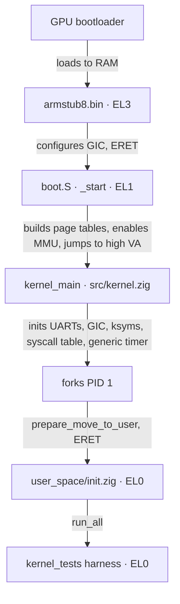

<div align="center">
  <picture>
    <source media="(prefers-color-scheme: dark)" srcset="assets/flashos_logo_dark.png">
    
  </picture>

  <h1>Documentation</h1>

  <p>
    <a href="README.md"><b>README</b></a> ·
    <b>Documentation</b> ·
    <a href="SETUP.md"><b>Setup</b></a> ·
    <a href="REFERENCE.md"><b>Reference</b></a> ·
    <a href="MIGRATION.md"><b>Migration</b></a> ·
    <a href="LICENSE.md"><b>License</b></a>
  </p>
</div>

---

This page is the architectural overview of FlashOS: how the boot path,
memory layout, scheduler, syscalls, IRQ handling, tracing, and the
test harness fit together. Module names below refer to actual files
in the repository.

## Contents

1. [Source layout](#1-source-layout)
2. [Boot path](#2-boot-path)
3. [Memory management](#3-memory-management)
4. [Process management & scheduling](#4-process-management--scheduling)
5. [Syscalls & exceptions](#5-syscalls--exceptions)
6. [Kernel symbol table](#6-kernel-symbol-table-ksyms)
7. [Tracing](#7-tracing)
8. [Testing](#8-testing)
9. [Build artefacts](#9-build-artefacts)

## 1. Source layout

```text
src/                       Kernel core (Zig + AArch64 assembly)
  start.zig                Build root: comptime-imports every kernel module
  kernel.zig               kernel_main + bring-up
  boot.S                   _start, EL3→EL1, MMU bring-up, jump to high VAs
  entry.S                  Exception vector table + syscall dispatch
  utils.S, mm.S            Assembly helpers
  sched.S, irq.S           Context switch + IRQ enable/disable
  generic_timer.S          CNTP system register helpers
  asm_defs.inc             Shared assembler-only macros
  linker.ld                Link script (kernel + user image layout)
  symbol_area.S            Generated kernel symbol table (see §6)

  uart.zig                 Mini-UART driver (console)
  gpio.zig                 GPIO pin function/enable
  timer.zig                BCM2711 system timer
  generic_timer.zig        ARM generic timer
  irq.zig                  GIC + dispatch + invalid-entry reporter
  page_alloc.zig           Physical page allocator
  mm_user.zig              map_page, copy_virt_memory, do_data_abort
  fork.zig                 copy_process, prepare_move_to_user
  sched.zig                Priority round-robin scheduler
  sys.zig                  Syscall table + handlers
  utilc.zig                memcpy/memset/panic + main_output helpers

  trace/
    trace_main.zig         Patchable-entry tracing
    utils.zig              Trace I/O helpers (PL011)
    ksyms.zig              Kernel symbol table lookup
    pl011_uart.zig         Dedicated PL011 trace UART driver
    hook.S                 Trace hook stub (saves regs, calls 'traced')

user_space/
  init.zig                 PID 1 entry shim
  kernel_tests.zig         In-kernel test harness ([TEST]/[PASS]/[FAIL])

tests/
  host_stubs.zig           Linker stubs for 'zig build test'

armstub/src/
  armstub8.S               EL3→EL1 bootstrap shim
  asm_defs.inc             Armstub-only assembler macros
  linker.ld                Armstub link script (.text at 0)
  root.zig                 Empty Zig root (build API requirement)

scripts/
  clear_syms.zig           Reset src/symbol_area.S to its placeholder form
  generate_syms.zig        Read 'aarch64-elf-nm' and emit src/symbol_area.S

assets/                    Logo and visual assets

build.zig                  The only build entry point
build.sh                   Two-pass build orchestrator + deploy prompt
config.txt                 RPi 4 firmware configuration
```

## 2. Boot path



1. The GPU bootloader loads `armstub8.bin` and `kernel8.img` into RAM
   and starts the cores at EL3.
2. `armstub/src/armstub8.S` configures secure-mode registers, enables
   the GIC, and `eret`s to EL1.
3. `_start` (`src/boot.S`) sets the stack, clears `.bss`, builds the
   identity and high page tables, wakes the secondary cores,
   initialises `TCR_EL1` / `MAIR_EL1` / `VBAR_EL1` / `TTBR0` / `TTBR1`
   explicitly (required for QEMU; on real hardware armstub leaves
   these in a sane state), enables the MMU with an `ISB` after
   `SCTLR.M=1`, and jumps to `kernel_main` via the high virtual
   mapping.
4. `kernel_main` (`src/kernel.zig`) initialises the mini-UART, the
   PL011 trace UART, the GIC, the kernel symbol table, the syscall
   table, and the generic timer, then forks PID 1 and enters the
   scheduler loop.
5. PID 1 (`kernel_process`) drops to EL0 by copying the linker-wrapped
   user image (`user_start … user_end`) into a user page and `eret`ing
   to `user_process` in `user_space/init.zig`.
6. `user_space/init.zig` is a thin shim that calls `run_all()` from
   `kernel_tests.zig`. The harness exercises fork-stress / kill /
   exec, prints a `X/Y passed` tally, and exits.

## 3. Memory management

A four-level translation regime: PGD → PUD → PMD → PTE, 4 KiB pages.

### Physical layout (RPi 4, 4 GiB SKU)

| Range                       | Region          | Usage                              |
| :-------------------------- | :-------------- | :--------------------------------- |
| `0x00000000`–`0x38400000`   | 0 – 948 MiB     | Free / kernel image at `0x80000`   |
| `0x38400000`–`0x40000000`   | 948 – 1024 MiB  | VideoCore reserved                 |
| `0x40000000`–`0xFC000000`   | 1 GiB – 3960 MiB | `get_free_page` pool              |
| `0xFC000000`–`0x100000000`  | > 3960 MiB      | MMIO (GIC, UART, GPIO)             |

### Kernel virtual layout (EL1)

| Region        | Virtual base           | Physical base | Attributes        |
| :------------ | :--------------------- | :------------ | :---------------- |
| Identity map  | `0x0000000000000000`   | `0x00000000`  | Normal-NC (0–16 MiB) |
| Linear high   | `0xffff000000000000`   | `0x00000000`  | Normal-NC         |
| VC hole       | `0xffff00003B400000`   | `0x38400000`  | unmapped          |
| RAM high      | `0xffff000040000000`   | `0x40000000`  | Normal-NC         |
| Device high   | `0xffff0000FC000000`   | `0xFC000000`  | Device-nGnRnE     |

Translation between physical and the linear-high mapping uses
`PA_TO_KVA` / `KVA_TO_PA` from `src/mm_user.zig`.

### User pages

`map_page` walks (and lazily allocates) PGD/PUD/PMD/PTE tables for
the target task, then writes a leaf PTE with `TD_USER_PAGE_FLAGS`.
`allocate_user_page` is the convenience wrapper that also pulls a
fresh physical page from `get_free_page`. Page faults due to a
missing leaf (level-3 translation fault, `dfsc == 0x7`) trigger
demand allocation in `do_data_abort`.

User-space code is copied to UVA `0` at PID 1 setup. A consequence is
that user-space code **cannot** rely on absolute pointers baked at
link time — switch jump tables and arrays-of-pointers fault when the
image is relocated to UVA `0`. Only PC-relative `adr` references
survive. See `user_space/kernel_tests.zig` for a documented example.

## 4. Process management & scheduling

- **Scheduler.** Priority round-robin in `src/sched.zig`. `_schedule`
  picks the runnable task with the largest counter; if every counter
  is zero it refills them as `(counter >> 1) + priority`.
- **Tick.** `timer_tick` decrements `current.counter`. When it hits
  zero (and preemption is enabled) it calls `_schedule`.
- **Task states.** `TASK_RUNNING`, `TASK_INTERRUPTIBLE`, `TASK_ZOMBIE`.
- **Context switch.** `switch_to` updates `current`, programs the new
  PGD via `set_pgd`, and calls `core_switch_to` (`src/sched.S`) to
  swap callee-saved registers, FP, SP, and LR.
- **Fork.** `copy_process` allocates a kernel page for the new task,
  copies the parent's exception-frame regs, clones the user page
  table via `copy_virt_memory`, and links it into `task[]`.
- **Exit / wait.** `exit_process` flips the task to `TASK_ZOMBIE` and
  wakes any `TASK_INTERRUPTIBLE` parent. `do_wait` reaps the zombie's
  user pages, kernel pages, and slot — the page balance is the test
  harness's leak signal.
- **Kill.** `sys_kill(pid)` walks `task[]` for a matching `.pid`,
  flips it to `TASK_ZOMBIE`, and wakes the parent. Self-kill is
  rejected — the running task is its own kernel page; `sys_exit` is
  the safe self-cancel path.
- **Exec.** `sys_exec(blob_addr, blob_size)` snapshots the blob into
  a kernel-owned page, frees the old user/kernel pages, asks
  `prepare_move_to_user` to install a fresh PGD with the snapshot at
  UVA `0`, and frees the snapshot. Net page balance is identical to
  before.

## 5. Syscalls & exceptions

The vector table is in `src/entry.S` and is loaded into `vbar_el1` by
`irq_init_vectors` (`src/irq.S`). Synchronous exceptions from EL0 are
dispatched in `handle_sync_el0_64`. SVCs go through `el0_svc` →
indexed lookup in `sys_call_table` (`src/sys.zig`); data aborts call
`do_data_abort`.

`enable_interrupt_gic` (`src/irq.zig`) wires interrupt IDs to a
specific core. The kernel currently routes the auxiliary IRQ
(mini-UART RX) and the non-secure physical timer.

### Syscall ABI

User-space invokes a syscall by placing the syscall number in `x8`,
arguments in `x0..x5`, and executing `svc #0`. The return value is
in `x0`.

```text
x8       syscall number
x0..x5   arguments (per syscall)
svc #0   trap into the kernel
x0       return value
```

The vector at `vbar_el1 + 0x400` (`el0_svc` in `src/entry.S`)
indexes into `sys_call_table` (`src/sys.zig`) and `blr`s to the
selected handler. `NR_SYSCALLS = 7` is enforced by a `b.hs` check on
`x8`; out-of-range numbers fall through to the invalid-entry path.

Because the user PGD is installed in TTBR0 at the time of the SVC,
the syscall table is rewritten at boot to high-mem addresses (the
`LINEAR_MAP_BASE` OR-in) so the `blr` lands in the kernel's TTBR1
mapping rather than chasing into UVA space.

### Syscall reference

| `x8` | Name        | Args                              | Returns | Notes |
| :--: | :---------- | :-------------------------------- | :-----: | :---- |
|  0   | `write`     | `x0 = const u8 *` (NUL-terminated) | void   | Print to mini-UART |
|  1   | `fork`      | (none)                            | `i32` PID of child in parent, `0` in child | Standard fork semantics |
|  2   | `exit`      | (none)                            | does not return | Marks the task `TASK_ZOMBIE`, reschedules |
|  3   | `wait`      | (none)                            | `i32` PID of reaped child | Blocks on `TASK_INTERRUPTIBLE` until any child exits, then frees its pages and slot |
|  4   | `dump_free` | (none)                            | `u64` count of free pages | Debug instrumentation. Prints + returns the page count. The in-kernel test harness uses the return value as its leak-detection signal |
|  5   | `exec`      | `x0 = blob_addr`, `x1 = blob_size` | `i32` 0 on success, -1 on bad args / alloc failure | Replaces the current task's address space with `blob_size` bytes copied from `blob_addr`. Caller's PC after `svc` is unreachable on success — `eret` jumps to UVA `0` |
|  6   | `kill`      | `x0 = pid`                        | `i32` 0 on hit, -1 on miss | Finds the task with matching `pid`, flips it to `TASK_ZOMBIE`, wakes the parent. **Self-kill is rejected** — use `exit` |

`sys_dump_free` is a documented debug syscall, not part of the
forward-stable ABI surface. It is retained because the in-kernel
test harness depends on it.

Stub slots from `sys_openFile` (filesystem) onwards are present in
`src/sys.zig` for forward compatibility, but `NR_SYSCALLS = 7`
prevents them from being dispatched. They are no-ops when wired up.

## 6. Kernel symbol table (ksyms)

The trace machinery looks up function names by address. The table is
part of the linked image, so the build is a two-pass process:

1. **Pass 1.** `zig build` links `kernel8.elf` with a placeholder
   `_symbols` section large enough to hold the populated table
   (`scripts/generate_syms.zig:pre_allocated_size`).
2. **Extraction.** `zig build populate-syms` runs
   `aarch64-elf-nm -n kernel8.elf | sort | grep -v '\$' |
   zig run scripts/generate_syms.zig`, which overwrites
   `src/symbol_area.S` with `.quad` / `.string` / `.space` directives
   — one 64-byte entry per symbol, terminated by a zero-byte sentinel.
3. **Pass 2.** Another `zig build` relinks with the populated section.

`build.sh` runs both passes and diff-checks that the symbol layout
converged (i.e. inserting symbol data did not perturb addresses).

## 7. Tracing

- `-fpatchable-function-entry=2` is not enabled in the current
  Zig-only build, so the patchable-functions section is empty and
  `trace_init` is effectively a no-op. The runtime machinery is
  intact and ready to be wired up again once Zig grows an equivalent
  flag.
- When patchable entries exist, `trace_init`
  (`src/trace/trace_main.zig`) relocates the address table, overwrites
  the first `nop` of every entry with `mov x9, lr`, then patches the
  second `nop` with `bl hook`.
- `hook` (`src/trace/hook.S`) saves the argument and link registers,
  calls `traced`, restores them, then `blr`s into the original
  function. `traced` resolves the address with `ksym_name_from_addr`
  and prints the symbol name on the PL011 trace UART.

## 8. Testing

FlashOS ships two complementary test surfaces.

**Host-side unit tests** (`zig build test`).
Pure-logic kernel modules can be tested without the AArch64 runtime.
Each kernel module that has tests is its own test root, linked
against `tests/host_stubs.zig`, which stubs out the assembly-only
externs (`memzero`, `panic`, `main_output*`). The current suite
covers the page allocator: PA↔KVA round-trip, `mem_map_init`
zeroing, sequential allocation, free-and-reuse, free-page tracking,
above-range PA bounds-check, and `get_kernel_page` round-trip — 7/7
passing on host.

**In-kernel runtime harness** (`user_space/kernel_tests.zig`).
PID 1 enters `run_all()`, which exercises three scenarios on real
kernel state:

- `fork-stress` — 3 × 5 fork/reap rounds with per-round and final
  free-page-count baseline checks.
- `kill` — fork a child, kill it by pid, parent reaps.
- `exec` — fork a child, `exec` an in-page blob, parent reaps.

Each scenario emits `[TEST] name` … `[PASS] name` (or `[FAIL]`), and
`run_all` prints a final `X/Y passed` tally. The harness runs
identically under QEMU (`zig build run`) and on real hardware
(`./build.sh` → SD-flash → `picapture`); the current release is
certified with `3/3 passed`, 7 `0xbbff9` checkpoints, and 0
`ERROR CAUGHT` on both.

### Free-page invariants

The harness uses `sys_dump_free` to verify every scenario is
leak-free:

- **Kernel boot baseline:** `0xbc000` — emitted once by `kernel_main`
  (`src/kernel.zig`) before PID 1 is created. Equals 4 GiB Pi minus
  VC reservation, kernel image, and the identity + high page tables.
- **User-space baseline:** `0xbbff9` — emitted by PID 1 on entry to
  `run_all`. Equals the boot baseline minus 7 pages claimed by PID 1
  setup (user image + page-table chain + stack + bookkeeping). Every
  leak-free scenario must end at this same value.

A full QEMU or Pi run prints 8 `free_pages:` lines: 1 kernel boot
baseline + 1 user-space baseline + 1 checkpoint per fork-stress round
(3 rounds) + 1 fork-stress final + 1 kill + 1 exec.

```text
free_pages: 00000000000bc000   (kernel boot baseline)
free_pages: 00000000000bbff9   (PID 1 baseline)
free_pages: 00000000000bbff9   (fork-stress round 1)
free_pages: 00000000000bbff9   (fork-stress round 2)
free_pages: 00000000000bbff9   (fork-stress round 3)
free_pages: 00000000000bbff9   (fork-stress final)
free_pages: 00000000000bbff9   (kill)
free_pages: 00000000000bbff9   (exec)
```

Any deviation indicates a leak in the scenario above the deviating
checkpoint.

### Output markers

| Marker                  | Meaning                                              |
| :---------------------- | :--------------------------------------------------- |
| `[TEST] <name>`         | Scenario started                                     |
| `[PASS] <name>`         | Scenario finished with the expected free-page count  |
| `[FAIL] <name>`         | Scenario ended with a leak or wrong return value     |
| `X/Y passed`            | Final tally; `X == Y` is the green-run condition     |
| `SUCCESS`               | Marker that `picapture` waits on to terminate the capture session |
| `ERROR CAUGHT`          | Kernel-side fault (data abort, instruction abort, etc.) |
| `kill ok`, `exec'd`     | Per-scenario progress prints                         |

Greens require: `X == Y`, all `[PASS]` no `[FAIL]`, 0 `ERROR CAUGHT`,
seven `0xbbff9` checkpoints, and the `SUCCESS` marker present.

## 9. Build artefacts

| File                       | Description                                                   |
| :------------------------- | :------------------------------------------------------------ |
| `zig-out/kernel8.img`      | Raw binary; firmware loads it to physical `0x80000`           |
| `zig-out/armstub8.bin`     | EL3 bootstrap shim, loaded by the firmware                    |
| `zig-out/bin/kernel8.elf`  | Unstripped ELF, retains debug info for `nm` / `objdump`       |
| `zig-out/bin/armstub8.elf` | Unstripped armstub ELF                                        |

---

[← Prev: README](<README.md>) · [Next: Setup →](<SETUP.md>)
