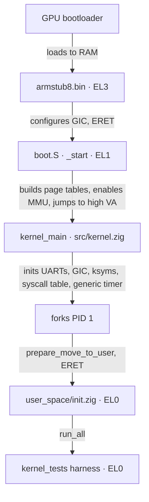

<div align="center">
  <picture>
    <source media="(prefers-color-scheme: dark)" srcset="assets/flashos_logo_dark.png">
    
  </picture>

<h1>Documentation</h1>

<p>
    <a href="README.md"><b>README</b></a> ·
    <b>Documentation</b> ·
    <a href="SETUP.md"><b>Setup</b></a> ·
    <a href="MIGRATION.md"><b>Migration</b></a> ·
    <a href="LICENSE.md"><b>License</b></a>
  </p>
</div>

---

This page is the architectural overview of FlashOS: how the boot path,
memory layout, scheduler, syscalls, IRQ handling, tracing, and the
test harness fit together. Module names below refer to actual files
in the repository.

## Contents

1. [Source layout](#1-source-layout)
2. [Boot path](#2-boot-path)
3. [Memory management](#3-memory-management)
4. [Process management &amp; scheduling](#4-process-management--scheduling)
5. [Syscalls &amp; exceptions](#5-syscalls--exceptions)
6. [Kernel symbol table](#6-kernel-symbol-table-ksyms)
7. [Tracing](#7-tracing)
8. [Testing](#8-testing)
9. [Build artefacts](#9-build-artefacts)

## 1. Source layout

```text
src/                       Kernel core (Zig + AArch64 assembly)
  start.zig                Build root: comptime-imports every kernel module
  kernel.zig               kernel_main + bring-up
  boot.S                   _start, EL3→EL1, MMU bring-up, jump to high VAs
  entry.S                  Exception vector table + syscall dispatch
  utils.S, mm.S            Assembly helpers
  sched.S, irq.S           Context switch + IRQ enable/disable
  generic_timer.S          CNTP system register helpers
  symbol_area.S            Generated kernel symbol table (see §6)
  asm_defs.inc             Bridge header — pulls in board_asm_defs.inc
  asm_defs_common.inc      Shared assembler-only macros (board-independent)

  board.zig                Comptime alias: build_options.board → board/<board>/*
  generic_timer.zig        ARM generic timer
  page_alloc.zig           Physical page allocator
  mm_user.zig              map_page, copy_virt_memory, do_data_abort
  fork.zig                 copy_process, prepare_move_to_user[_elf]
  sched.zig                Priority round-robin scheduler
  sys.zig                  Syscall table + handlers
  utilc.zig                memcpy/memset/panic + main_output helpers
  elf.zig                  ELF64 header + program-header parser (host-testable)
  task_layout.zig          Canonical extern-struct layouts (TaskStruct, MmStruct, …)
  user_layout.zig          User VA constants (TEXT/DATA/HEAP/STACK bases + flags)
  block_dev.zig            BlockDev vtable: board-agnostic LBA read/write indirection
  sdhci_cmd.zig            SDHCI CMDTM bit layout, CMDx constants, CSD v2 parser, clock divisor
  mailbox.zig              VideoCore property-tag message layout + parsing (board-agnostic)
  fat32.zig                FAT32 BPB/FAT/dir-entry decode + cluster-chain walk (host-testable)
  fat32_backend.zig        FAT32 VfsOps backend: read + writeBack over block_dev (real SD I/O — Pi-HW path; replaced the earlier fat32_stub.zig)

  board/rpi4b/             Raspberry Pi 4 driver bag
    uart.zig               Mini-UART driver (console)
    gpio.zig               GPIO pin function/enable
    timer.zig              BCM2711 system timer
    irq.zig                BCM2711 GIC + dispatch + invalid-entry reporter
    emmc2.zig              BCM2711 EMMC2 SDHCI driver — PIO single-block read/write
    mailbox.zig            VideoCore mailbox MMIO doorbell (pairs with src/mailbox.zig)
    boot_quirks.S          Pi-specific boot fixups
    board_asm_defs.inc     Pi memory-layout addresses + macros
    linker.ld              Per-board kernel link script

  board/virt/              QEMU `-M virt` driver bag
    uart.zig, gpio.zig, timer.zig, irq.zig   (virt MMIO addresses)
    dtb.zig                Minimal DTB walker for runtime device-address discovery
    image_header.S         Linux arm64 image header (UEFI/GRUB compatibility)
    boot_quirks.S          virt-specific boot fixups
    board_asm_defs.inc     virt memory-layout addresses + macros
    linker.ld              virt kernel link script

  trace/
    trace_main.zig         Patchable-entry tracing
    utils.zig              Trace I/O helpers (PL011)
    ksyms.zig              Kernel symbol table lookup
    pl011_uart.zig         Dedicated PL011 trace UART driver
    hook.S                 Trace hook stub (saves regs, calls 'traced')

user_space/
  init.zig                 PID 1 entry shim
  kernel_tests.zig         In-kernel test harness ([TEST]/[PASS]/[FAIL])
  lib/flibc/               Userland mini-libc for ELF-loaded programs
    flibc.zig              Root re-exports (printf, malloc, fork, ...)
    syscalls.zig           Raw SVC wrappers (sys.write/fork/exit/...)
    io.zig                 printf / puts / write on sys_writeConsole
    heap.zig               Bump allocator over sys_brk / sys_sbrk
    process.zig            fork / wait / exit / execve glue

lib/
  syscall_defs.zig         Shared SYS_* IDs (kernel + user side)

tools/
  hello_elf.zig + .S       Hand-rolled ELF for [TEST] exec-elf
  stackbomb_elf.zig + .S   Recursive stack-blower for [TEST] stack-overflow
  flibc_demo_elf.zig + .S  flibc-driven demo for [TEST] flibc
  hello_linker.ld          Single-PT_LOAD layout (hello + stackbomb)
  flibc_demo_linker.ld     Single-PT_LOAD layout with .rodata folded in

tests/
  host_stubs.zig           Linker stubs for 'zig build test'

armstub/src/
  armstub8.S               EL3→EL1 bootstrap shim
  asm_defs.inc             Armstub-only assembler macros
  linker.ld                Armstub link script (.text at 0)
  root.zig                 Empty Zig root (build API requirement)

scripts/
  clear_syms.zig           Reset src/symbol_area.S to its placeholder form
  generate_syms.zig        Read 'aarch64-elf-nm' and emit src/symbol_area.S
  make_iso.sh              GRUB-EFI rescue ISO builder (virt only)

assets/                    Logo and visual assets

build.zig                  The only build entry point
build.sh                   Two-pass build orchestrator + deploy prompt
config.txt                 RPi 4 firmware configuration
```

## 2. Boot path



1. The GPU bootloader loads `armstub8.bin` and `kernel8.img` into RAM
   and starts the cores at EL3.
2. `armstub/src/armstub8.S` configures secure-mode registers, enables
   the GIC, and `eret`s to EL1.
3. `_start` (`src/boot.S`) sets the stack, clears `.bss`, builds the
   identity and high page tables, wakes the secondary cores,
   initialises `TCR_EL1` / `MAIR_EL1` / `VBAR_EL1` / `TTBR0` / `TTBR1`
   explicitly (required for QEMU; on real hardware armstub leaves
   these in a sane state), enables the MMU with an `ISB` after
   `SCTLR.M=1`, and jumps to `kernel_main` via the high virtual
   mapping.
4. `kernel_main` (`src/kernel.zig`) initialises the mini-UART, the
   PL011 trace UART, the GIC, the kernel symbol table, the syscall
   table, and the generic timer, then forks PID 1 and enters the
   scheduler loop.
5. PID 1 (`kernel_process`) drops to EL0 by copying the linker-wrapped
   user image (`user_start … user_end`) into a user page and `eret`ing
   to `user_process` in `user_space/init.zig`.
6. `user_space/init.zig` is a thin shim that calls `run_all()` from
   `kernel_tests.zig`. The harness exercises fork-stress / kill /
   exec, prints a `X/Y passed` tally, and exits.

## 3. Memory management

A four-level translation regime: PGD → PUD → PMD → PTE, 4 KiB pages.

### Physical layout (RPi 4, 4 GiB SKU)

| Range                           | Region            | Usage                              |
| :------------------------------ | :---------------- | :--------------------------------- |
| `0x00000000`–`0x38400000`  | 0 – 948 MiB      | Free / kernel image at `0x80000` |
| `0x38400000`–`0x40000000`  | 948 – 1024 MiB   | VideoCore reserved                 |
| `0x40000000`–`0xFC000000`  | 1 GiB – 3960 MiB | `get_free_page` pool             |
| `0xFC000000`–`0x100000000` | > 3960 MiB        | MMIO (GIC, UART, GPIO)             |

### Kernel virtual layout (EL1)

| Region       | Virtual base           | Physical base  | Attributes            |
| :----------- | :--------------------- | :------------- | :-------------------- |
| Identity map | `0x0000000000000000` | `0x00000000` | Normal-NC (0–16 MiB) |
| Linear high  | `0xffff000000000000` | `0x00000000` | Normal-NC             |
| VC hole      | `0xffff00003B400000` | `0x38400000` | unmapped              |
| RAM high     | `0xffff000040000000` | `0x40000000` | Normal-NC             |
| Device high  | `0xffff0000FC000000` | `0xFC000000` | Device-nGnRnE         |

Translation between physical and the linear-high mapping uses
`PA_TO_KVA` / `KVA_TO_PA` from `src/mm_user.zig`.

### User virtual layout (EL0)

Constants are defined in `src/user_layout.zig` (Zig-authoritative,
imported by both `src/fork.zig` and `src/mm_user.zig`).

| Region | Virtual base           | Direction      | Attributes (post-loader) |
| :----- | :--------------------- | :------------- | :----------------------- |
| Text   | `0x0000000000000000` | static         | R-X (no UXN)             |
| Data   | `0x0000000000100000` | static         | RW- (UXN)                |
| Heap   | `0x0000000000200000` | grows up (brk) | RW- (UXN)                |
| Stack  | `0x00000FFFFFFFF000` | grows down     | RW- (UXN), guard below   |

The 16 TiB gap between `HEAP_BASE` and `STACK_TOP` makes the heap/
stack guard implicit — any access in that range is a wild pointer
and `do_data_abort` panics with `[KERN] invalid uva at 0x<hex>` after
zombie-ing the offending task (the parent's `sys_wait` reaps as
usual). Region classification keys off `mm.brk` plus the static
layout constants in `src/user_layout.zig`; see `do_data_abort` in
`src/mm_user.zig` for the full dispatch.

Per-region attributes (text RX, data/heap/stack RW with UXN) apply
universally now that PID 1 is ELF-loaded from initramfs:
`prepare_move_to_user_elf` (`src/fork.zig`) maps each PT_LOAD
segment with flags derived from `p_flags`, and `do_data_abort`
(`src/mm_user.zig`) stamps demand-allocated heap and stack pages
with `TD_USER_PAGE_FLAGS_DEFAULT | TD_USER_XN`. The non-ELF blob
path (`prepare_move_to_user`) survives only as the fallback for
`sys_exec`'s inline `[TEST] exec` 24-byte blob, which fits in a
single eagerly-mapped page at UVA `0` and is `svc`-only — its
initial stack frame at `sp = 2 * PAGE_SIZE` is never dereferenced.

### User pages

`map_page` walks (and lazily allocates) PGD/PUD/PMD/PTE tables for
the target task, then writes a leaf PTE with the supplied permission
bag (`user_layout.TD_USER_PAGE_FLAGS_DEFAULT` for the historical
combined-permission stamp; the ELF loader picks per-region values).
`allocate_user_page` is the convenience wrapper that also pulls a
fresh physical page from `get_free_page`. Translation faults
(`dfsc == 0x4..0x7`) enter `do_data_abort`, which dispatches by
region:

| Fault UVA range                         | Action                                 |
| :-------------------------------------- | :------------------------------------- |
| `[HEAP_BASE, current.mm.brk)`         | Demand-allocate (RW+UXN)               |
| `[STACK_LOW, STACK_TOP)`              | Demand-allocate (RW+UXN)               |
| `[STACK_GUARD_LOW, STACK_GUARD_HIGH)` | Panic `stack overflow` + zombie task |
| `[TEXT_BASE, DATA_BASE)`              | Panic `text fault` + zombie task     |
| anything else                           | Panic `invalid uva` + zombie task    |

The non-ELF blob path used by `sys_exec`'s `[TEST] exec` scenario
copies the user image to UVA `0` regardless of its link-time
address. Code on that path **cannot** rely on absolute pointers —
switch jump tables and arrays-of-pointers fault after relocation.
Only PC-relative `adr` references survive. ELF-loaded tasks (PID 1
plus the `{hello,stackbomb,flibc_demo}.elf` payloads under `/test/`)
honour their link-time `p_vaddr` and are unaffected.

### Kernel-resident IPC pages

Anonymous pipes (`src/pipe.zig`) allocate one
4 KiB page per `Pipe`: header (refs + head/tail + readers/writers
wait queues) at the front, byte ring filling the rest. The page is
**not** tracked in `mm.user_pages` or `mm.kernel_pages` — its
lifetime is owned by `Pipe.refs`. Fork dups the per-task fd table
(refcount bump per inherited slot); `do_wait` calls
`pipe.closeAll(zombie)` before sweeping the mm pages so any
unclosed fds drop their refs cleanly. This is the only category of
kernel page today whose lifetime is decoupled from the per-task
mm sweep.

The console RX layer (`src/console.zig`) keeps a
256-byte ring in BSS — no `get_free_page` allocation on the IRQ →
syscall path. Single producer (IRQ-side `console_push`) / single
consumer (`sys_readConsole`) by construction on single core; the
per-ring `WaitQueue` blocks readers on the empty branch and wakes
on each push.

### Embedded initramfs

The initramfs is linked into the kernel image as a `.initramfs`
section between `bss_end` and `id_pg_dir` in both board linker
scripts. `tools/initramfs.S` carries a `.incbin "initramfs.cpio"`
between `__initramfs_start` / `__initramfs_end` labels; the build
stages `pid1.elf` at `/sbin/init` and `hello.elf` / `stackbomb.elf`
/ `flibc_demo.elf` at `/test/*.elf` via a `cpio -o -H newc --reproducible` invocation on a sorted file list. `src/initramfs.zig`
exposes an `Iterator` + `locate(path)` walker over the newc bytes
through the TTBR1 alias of the section, host-tested against
synthetic fixtures. PID 1 (`kernel_process`) reads `/sbin/init` from
this archive and hands it to `prepare_move_to_user_elf`; the
harness scenarios fetch `/test/{hello,stackbomb,flibc_demo}.elf`
via `sys_openFile` + `sys_readFile` + `sys_exec`. The whole archive
is read-only and lives in the kernel's address space — `File`
handles allocated by `src/file.zig` carry an offset into the
section, not a copy of the bytes. Since v0.4.0 the file
syscalls reach this archive through the VFS shim (next subsection)
rather than calling `initramfs.locate` directly; PID 1's
`kernel_process` is the one remaining direct caller, because it runs
before the syscall path is wired.

### Filesystem layout (VFS shim)

`src/vfs.zig` is a 1-bit-superblock dispatch layer (v0.4.0)
sitting between the file syscalls and the storage backends. It owns
a fixed two-slot mount table and routes each path by prefix:

| Path prefix     | Slot | Backend                                    |
| :-------------- | :--: | :----------------------------------------- |
| `/mnt/…`     |  1  | FAT32 —`src/fat32_backend.zig` (v0.4.0) |
| everything else |  0  | initramfs —`src/initramfs_backend.zig`  |

initramfs is the root `/`; FAT32 mounts at `/mnt` (the system still boots if the SD card is
unreadable). The EMMC2 driver
(`src/board/rpi4b/emmc2.zig`) is **verified on real Pi-4 hardware**
(v0.4.0): init + write_block + read_block + byte
compare all green against a 64 GB SDXC formatted FAT32 (MBR, name
`BOOT`), Pi booting FlashOS off EMMC2 with the Toshiba USB removed.
The first real-card run uncovered one driver bug — write_block and
read_block were polling `BUFFER_WRITE_READY`/`BUFFER_READ_READY`
before every 32-bit word; those interrupts fire once per block on the
BCM2711 Arasan controller. The loop now waits once, bursts all 128
words through `DATAPORT`, then waits for `DATA_DONE` (the canonical
SDHCI single-block PIO pattern).

Since v0.4.0 the `/mnt` slot is backed by the real
`src/fat32_backend.zig` (it replaced `fat32_stub.zig`): `fat32.zig`
decodes the BPB / FAT / root-dir on `init()`, and the backend's
`open` / `read` / `seek` / `close` / `write` walk and mutate the
cluster chain over `block_dev.sd_dev`. **On-disk layout** matches
`scripts/format_sd.sh`: a single MBR primary partition, type `0x0c`
(FAT32-LBA), starting at **LBA 2048**, labelled `BOOT`, spanning the
disk. The Pi-HW acceptance run seeds two files into the FAT32 root
before `picapture`: `ROUNDTR.DAT` (4 KiB of zero) and `ROUNDTR.MAG`
(1 byte of zero) — 8.3 short names (`fat32.encode8_3` rejects a
basename longer than 8). `[TEST] fs-roundtrip` uses `ROUNDTR.MAG` as the boot-to-boot witness.

**No QEMU gate exercises the real SD / FAT32 write path.** QEMU
`-M raspi4b` does not model the BCM2711 EMMC2/Arasan SDHCI well
enough to pass CMD8 (SEND_IF_COND), so `board.emmc2.init()` returns
-1 and `fat32_backend.init()` never runs; `virt` has no SD device by
design. On **both** QEMU boards `[TEST] fs-roundtrip` takes the
mount-detected SKIP path (`[PASS] fs-roundtrip (skip)`, tally still
14/14). The real Variant-B roundtrip (`[PASS] fs-roundtrip-write`
on boot 1, `[PASS] fs-roundtrip` after a power-cycle on boot 2) and
all of `fat32_backend.writeBack` / `sys_writeFile` are validated on
**real Pi-4 hardware only**;
`zig build test` covers `src/fat32.zig`'s decode units but not
`fat32_backend.zig`. Dispatch is a
single `startsWith("/mnt/")` branch; the trailing slash is
load-bearing, so `/mnt2/foo` stays an initramfs path and `/mnt` with
no slash does too. `sys_mount`, longest-prefix matching, and path
normalisation are future work.

Each backend exposes a `VfsOps` vtable (`open` / `read` / `seek` /
`close` / `write`, C-ABI fn pointers; `write` is the 5th slot added). `vfs.vfs_open` resolves the path, dispatches to the
backend's `open`, and stashes the backing `SuperBlock` pointer in
`File.sb`; `sys_readFile` / `sys_writeFile` / `sys_seek` /
`sys_closeFile` re-cast that opaque pointer and call back through the
vtable (`vfs.vfs_write` → backend `write`; the FAT32 backend
implements it, the initramfs backend returns -EROFS). The vtable entries are relocated to their TTBR1 high-mem
aliases at bring-up (`vfs.relocateOps`, mirroring
`sys_call_table_relocate`) so the indirect `blr` survives running at
EL1 with the user pgd installed in TTBR0.

## 4. Process management & scheduling

- **Scheduler.** Priority round-robin in `src/sched.zig`. `_schedule`
  picks the runnable task with the largest counter via
  `pick_next_running`; if that task's counter is zero (round end) it
  invokes `refill_counters`, which rewrites every non-null slot as
  `(counter >> 1) + priority`. Both helpers are pure and host-tested.
- **Tick.** `timer_tick` decrements `current.counter`. When it hits
  zero (and preemption is enabled) it calls `_schedule`.
- **Task states.** `TASK_RUNNING`, `TASK_INTERRUPTIBLE`, `TASK_ZOMBIE`.
- **Context switch.** `switch_to` updates `current`, programs the new
  PGD via `set_pgd`, and calls `core_switch_to` (`src/sched.S`) to
  swap callee-saved registers, FP, SP, and LR.
- **Fork.** `copy_process` allocates a kernel page for the new task,
  copies the parent's exception-frame regs, clones the user page
  table via `copy_virt_memory`, and links it into `task[]`.
- **Exit / wait.** `exit_process` calls `zombify_and_wake_parent` on
  `current` (flip to `TASK_ZOMBIE`, wake any `TASK_INTERRUPTIBLE`
  parent). `do_wait` reaps the zombie's user pages, kernel pages, and
  slot — the page balance is the test harness's leak signal.
- **Kill.** `sys_kill(pid)` walks `task[]` for a matching `.pid` and
  applies the same `zombify_and_wake_parent` helper. Self-kill is
  rejected — the running task is its own kernel page; `sys_exit` is
  the safe self-cancel path.
- **Exec.** `sys_exec(blob_addr, blob_size)` snapshots the blob into
  a kernel-owned page, frees the old user/kernel pages, asks
  `prepare_move_to_user` to install a fresh PGD with the snapshot at
  UVA `0`, and frees the snapshot. Net page balance is identical to
  before.

## 5. Syscalls & exceptions

The vector table is in `src/entry.S` and is loaded into `vbar_el1` by
`irq_init_vectors` (`src/irq.S`). Synchronous exceptions from EL0 are
dispatched in `handle_sync_el0_64`. SVCs go through `el0_svc` →
indexed lookup in `sys_call_table` (`src/sys.zig`); data aborts call
`do_data_abort`.

`enable_interrupt_gic` (`src/irq.zig`) wires interrupt IDs to a
specific core. The kernel currently routes the auxiliary IRQ
(mini-UART RX) and the non-secure physical timer. The mini-UART RX
handler drains the FIFO to empty in a single IRQ slot and feeds each
byte into the `console.zig` RX ring; the same pattern lives in the
`virt` PL011 path. See `### Console subsystem` below.

### Syscall ABI

User-space invokes a syscall by placing the syscall number in `x8`,
arguments in `x0..x5`, and executing `svc #0`. The return value is
in `x0`.

```text
x8       syscall number
x0..x5   arguments (per syscall)
svc #0   trap into the kernel
x0       return value
```

The vector at `vbar_el1 + 0x400` (`el0_svc` in `src/entry.S`)
indexes into `sys_call_table` (`src/sys.zig`) and `blr`s to the
selected handler. `NR_SYSCALLS = 31` (in `src/asm_defs_common.inc`)
is enforced by a `b.hs` check on `x8`; out-of-range numbers fall
through to the invalid-entry path.

Because the user PGD is installed in TTBR0 at the time of the SVC,
the syscall table is rewritten at boot to high-mem addresses (the
`LINEAR_MAP_BASE` OR-in) so the `blr` lands in the kernel's TTBR1
mapping rather than chasing into UVA space.

### Syscall reference

| `x8` | Name               | Args                                              |                                         Returns                                         | Notes                                                                                                                                                                                                                                                                                                                                                                                                                                                                                                                          |
| :----: | :----------------- | :------------------------------------------------ | :-------------------------------------------------------------------------------------: | :----------------------------------------------------------------------------------------------------------------------------------------------------------------------------------------------------------------------------------------------------------------------------------------------------------------------------------------------------------------------------------------------------------------------------------------------------------------------------------------------------------------------------- |
|   0   | `write`          | `x0 = const u8 *` (NUL-terminated)              |                                          void                                          | Print to mini-UART (delegates to `sys_writeConsole`)                                                                                                                                                                                                                                                                                                                                                                                                                                                                         |
|   1   | `fork`           | (none)                                            |                     `i32` PID of child in parent, `0` in child                     | Standard fork semantics                                                                                                                                                                                                                                                                                                                                                                                                                                                                                                        |
|   2   | `exit`           | (none)                                            |                                     does not return                                     | Marks the task `TASK_ZOMBIE`, reschedules                                                                                                                                                                                                                                                                                                                                                                                                                                                                                    |
|   3   | `wait`           | (none)                                            |                               `i32` PID of reaped child                               | Blocks on `TASK_INTERRUPTIBLE` until any child exits, then frees its pages and slot                                                                                                                                                                                                                                                                                                                                                                                                                                          |
|   4   | `dump_free`      | (none)                                            |                               `u64` count of free pages                               | Debug instrumentation. Prints + returns the page count. The in-kernel test harness uses the return value as its leak-detection signal                                                                                                                                                                                                                                                                                                                                                                                          |
|   5   | `exec`           | `x0 = blob_addr`, `x1 = blob_size`            |                  `i32` 0 on success, -1 on bad args / alloc failure                  | Snapshots the blob into a kernel page, sniffs ELF magic. ELF →`prepare_move_to_user_elf` (PT_LOAD walk + per-region flags + eager top-stack page, entry from `e_entry`). Non-ELF → blob path (single page at UVA `0`, sp = `USER_SP_INIT_POS`). Caller's PC after `svc` is unreachable on success — `eret` jumps to the new entry                                                                                                                                                                               |
|   6   | `kill`           | `x0 = pid`                                      |                              `i32` 0 on hit, -1 on miss                              | Finds the task with matching `pid`, flips it to `TASK_ZOMBIE`, wakes the parent. **Self-kill is rejected** — use `exit`                                                                                                                                                                                                                                                                                                                                                                                           |
|   7   | `openFile`       | `x0 = const u8 *` (NUL-terminated path)         |                 `i32` fd ≥ 0 on success, -1 on miss / alloc failure                 | Dispatches the path through the VFS shim (`vfs.vfs_open`, see §3) to the matching backend, allocates a `File` page (`src/file.zig`), stashes the backing `SuperBlock` in `File.sb`, installs the handle into the per-task `open_files` slot. FIXME: no `copy_from_user` — bad path pointers fault through `do_data_abort`                                                                                                                                                                           |
|   8   | `readFile`       | `x0 = fd`, `x1 = u8 *buf`, `x2 = len`       |           `i64` bytes read (short read OK), `0` on EOF, `-1` on bad fd           | Dispatches through the backend vtable (`vfs.vfs_read` → backend `read`), advances `File.offset`. Bad user buffers must be pre-faulted from EL0 until a `copy_to_user` wrapper lands (see `prefault_buf` in `user_space/kernel_tests.zig`)                                                                                                                                                                                                                                                                 |
|   9   | `writeFile`      | `x0 = fd`, `x1 = const u8 *buf`, `x2 = len` |        `i64` bytes written, `-1` on bad fd / no backend / -EROFS / I/O error        | Live since v0.4.0 —**stable ABI**. Dispatches through the backend vtable (`vfs.vfs_write` → backend `write`); the FAT32 backend's `writeBack` walks the cluster chain, allocates + FAT-links new clusters, grows the dir-entry `file_size`, and updates FSInfo, advancing `File.offset`. The initramfs backend returns -EROFS (root is read-only). Bad user buffers must be pre-faulted from EL0 until a `copy_from_user` wrapper lands (see `prefault_buf` in `user_space/kernel_tests.zig`) |
|   10   | `seek`           | `x0 = fd`, `x1 = i64 off`, `x2 = whence`    |                   `i64` new offset, `-1` on bad fd / out-of-range                   | `whence = 0` SEEK_SET, `1` SEEK_CUR, `2` SEEK_END. Bounds check `[0, File.size]`                                                                                                                                                                                                                                                                                                                                                                                                                                       |
|   11   | `closeFile`      | `x0 = fd`                                       |                              `i32` 0 on hit, -1 on miss                              | Drops the per-task `open_files` slot, decrements `File.refs`; the page returns to the allocator when the last ref drops. `do_wait` calls `file_mod.closeAll` on the zombie so leaked fds reclaim at reap time                                                                                                                                                                                                                                                                                                          |
|   12   | `brk`            | `x0 = addr` (or 0 to read)                      |       `i64` new break, or current break if `addr == 0`, `-1` on bad request       | Sets the heap break (rounded up to PAGE_SIZE). Bounds:`[HEAP_BASE, STACK_TOP - STACK_BUDGET)`. Pages are demand-allocated by `do_data_abort`; shrinks unmap + free the released pages and TLB-flush via `set_pgd`                                                                                                                                                                                                                                                                                                        |
|   13   | `sbrk`           | `x0 = delta` (i64)                              |                   `i64` previous break, `-1` on overflow / range                   | Convenience wrapper:`brk(current + delta)`. Returns the *previous* break                                                                                                                                                                                                                                                                                                                                                                                                                                                   |
|   18   | `pipe`           | (none)                                            |       `i64` packed (`(wfd << 32) \| rfd`), `-1` on alloc or fd-table failure       | Allocates a 4 KiB Pipe page (header + ring). Two fds installed in `current.fd_table`, `refs = 2`. Single-producer / single-consumer per end; multi-reader/writer deferred                                                                                                                                                                                                                                                                                                                                       |
|   27   | `pipe_read`      | `x0 = fd`, `x1 = u8 *buf`, `x2 = len`       | `i64` bytes read (short read OK), `0` on EOF (last writer closed), `-1` on bad fd | Blocks (`TASK_INTERRUPTIBLE`) when the ring is empty and more writers exist; drains what's currently buffered on each call. FIXME: no `copy_from_user`, bad pointers fault through `do_data_abort`                                                                                                                                                                                                                                                                                                              |
|   28   | `pipe_write`     | `x0 = fd`, `x1 = const u8 *buf`, `x2 = len` |                         `i64` bytes pushed, `-1` on bad fd                         | Blocks when the ring is full and more readers exist. SIGPIPE territory (last reader closed) returns the short-write count for now; signal path TBD                                                                                                                                                                                                                                                                                                                                                               |
|   29   | `pipe_close`     | `x0 = fd`                                       |                              `i32` 0 on hit, -1 on miss                              | Clears the fd slot, drops one ref on the Pipe; when `refs == 0` wakes both wait queues and frees the page                                                                                                                                                                                                                                                                                                                                                                                                                    |
|   23   | `openConsole`    | `x0 = mode` (0 = stdin, 1 = stdout)             |                         `i32` 0/1 on success, -1 on bad mode                         | Synthetic fd, not installed in any fd-table. Pipe-fds and console-fds coexist separately until they're unified behind a single `read`/`write` dispatcher                                                                                                                                                                                                                                                                                                                                                              |
|   24   | `readConsole`    | `x0 = u8 *buf`, `x1 = len`                    |                `i64` bytes read (short read OK), `0` on `len == 0`                | Blocks on `console.rx_wq` when the ring is empty; drains up to `len` bytes per call. Future flips: line vs raw via `O_NONBLOCK` and `sys_setConsoleMode`                                                                                                                                                                                                                                                                                                                                                      |
|   25   | `setConsoleMode` | (none)                                            |                                          void                                          | Inert (mode flips: line / raw / nonblocking — not yet wired)                                                                                                                                                                                                                                                                                                                                                                                                                                                                     |
|   26   | `closeConsole`   | (none)                                            |                                          void                                          | Inert (fd-table teardown — not yet wired)                                                                                                                                                                                                                                                                                                                                                                                                                                                                                        |
|   30   | `console_inject` | `x0 = byte`                                     |                                          void                                          | **Debug only — not part of the stable ABI.** Pushes one byte into the kernel RX ring as if it had arrived on the UART. Powers deterministic `[TEST] console-echo` coverage on QEMU where there is no external input driver; symmetric to `sys_dump_free`. To be removed once a real host-input driver lands                                                                                                                                                                                                 |

`sys_dump_free` and `sys_console_inject` are documented debug
syscalls, not part of the forward-stable ABI surface. Both are
retained because the in-kernel test harness depends on them.

Slots `7..11` carry the file ABI (`sys_openFile` / `sys_readFile` /
`sys_writeFile` / `sys_seek` / `sys_closeFile`), which dispatch
through the VFS shim (§3) to the matching backend. `sys_writeFile`
went live in v0.4.0 (FAT32 `writeBack`) and is now a
stable ABI: writes to `/mnt/…` route to the FAT32 backend, every
other path returns -EROFS from the initramfs backend. Slots `14..17` (`sys_mmap`, `sys_munmap`,
`sys_mlock`, `sys_munlock`) and `19..22` (socket / IPC stubs) are
present in `src/sys.zig` for forward compatibility but return
immediately. Slot `18` is the active `sys_pipe`; slots `23..26`
carry the console RX ABI (`sys_openConsole` /
`_readConsole` / `_setConsoleMode` / `_closeConsole`); slots
`27..29` carry the rest of the pipe ABI (`sys_pipe_read` / `_write`
/ `_close`). Slot `30` (`sys_console_inject`) is the debug-only
host-input shim.

### Console subsystem

The board IRQ handler (`src/board/{rpi4b,virt}/irq.zig`) drains the
UART RX FIFO on every IRQ slot and pushes each byte into a 256-byte
BSS-resident ring in `src/console.zig` via `console_push`. The ring
is single-producer (IRQ) / single-consumer (syscall) by construction
on single core. `console_push` wakes the per-ring `WaitQueue`
(`src/wait_queue.zig`); `sys_readConsole` blocks on it when the ring
is empty and drains a short read on wake. Echo policy lives in
user space — the kernel does *not* loop the byte back through the
TX path. Future work will unify `console_read` and `pipe_read` behind a
single `sys_read(fd, buf, len)` once the fd-table grows tagged
pointers.

## 6. Kernel symbol table (ksyms)

The trace machinery looks up function names by address. The table is
part of the linked image, so the build is a two-pass process:

1. **Pass 1.** `zig build` links `kernel8.elf` with a placeholder
   `_symbols` section large enough to hold the populated table
   (`scripts/generate_syms.zig:pre_allocated_size`).
2. **Extraction.** `zig build populate-syms` runs
   `aarch64-elf-nm -n kernel8.elf | sort | grep -v '\$' | zig run scripts/generate_syms.zig`, which overwrites
   `src/symbol_area.S` with `.quad` / `.string` / `.space` directives
   — one 64-byte entry per symbol, terminated by a zero-byte sentinel.
3. **Pass 2.** Another `zig build` relinks with the populated section.

`build.sh` runs both passes and diff-checks that the symbol layout
converged (i.e. inserting symbol data did not perturb addresses).

## 7. Tracing

- `-fpatchable-function-entry=2` is not enabled in the current
  Zig-only build, so the patchable-functions section is empty and
  `trace_init` is effectively a no-op. The runtime machinery is
  intact and ready to be wired up again once Zig grows an equivalent
  flag.
- When patchable entries exist, `trace_init`
  (`src/trace/trace_main.zig`) relocates the address table, overwrites
  the first `nop` of every entry with `mov x9, lr`, then patches the
  second `nop` with `bl hook`.
- `hook` (`src/trace/hook.S`) saves the argument and link registers,
  calls `traced`, restores them, then `blr`s into the original
  function. `traced` resolves the address with `ksym_name_from_addr`
  and prints the symbol name on the PL011 trace UART.

## 8. Testing

FlashOS ships two complementary test surfaces.

**Host-side unit tests** (`zig build test`).
Pure-logic kernel modules can be tested without the AArch64 runtime.
Each tested kernel module is its own test root, linked against a
host-stub object that fills in the assembly-only externs (`memzero`,
`panic`, `main_output*`, `core_switch_to`, `set_pgd`, the IRQ
masking pair, the page-allocator entry points). The shared stub set
lives in `tests/host_stubs.zig`; `pipe.zig`, `sched.zig`, and the
initramfs/file pair get dedicated per-target stub objects
(`tests/host_stubs_pipe.zig`, `tests/host_stubs_sched.zig`,
`tests/host_stubs_initramfs.zig`, `tests/host_stubs_vfs.zig`) to
avoid double-defining symbols that the module under test already
exports. The current suite totals **117 host tests** across twelve
modules — see the coverage matrix below for the per-module split.

**In-kernel runtime harness** (`user_space/kernel_tests.zig`).
PID 1 enters `run_all()`, which exercises fourteen scenarios on real
kernel state:

- `fork-stress` — 3 × 5 fork/reap rounds with per-round and final
  free-page-count baseline checks.
- `kill` — fork a child, kill it by pid, parent reaps.
- `exec` — fork a child, `exec` an in-page blob, parent reaps.
- `exec-elf` — fork a child, `exec` `tools/hello.elf` through the
  ELF path (parser + PT_LOAD walk + eager top-stack page),
  parent reaps.
- `brk` — fork a child, grow heap by 16 pages (each touch fires
  `do_data_abort`'s heap-range demand-alloc), read pattern back,
  shrink to baseline, parent reaps.
- `stack-overflow` — fork a child, `exec` `tools/stackbomb.elf`,
  child recurses past `STACK_LOW` into the guard page, kernel zombies
  via `[KERN] stack overflow`, parent reaps.
- `wild-pointer` — fork a child, write to `0xDEADBEEF000`
  (heap-stack gap), kernel zombies via `[KERN] invalid uva`, parent
  reaps.
- `flibc` — fork a child, `exec` `tools/flibc_demo.elf` (built against
  `user_space/lib/flibc/`), demo runs `printf("flibc hello %d\n", 42)`
  + 32-byte malloc + pattern verify + `exit`, parent reaps. Validates
    flibc's printf / bump-allocator / exit layers end-to-end through the
    ELF loader.
- `pipe` — fork a child, hand a 16-byte payload through an anonymous
  pipe (parent reads, child writes), close both ends, parent reaps.
  Validates `sys_pipe` allocation, `fork`-dup of `fd_table`,
  `sys_pipe_read` / `_write` round-trip, and `sys_pipe_close` ref
  drop + page free.
- `console-echo` — `sys_openConsole(0/1)` ABI smoke, fork a child
  that injects 8 deterministic bytes (`0xC0..0xC7`) via
  `sys_console_inject` after a short delay, parent blocks in
  `sys_readConsole` on the empty ring (covers the
  `console.rx_wq.wait` path), drains via short reads until the
  payload is collected, then byte-compare. Free-page baseline still
  the [PASS] gate.
- `initramfs-open` — `sys_openFile("/sbin/init")` + `sys_readFile`
  of the first 4 bytes, asserts ELF magic `0x7f 'E' 'L' 'F'`,
  `sys_closeFile`, baseline holds. Demonstrates the read-only file
  path end-to-end against the embedded initramfs.
- `vfs-dispatch` — exercises the VFS shim's two legs: `/sbin/init`
  resolves through the initramfs backend (positive, fd ≥ 0 + clean
  close), `/mnt/this-does-not-exist` routes to the FAT32 stub and
  returns -1 (negative-but-routed), `/mnt` with no trailing slash
  stays an initramfs path and misses there. Asserts the dispatch
  contract, not the mechanism; baseline holds (one File page
  allocated and freed).
- `trace` — four sequential fork/exit/wait cycles, exercising the
  patched trampolines `copy_process` (fork), `do_wait` (wait), and
  `_schedule` (timer-tick + explicit yield). On Pi the trampolines'
  `bl hook` lands on PL011 (UART4) with each canonical name; on virt
  `pl011_uart_send_string` is comptime-stubbed and the patch path
  runs silently. Pass criterion mirrors the other reap-based
  scenarios: free-page count after the loop equals the suite baseline.
- `fs-roundtrip` — the Variant-B magic-file persistence scenario.
  Opens `/mnt/ROUNDTR.MAG`: a negative fd means `/mnt` is unmounted
  (no FAT32 — **mount-detected SKIP**, `[PASS] fs-roundtrip (skip)`,
  one parity `sys_dump_free`). Magic byte `0` → first-boot phase:
  write a 4 KiB pattern to `/mnt/ROUNDTR.DAT` via `sys_writeFile`,
  set magic = 1, emit `[PASS] fs-roundtrip-write (reboot to verify)`.
  Magic byte `1` → second-boot phase: read `ROUNDTR.DAT` back,
  byte-compare against the formula, reset magic to `0`, emit
  `[PASS] fs-roundtrip`. Baseline check gates each non-skip branch.
  This is the only scenario that crosses a power-cycle, so it
  validates `fat32_backend.writeBack` + persistence end-to-end —
  **but only on real Pi-4 hardware**: QEMU `-M raspi4b` cannot pass
  EMMC2 CMD8 and `virt` has no SD device, so on both QEMU boards
  this scenario takes the SKIP path (see §3). Pi-HW operator runs
  it twice across a reboot.

Each scenario emits `[TEST] name` … `[PASS] name` (or `[FAIL]`), and
`run_all` prints a final `X/Y passed` tally. The harness runs
identically under QEMU (`zig build -Dboard=virt run-virt` /
`-Dboard=rpi4b run`) and on real hardware (`./build.sh` → SD-flash →
`picapture`); a green run lands `14/14 passed` with 18 `0xbbff4`
checkpoints and 0 `ERROR CAUGHT` on both boards (in QEMU the 18th
checkpoint is `fs-roundtrip`'s parity `sys_dump_free` on the SKIP
path; on Pi-HW it is the real write/verify branch).

**Pre-PID-1 EL1 smoke** (`run_emmc2_smoke` in `src/kernel.zig`).
A single scenario `emmc2-block` runs before PID 1 is forked,
writing a deterministic 512-byte pattern to LBA 2064 through
`board.emmc2.write_block`, reading it back via `read_block`, and
byte-comparing. Emits `[TEST] emmc2-block` … `[PASS] emmc2-block`
or `[FAIL] emmc2-block (write|read|mismatch)`. On QEMU it
exercises the virt fake (`src/board/virt/emmc2.zig`); on Pi 4 it
exercises the real BCM2711 EMMC2 driver (verified on a 64 GB SDXC,
v0.4.0). The EL0 14/14 tally is unaffected — both
buffers live on the kernel stack and the scenario runs in kernel
context.

### Free-page invariants

The harness uses `sys_dump_free` to verify every scenario is
leak-free:

- **Kernel boot baseline:** `0xbc000` — emitted once by `kernel_main`
  (`src/kernel.zig`) before PID 1 is created. Equals 4 GiB Pi minus
  VC reservation, kernel image, and the identity + high page tables.
- **User-space baseline:** `0xbbff4` — emitted by PID 1 on entry to
  `run_all`. Equals the boot baseline minus 12 pages claimed by PID 1
  setup (ELF text + page-table chain + eager top-stack page +
  `run_all`'s stack-warm-up + bookkeeping). Every leak-free scenario
  must end at this same value. Shifted from `0xbbff9` (v0.3.0 blob
  PID 1) when PID 1 flipped to ELF-loaded (v0.4.0) and added
  the EL0 stack-warm-up needed for kernel-mode user-VA stores in
  `sys_readFile` (see `prefault_buf` in `user_space/kernel_tests.zig`).

A full QEMU or Pi run prints 19 `free_pages:` lines: 1 kernel boot
baseline + 1 user-space baseline + 1 checkpoint per fork-stress round
(3 rounds) + 1 fork-stress final + 1 each for kill / exec / exec-elf
/ brk / stack-overflow / wild-pointer / flibc / pipe / console-echo /
initramfs-open / vfs-dispatch / trace / fs-roundtrip.

```text
free_pages: 00000000000bc000   (kernel boot baseline)
free_pages: 00000000000bbff4   (PID 1 baseline)
free_pages: 00000000000bbff4   (fork-stress round 1)
free_pages: 00000000000bbff4   (fork-stress round 2)
free_pages: 00000000000bbff4   (fork-stress round 3)
free_pages: 00000000000bbff4   (fork-stress final)
free_pages: 00000000000bbff4   (kill)
free_pages: 00000000000bbff4   (exec)
free_pages: 00000000000bbff4   (exec-elf)
free_pages: 00000000000bbff4   (brk)
free_pages: 00000000000bbff4   (stack-overflow)
free_pages: 00000000000bbff4   (wild-pointer)
free_pages: 00000000000bbff4   (flibc)
free_pages: 00000000000bbff4   (pipe)
free_pages: 00000000000bbff4   (console-echo)
free_pages: 00000000000bbff4   (initramfs-open)
free_pages: 00000000000bbff4   (vfs-dispatch)
free_pages: 00000000000bbff4   (trace)
free_pages: 00000000000bbff4   (fs-roundtrip)
```

Any deviation indicates a leak in the scenario above the deviating
checkpoint.

### Coverage matrix

The Host column counts inline `test "…"` blocks in each module (run
via `zig build test`). The Kernel-harness column lists the `[TEST]`
scenarios in `user_space/kernel_tests.zig` that exercise the module
end-to-end on QEMU + Pi 4.

| Module                          | Host tests | Kernel-harness scenarios                                                                            | Reason if host-untested                                                                                                                                                                                                                      |
| ------------------------------- | ---------: | --------------------------------------------------------------------------------------------------- | -------------------------------------------------------------------------------------------------------------------------------------------------------------------------------------------------------------------------------------------- |
| `src/page_alloc.zig`          |          7 | every (free-page baseline)                                                                          | —                                                                                                                                                                                                                                           |
| `src/elf.zig`                 |         14 | `exec-elf`, `stack-overflow`, `flibc`                                                         | —                                                                                                                                                                                                                                           |
| `src/wait_queue.zig`          |          4 | `pipe`, `console-echo`                                                                          | —                                                                                                                                                                                                                                           |
| `src/pipe.zig`                |          9 | `pipe`                                                                                            | —                                                                                                                                                                                                                                           |
| `src/console.zig`             |          7 | `console-echo`                                                                                    | —                                                                                                                                                                                                                                           |
| `src/sched.zig`               |         11 | every fork/kill/wait scenario                                                                       | —                                                                                                                                                                                                                                           |
| `src/initramfs.zig`           |          7 | `initramfs-open`, `vfs-dispatch`, `exec-elf`, `stack-overflow`, `flibc`                   | —                                                                                                                                                                                                                                           |
| `src/file.zig`                |          7 | `initramfs-open`, `vfs-dispatch`, `exec-elf`, `stack-overflow`, `flibc`                   | —                                                                                                                                                                                                                                           |
| `src/vfs.zig`                 |         11 | `vfs-dispatch`, `fs-roundtrip`, `initramfs-open`, `exec-elf`, `stack-overflow`, `flibc` | —                                                                                                                                                                                                                                           |
| `src/sdhci_cmd.zig`           |         13 | `emmc2-block` (CMD17/CMD24 encoding, CSD v2 parse, clock divisor)                                 | —                                                                                                                                                                                                                                           |
| `src/mailbox.zig`             |         13 | `emmc2-block` (clock-rate query for SDHCI divider; SD VDD power-on and 3.3 V I/O rail at init)    | —                                                                                                                                                                                                                                           |
| `src/fat32.zig`               |         14 | `fs-roundtrip`, `vfs-dispatch`                                                                  | —                                                                                                                                                                                                                                           |
| `src/initramfs_backend.zig`   |          0 | `initramfs-open`, `vfs-dispatch`, `exec-elf`, `stack-overflow`, `flibc`                   | thin vtable wrapper; pure delegation to `src/initramfs.zig`                                                                                                                                                                                |
| `src/fat32_backend.zig`       |          0 | `vfs-dispatch`, `fs-roundtrip`                                                                  | thin VfsOps wrapper over `src/fat32.zig`; the real SD read/write path runs on Pi-4 hardware only (QEMU `raspi4b` EMMC2 dies at CMD8, `virt` has no SD), so the on-disk decode logic is covered by `src/fat32.zig` host tests instead |
| `src/block_dev.zig`           |          0 | `emmc2-block`                                                                                     | pure vtable indirection; logic ≈ fn-pointer forwarding                                                                                                                                                                                      |
| `src/sys.zig`                 |          0 | every syscall scenario                                                                              | extern-heavy dispatch; logic ≈ argument forwarding                                                                                                                                                                                          |
| `src/fork.zig`                |          0 | `fork-stress`, `exec`, `exec-elf`, `brk`                                                    | depends on MMU + page-table state                                                                                                                                                                                                            |
| `src/mm_user.zig`             |          0 | `brk`, `stack-overflow`, `wild-pointer`                                                       | depends on real PTW + LINEAR_MAP alias                                                                                                                                                                                                       |
| `src/utilc.zig`               |          0 | every (every print path)                                                                            | u64-hex helper is trivial; the print helpers are UART-stub-bound                                                                                                                                                                             |
| `src/trace/*`                 |          0 | `trace`                                                                                           | runtime code patching; no ICache sync host-side                                                                                                                                                                                              |
| `src/board/*/irq.zig`         |          0 | timer ticks,`console-echo` RX                                                                     | pure MMIO; stubs would identity-read                                                                                                                                                                                                         |
| `src/board/*/uart.zig`        |          0 | every print                                                                                         | pure MMIO                                                                                                                                                                                                                                    |
| `src/board/*/emmc2.zig`       |          0 | `emmc2-block`                                                                                     | pure MMIO + board-specific (BCM2711 SDHCI vs. virt fake); behaviour verified on real Pi-4 hardware at v0.4.0                                                                                                                 |
| `src/board/rpi4b/mailbox.zig` |          0 | `emmc2-block` (via the driver's clock-rate / GPIO / power-state calls)                            | pure MMIO doorbell; message layout + parsing tested in `src/mailbox.zig`                                                                                                                                                                   |

Totals: **117 host tests** (`zig build test`) + **14 in-kernel
EL0 scenarios** + **1 pre-PID-1 EL1 scenario** (`emmc2-block`,
`run-virt` / `run`). A CI sniff that the table's host counts match
the `zig build test` summary is deferred to v0.3.1+.

### Output markers

| Marker                  | Meaning                                                             |
| :---------------------- | :------------------------------------------------------------------ |
| `[TEST] <name>`       | Scenario started                                                    |
| `[PASS] <name>`       | Scenario finished with the expected free-page count                 |
| `[FAIL] <name>`       | Scenario ended with a leak or wrong return value                    |
| `X/Y passed`          | Final tally;`X == Y` is the green-run condition                   |
| `SUCCESS`             | Marker that `picapture` waits on to terminate the capture session |
| `ERROR CAUGHT`        | Kernel-side fault (data abort, instruction abort, etc.)             |
| `kill ok`, `exec'd` | Per-scenario progress prints                                        |

Greens require: `X == Y`, all `[PASS]` no `[FAIL]`, 0 `ERROR CAUGHT`,
eighteen `0xbbff4` checkpoints, and the `SUCCESS` marker present.

## 9. Build artefacts

| File                         | Description                                                 |
| :--------------------------- | :---------------------------------------------------------- |
| `zig-out/kernel8.img`      | Raw binary; firmware loads it to physical `0x80000`       |
| `zig-out/armstub8.bin`     | EL3 bootstrap shim, loaded by the firmware                  |
| `zig-out/bin/kernel8.elf`  | Unstripped ELF, retains debug info for `nm` / `objdump` |
| `zig-out/bin/armstub8.elf` | Unstripped armstub ELF                                      |

---

[← Prev: README](README.md) · [Next: Setup →](SETUP.md)
