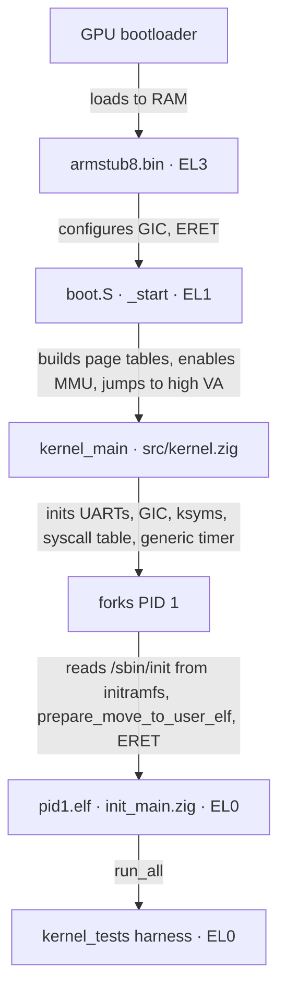

<div align="center">
  <picture>
    <source media="(prefers-color-scheme: dark)" srcset="assets/flashos_logo_dark.png">
    
  </picture>

<h1>Documentation</h1>

<p>
    <a href="README.md"><b>README</b></a> ·
    <b>Documentation</b> ·
    <a href="SETUP.md"><b>Setup</b></a> ·
    <a href="MIGRATION.md"><b>Migration</b></a> ·
    <a href="VERSIONING.md"><b>Versioning</b></a> ·
    <a href="CHANGELOG.md"><b>Changelog</b></a> ·
    <a href="LICENSE.md"><b>License</b></a>
  </p>

<p>
    <b>English</b> ·
    <a href="docs/de/DOCUMENTATION.md">Deutsch</a>
  </p>
</div>

---

This page is the architectural overview of FlashOS: how the boot path,
memory layout, scheduler, syscalls, IRQ handling, tracing, and the
test harness fit together. Module names below refer to actual files
in the repository.

## Contents

1. [Source layout](#1-source-layout)
2. [Boot path](#2-boot-path)
3. [Memory management](#3-memory-management)
4. [Process management &amp; scheduling](#4-process-management--scheduling)
5. [Syscalls &amp; exceptions](#5-syscalls--exceptions)
6. [Kernel symbol table](#6-kernel-symbol-table-ksyms)
7. [Tracing](#7-tracing)
8. [Testing](#8-testing)
9. [Build artefacts](#9-build-artefacts)

## 1. Source layout

```text
src/                       Kernel core (Zig + AArch64 assembly)
  start.zig                Build root: comptime-imports every kernel module
  kernel.zig               kernel_main + bring-up
  boot.S                   _start, EL3→EL1, MMU bring-up, jump to high VAs
  entry.S                  Exception vector table + syscall dispatch
  utils.S, mm.S            Assembly helpers
  sched.S, irq.S           Context switch + IRQ enable/disable
  generic_timer.S          CNTP system register helpers
  symbol_area.S            Generated kernel symbol table (see §6)
  asm_defs.inc             Bridge header — pulls in board_asm_defs.inc
  asm_defs_common.inc      Shared assembler-only macros (board-independent)

  board.zig                Comptime alias: build_options.board → board/<board>/*
  generic_timer.zig        ARM generic timer
  page_alloc.zig           Physical page allocator
  mm_user.zig              map_page, copy_virt_memory, do_data_abort
  fork.zig                 copy_process, prepare_move_to_user[_elf]
  sched.zig                Priority round-robin scheduler
  sys.zig                  Syscall table + handlers
  utilc.zig                memcpy/memset/panic + main_output helpers
  elf.zig                  ELF64 header + program-header parser (host-testable)
  task_layout.zig          Canonical extern-struct layouts (TaskStruct, MmStruct, …)
  user_layout.zig          User VA constants (TEXT/DATA/HEAP/STACK bases + flags)
  block_dev.zig            BlockDev vtable: board-agnostic LBA read/write indirection
  sdhci_cmd.zig            SDHCI CMDTM bit layout, CMDx constants, CSD v2 parser, clock divisor
  mailbox.zig              VideoCore property-tag message layout + parsing (board-agnostic)
  fat32.zig                FAT32 BPB/FAT/dir-entry decode + cluster-chain walk (host-testable)
  fat32_backend.zig        FAT32 VfsOps backend: read + writeBack over block_dev (real SD I/O — Pi-HW path; replaced the earlier fat32_stub.zig)
  usb_descriptors.zig      USB CDC-ACM descriptor set + SETUP-packet decode (host-testable)

  board/rpi4b/             Raspberry Pi 4 driver bag
    uart.zig               Mini-UART driver (console)
    gpio.zig               GPIO pin function/enable
    timer.zig              BCM2711 system timer
    irq.zig                BCM2711 GIC + dispatch + invalid-entry reporter
    emmc2.zig              BCM2711 EMMC2 SDHCI driver — PIO single-block read/write
    mailbox.zig            VideoCore mailbox MMIO doorbell (pairs with src/mailbox.zig)
    usb.zig                BCM2711 DWC2 USB-OTG device (gadget) — CDC-ACM console
    boot_quirks.S          Pi-specific boot fixups
    board_asm_defs.inc     Pi memory-layout addresses + macros
    linker.ld              Per-board kernel link script

  board/virt/              QEMU `-M virt` driver bag
    uart.zig, gpio.zig, timer.zig, irq.zig   (virt MMIO addresses)
    dtb.zig                Minimal DTB walker for runtime device-address discovery
    usb.zig                No-op USB gadget stub (board-API parity with rpi4b)
    image_header.S         Linux arm64 image header (UEFI/GRUB compatibility)
    boot_quirks.S          virt-specific boot fixups
    board_asm_defs.inc     virt memory-layout addresses + macros
    linker.ld              virt kernel link script

  trace/
    trace_main.zig         Patchable-entry tracing
    utils.zig              Trace I/O helpers (PL011)
    ksyms.zig              Kernel symbol table lookup
    pl011_uart.zig         Dedicated PL011 trace UART driver
    hook.S                 Trace hook stub (saves regs, calls 'traced')

user_space/
  init_main.zig            PID 1 ELF root (staged at /sbin/init)
  kernel_tests.zig         In-kernel test harness ([TEST]/[PASS]/[FAIL])
  lib/flibc/               Userland mini-libc for ELF-loaded programs
    flibc.zig              Root re-exports (printf, malloc, fork, ...)
    syscalls.zig           Raw SVC wrappers (sys.write/fork/exit/...)
    io.zig                 printf / puts / write on sys_writeConsole
    heap.zig               Bump allocator over sys_brk / sys_sbrk
    process.zig            fork / wait / exit / execve glue

lib/
  syscall_defs.zig         Shared SYS_* IDs (kernel + user side)

tools/
  hello_elf.zig + .S       Hand-rolled ELF for [TEST] exec-elf
  stackbomb_elf.zig + .S   Recursive stack-blower for [TEST] stack-overflow
  flibc_demo_elf.zig + .S  flibc-driven demo for [TEST] flibc
  hello_linker.ld          Single-PT_LOAD layout (hello + stackbomb)
  flibc_demo_linker.ld     Single-PT_LOAD layout with .rodata folded in

tests/
  host_stubs.zig           Shared linker stubs for 'zig build test'
  host_stubs_pipe.zig      Pipe-test page-alloc stub
  host_stubs_sched.zig     Sched-test HW-side stubs
  host_stubs_initramfs.zig File/initramfs stubs (typed `current`)
  host_stubs_vfs.zig       VFS-test stubs

armstub/src/
  armstub8.S               EL3→EL1 bootstrap shim
  asm_defs.inc             Armstub-only assembler macros
  linker.ld                Armstub link script (.text at 0)
  root.zig                 Empty Zig root (build API requirement)

scripts/
  clear_syms.zig           Reset src/symbol_area.S to its placeholder form
  generate_syms.zig        Read 'aarch64-elf-nm' and emit src/symbol_area.S
  make_iso.sh              GRUB-EFI rescue ISO builder (virt only)

assets/                    Logo and visual assets

build.zig                  The only build entry point
build.sh                   Two-pass build orchestrator + deploy prompt
config.txt                 RPi 4 firmware configuration
```

## 2. Boot path



1. The GPU bootloader loads `armstub8.bin` and `kernel8.img` into RAM
   and starts the cores at EL3.
2. `armstub/src/armstub8.S` configures secure-mode registers, enables
   the GIC, and `eret`s to EL1.
3. `_start` (`src/boot.S`) sets the stack, clears `.bss`, builds the
   identity and high page tables, wakes the secondary cores,
   initialises `TCR_EL1` / `MAIR_EL1` / `VBAR_EL1` / `TTBR0` / `TTBR1`
   explicitly (required for QEMU; on real hardware armstub leaves
   these in a sane state), enables the MMU with an `ISB` after
   `SCTLR.M=1`, and jumps to `kernel_main` via the high virtual
   mapping.
4. `kernel_main` (`src/kernel.zig`) initialises the mini-UART, the
   PL011 trace UART, the GIC, the kernel symbol table, the syscall
   table, and the generic timer, then forks PID 1 and enters the
   scheduler loop.
5. PID 1 (`kernel_process`) reads `/sbin/init` — the `pid1.elf`
   image staged in the embedded initramfs — and hands its bytes to
   `prepare_move_to_user_elf`, which walks the PT_LOAD segments,
   maps each with per-region permissions, eagerly maps the top
   stack page, and `eret`s to the ELF entry point.
6. `user_space/init_main.zig` is the `pid1.elf` root: `_start`
   calls `pid1_main`, which runs `run_all()` from
   `kernel_tests.zig`. The harness runs the twenty-seven scenarios and
   prints an `X/Y passed` tally, then hands PID 1 to `/bin/login`:
   the login gate authenticates against `/etc/shadow`,
   drops privilege per `/etc/passwd`, and execs the user's shell —
   the boot ends at the interactive shell prompt (§4).

## 3. Memory management

A four-level translation regime: PGD → PUD → PMD → PTE, 4 KiB pages.

### Physical layout (RPi 4, 4 GiB SKU)

| Range                           | Region            | Usage                              |
| :------------------------------ | :---------------- | :--------------------------------- |
| `0x00000000`–`0x38400000`  | 0 – 948 MiB      | Free / kernel image at `0x80000` |
| `0x38400000`–`0x40000000`  | 948 – 1024 MiB   | VideoCore reserved                 |
| `0x40000000`–`0xFC000000`  | 1 GiB – 3960 MiB | `get_free_page` pool             |
| `0xFC000000`–`0x100000000` | > 3960 MiB        | MMIO (GIC, UART, GPIO)             |

### Kernel virtual layout (EL1)

| Region       | Virtual base           | Physical base  | Attributes            |
| :----------- | :--------------------- | :------------- | :-------------------- |
| Identity map | `0x0000000000000000` | `0x00000000` | Normal-NC (0–16 MiB) |
| Linear high  | `0xffff000000000000` | `0x00000000` | Normal-NC             |
| VC hole      | `0xffff00003B400000` | `0x38400000` | unmapped              |
| RAM high     | `0xffff000040000000` | `0x40000000` | Normal-NC             |
| Device high  | `0xffff0000FC000000` | `0xFC000000` | Device-nGnRnE         |

Translation between physical and the linear-high mapping uses
`PA_TO_KVA` / `KVA_TO_PA` from `src/mm_user.zig`.

### User virtual layout (EL0)

Constants are defined in `src/user_layout.zig` (Zig-authoritative,
imported by both `src/fork.zig` and `src/mm_user.zig`).

| Region | Virtual base           | Direction      | Attributes (post-loader) |
| :----- | :--------------------- | :------------- | :----------------------- |
| Text   | `0x0000000000000000` | static         | RWX (no UXN, no RO bit)  |
| Data   | `0x0000000000100000` | static         | RW- (UXN)                |
| Heap   | `0x0000000000200000` | grows up (brk) | RW- (UXN)                |
| Stack  | `0x00000FFFFFFFF000` | grows down     | RW- (UXN), guard below   |

Text is mapped RWX today: the loader's default page bag grants EL0
read/write and clears UXN, and no read-only (AP[2]) descriptor bit is
defined, so W^X is not yet enforced for user code. Data, heap, and stack
add UXN for RW-NX.

The 16 TiB gap between `HEAP_BASE` and `STACK_TOP` makes the heap/
stack guard implicit — any access in that range is a wild pointer
and `do_data_abort` panics with `[KERN] invalid uva at 0x<hex>` after
zombie-ing the offending task (the parent's `sys_wait` reaps as
usual). Region classification keys off `mm.brk` plus the static
layout constants in `src/user_layout.zig`; see `do_data_abort` in
`src/mm_user.zig` for the full dispatch.

Per-region attributes (text RX, data/heap/stack RW with UXN) apply
universally now that PID 1 is ELF-loaded from initramfs:
`prepare_move_to_user_elf` (`src/fork.zig`) maps each PT_LOAD
segment with flags derived from `p_flags`, and `do_data_abort`
(`src/mm_user.zig`) stamps demand-allocated heap and stack pages
with `TD_USER_PAGE_FLAGS_DEFAULT | TD_USER_XN`. The non-ELF blob
path (`prepare_move_to_user`) backed the retired blob loader and no
longer has a live caller; every task today is ELF-loaded with
per-region attributes.

### User pages

`map_page` walks (and lazily allocates) PGD/PUD/PMD/PTE tables for
the target task, then writes a leaf PTE with the supplied permission
bag (`user_layout.TD_USER_PAGE_FLAGS_DEFAULT` for the historical
combined-permission stamp; the ELF loader picks per-region values).
`allocate_user_page` is the convenience wrapper that also pulls a
fresh physical page from `get_free_page`. Translation faults
(`dfsc == 0x4..0x7`) enter `do_data_abort`, which dispatches by
region:

| Fault UVA range                         | Action                                 |
| :-------------------------------------- | :------------------------------------- |
| `[HEAP_BASE, current.mm.brk)`         | Demand-allocate (RW+UXN); OOM → `[KERN] OOM` + zombie |
| `[STACK_LOW, STACK_TOP)`              | Demand-allocate (RW+UXN); OOM → `[KERN] OOM` + zombie |
| `[STACK_GUARD_LOW, STACK_GUARD_HIGH)` | Panic `stack overflow` + zombie task |
| `[TEXT_BASE, DATA_BASE)`              | Panic `text fault` + zombie task     |
| anything else                           | Panic `invalid uva` + zombie task    |

Every task is ELF-loaded: PID 1 plus the
`{hello,stackbomb,flibc_demo}.elf` payloads under `/test/` honour
their link-time `p_vaddr`, so absolute pointers, switch jump tables,
and arrays-of-pointers all resolve correctly. The retired blob
loader, which copied a non-ELF image to UVA `0` regardless of its
link-time address, no longer exists.

### Out-of-memory policy

`get_free_page` returns the page PA on success, **`0` on exhaustion**
(`src/page_alloc.zig`). `0` is an unambiguous sentinel — the pool starts
at `MALLOC_START` (`0x40000000`), so no live allocation is ever PA 0 —
and `get_kernel_page` propagates it as a raw `0` (never `pa_to_kva(0)`,
which would be a valid-looking KVA and hide the failure). Every
allocation site checks `== 0` and fails its operation cleanly rather
than aborting the kernel:

- `mm_user.map_page` returns `-1` on a mid-walk allocation failure,
  rolling back any intermediate PGD/PUD/PMD/PTE tables it created in that
  call (so the failure is page-balance-neutral) and **never** writing a
  descriptor that maps PA 0. `allocate_user_page` frees the orphaned
  user page if the subsequent `map_page` fails.
- `fork.copy_process` releases the partially- or fully-built child mm
  (`sched.release_user_mm`) on both failure paths — a `copy_virt_memory`
  failure and task-slot exhaustion — before freeing the TaskStruct page.
- `pipe` / `file` / `openFile` / `exec` turn an allocation `0` into a
  syscall `-1` (see §5).

Two fault paths keep a process-level reaction instead of a syscall
return:

- **Fault-context demand-alloc** (`do_data_abort`, heap/stack) is not
  recoverable — the faulting instruction cannot resume without the page.
  On exhaustion it emits `[KERN] OOM at 0x<hex>` (joining the
  `stack overflow` / `text fault` / `invalid uva` marker family) and
  zombifies the task via `exit_process`; the parent's `sys_wait` reaps.
- **`execve` / `exec` post-teardown** OOM: the caller's address space is
  already gone (`pgd == 0`), so a loader `-1` past the point of no return
  emits `[KERN] OOM` and zombifies it (a controlled zombie), mirroring
  the fault path.

The **soft** path is the opposite: `copy_from_user` / `copy_to_user`
prefault through `mm_user.soft_demand_alloc`, which returns `-1` on
exhaustion **without** `exit_process` — a syscall handed a heap/stack
address that can't be backed fails cleanly and the task survives.

Under the current caps real pool exhaustion is unreachable from userland
(`MAX_PAGE_COUNT * NR_TASKS` caps all live user memory at 8 MiB against a
~3 GiB pool), so the sentinel contract is exercised by the host test
suite (`page_alloc`, `mm_user`, `sched`, `fork`) rather than in-kernel.
There is no `free()` / `sys_mmap` yet — the allocator is allocate-only
plus the per-task mm sweep on reap; a general allocator is v1.x.

### Kernel-resident IPC pages

Anonymous pipes (`src/pipe.zig`) allocate one
4 KiB page per `Pipe`: header (refs + head/tail + readers/writers
wait queues) at the front, byte ring filling the rest. The page is
**not** tracked in `mm.user_pages` or `mm.kernel_pages` — its
lifetime is owned by `Pipe.refs`. Fork dups the per-task fd table
(refcount bump per inherited slot); `do_wait` calls
`pipe.closeAll(zombie)` before sweeping the mm pages so any
unclosed fds drop their refs cleanly. This is the only category of
kernel page today whose lifetime is decoupled from the per-task
mm sweep.

The console RX layer (`src/console.zig`) keeps a
256-byte ring in BSS — no `get_free_page` allocation on the IRQ →
syscall path. Single producer (IRQ-side `console_push`) / single
consumer (`sys_read` on a `console`-tagged fd) by construction on
single core; the
per-ring `WaitQueue` blocks readers on the empty branch and wakes
on each push.

### Embedded initramfs

The initramfs is linked into the kernel image as a `.initramfs`
section between `bss_end` and `id_pg_dir` in both board linker
scripts. `tools/initramfs.S` carries a `.incbin "initramfs.cpio"`
between `__initramfs_start` / `__initramfs_end` labels; the build
stages `pid1.elf` at `/sbin/init` and `hello.elf` / `stackbomb.elf`
/ `flibc_demo.elf` at `/test/*.elf` via the hand-rolled `scripts/build_initramfs.zig` encoder over a
sorted arc list (fixed mtime/uid/gid/ino so the archive is a pure
function of contents + name list). `src/initramfs.zig`
exposes an `Iterator` + `locate(path)` walker over the newc bytes
through the TTBR1 alias of the section, host-tested against
synthetic fixtures. PID 1 (`kernel_process`) reads `/sbin/init` from
this archive and hands it to `prepare_move_to_user_elf`; the
harness scenarios reach `/test/{hello,stackbomb,flibc_demo}.elf`
either by hand (`sys_openFile` + `sys_read`) or through the
path-resolved loader `sys_execve`. The whole archive
is read-only and lives in the kernel's address space — `File`
handles allocated by `src/file.zig` carry an offset into the
section, not a copy of the bytes. The file
syscalls reach this archive through the VFS shim (next subsection)
rather than calling `initramfs.locate` directly; PID 1's
`kernel_process` is the one remaining direct caller, because it runs
before the syscall path is wired.

### Filesystem layout (VFS shim)

`src/vfs.zig` is a 1-bit-superblock dispatch layer
sitting between the file syscalls and the storage backends. It owns
a fixed two-slot mount table and routes each path by prefix:

| Path prefix     | Slot | Backend                                    |
| :-------------- | :--: | :----------------------------------------- |
| `/mnt/…`     |  1  | FAT32 —`src/fat32_backend.zig`          |
| everything else |  0  | initramfs —`src/initramfs_backend.zig`  |

initramfs is the root `/`; FAT32 mounts at `/mnt` (the system still boots if the SD card is
unreadable). The EMMC2 driver
(`src/board/rpi4b/emmc2.zig`) is **verified on real Pi-4 hardware**:
init + write_block + read_block + byte
compare all green against a 64 GB SDXC formatted FAT32 (MBR, name
`BOOT`), Pi booting FlashOS off EMMC2 with the Toshiba USB removed.
The first real-card run uncovered one driver bug — write_block and
read_block were polling `BUFFER_WRITE_READY`/`BUFFER_READ_READY`
before every 32-bit word; those interrupts fire once per block on the
BCM2711 Arasan controller. The loop now waits once, bursts all 128
words through `DATAPORT`, then waits for `DATA_DONE` (the canonical
SDHCI single-block PIO pattern).

The `/mnt` slot is backed by the real
`src/fat32_backend.zig` (it replaced `fat32_stub.zig`): `fat32.zig`
decodes the BPB / FAT / root-dir on `init()`, and the backend's
`open` / `read` / `seek` / `close` / `write` walk and mutate the
cluster chain over `block_dev.sd_dev`. **On-disk layout** matches
`scripts/format_sd.sh`: a single MBR primary partition, type `0x0c`
(FAT32-LBA), starting at **LBA 2048**, labelled `BOOT`, spanning the
disk. The Pi-HW acceptance run seeds two files into the FAT32 root
before `picapture`: `ROUNDTR.DAT` (4 KiB of zero) and `ROUNDTR.MAG`
(1 byte of zero) — 8.3 short names (`fat32.encode8_3` rejects a
basename longer than 8). `[TEST] fs-roundtrip` uses `ROUNDTR.MAG` as the boot-to-boot witness.

**No QEMU gate exercises the real SD / FAT32 write path.** QEMU
`-M raspi4b` does not model the BCM2711 EMMC2/Arasan SDHCI well
enough to pass CMD8 (SEND_IF_COND), so `board.emmc2.init()` returns
-1 and `fat32_backend.init()` never runs; `virt` has no SD device by
design. On **both** QEMU boards `[TEST] fs-roundtrip` takes the
mount-detected SKIP path (`[PASS] fs-roundtrip (skip)`, tally still
18/18). The real Variant-B roundtrip (`[PASS] fs-roundtrip-write`
on boot 1, `[PASS] fs-roundtrip` after a power-cycle on boot 2) and
all of `fat32_backend.writeBack` / `sys_write` are validated on
**real Pi-4 hardware only**;
`zig build test` covers `src/fat32.zig`'s decode units but not
`fat32_backend.zig`. Dispatch is a
single `startsWith("/mnt/")` branch; the trailing slash is
load-bearing, so `/mnt2/foo` stays an initramfs path and `/mnt` with
no slash does too. `sys_mount`, longest-prefix matching, and path
normalisation are future work.

Each backend exposes a `VfsOps` vtable (`open` / `read` / `seek` /
`close` / `write` / `readdir`, C-ABI fn pointers; `write` is the 5th slot,
`readdir` the 6th). `vfs.vfs_open` resolves the path, dispatches to the
backend's `open`, and stashes the backing `SuperBlock` pointer in
`File.sb`; `sys_read` / `sys_write` / `sys_seek` /
`sys_close` (on a `file`-tagged fd) re-cast that opaque pointer and call back through the
vtable (`vfs.vfs_write` → backend `write`; the FAT32 backend
implements it, the initramfs backend returns -EROFS). The vtable entries are relocated to their TTBR1 high-mem
aliases at bring-up (`vfs.relocateOps`, mirroring
`sys_call_table_relocate`) so the indirect `blr` survives running at
EL1 with the user pgd installed in TTBR0.

The backend's `open` also reports the file's permission metadata
(`OpenResult.mode/uid/gid`): initramfs forwards the cpio
header's fields, FAT32 stamps its documented `0o100666` root:root
default. The syscall layer copies them onto the `File` handle and
enforces them — see §5 "VFS permission layer".

### Directory enumeration

`sys_readdir` (slot 37) is the 6th `VfsOps` entry — a
stateless `(path, index, *Dirent)` walk with no `opendir` handle and no fd
cursor (each call resolves `path` afresh and returns the `index`-th
entry). Neither backing store has a real directory inode, so the two
backends synthesise the listing differently:

- **initramfs — synthesised from path prefixes.** The newc-cpio archive
  is flat: there is no `/bin` entry, only `/bin/cat`, `/bin/echo`, … So
  `readdir` derives the listing from prefixes. For directory `path` it
  forms a `prefix` (the path plus a guaranteed trailing `/`; root `/`
  stays `/`), walks the cpio iterator, and takes the single path segment
  that follows `prefix` for each entry: a direct file child (`cat` under
  `/bin/`) surfaces as `DT_REG`; a deeper entry contributes its first
  segment as a synthetic `DT_DIR` (`bin` under `/`). The arc list is
  lexicographically sorted, so duplicate synthetic subdirectories are
  adjacent and collapse with a single de-dup. `ls /` → `bin`, `etc`,
  `sbin`, `test`; `ls /bin` → `cat`, `clear`, `dmesg`, `echo`, `forkbomb`, `fsh`,
  `less`, `login`, `ls`, `meminfo`, `passwd`, `sysinfo`. The pure `directEntry`
  helper is host-tested against a comptime cpio fixture.
- **FAT32 — root-directory 8.3 walk (Pi-only).** `readdir` reuses the
  root-walk (16 entries/sector, skipping `0x00` end / `0xE5` deleted /
  `ATTR_LONG_NAME` / `ATTR_VOLUME_ID` — the volume label is not an
  enumerable entry), renders the index-th survivor's 11-byte 8.3 field via
  the pure `fat32.decode8_3` (lowercase `name.ext`, trailing-space trim),
  and sets `d_type` from `ATTR_DIRECTORY`. Only the mount root enumerates
  this release; a subdirectory listing would need a directory-cluster walk
  (deferred — no nested directory in the demo image), so non-root
  paths list empty. Like every FAT32 path it is validated **Pi-interactive
  only**: FAT32 does not mount under QEMU (CMD8), so `vfs.resolve("/mnt/*")`
  returns null and `sys_readdir` returns -1 cleanly.

Being stateless, the walk allocates nothing — a future OOM audit
inherits no new site from this surface, which is why the stateless shape
was chosen over a POSIX `opendir` / fd-cursor handle (that would need a
faked directory `File` or a scratch-page allocation freed on close). The
POSIX handle shape is a future portable-userland revisit. The `Dirent`
ABI type is documented in §5.

## 4. Process management & scheduling

- **Scheduler.** Priority round-robin in `src/sched.zig`. `_schedule`
  picks the runnable task with the largest counter via
  `pick_next_running`; if that task's counter is zero (round end) it
  invokes `refill_counters`, which rewrites every non-null slot as
  `(counter >> 1) + priority`. Both helpers are pure and host-tested.
- **Tick.** `timer_tick` decrements `current.counter`. When it hits
  zero (and preemption is enabled) it calls `_schedule`.
- **Task states.** `TASK_RUNNING`, `TASK_INTERRUPTIBLE`, `TASK_ZOMBIE`.
- **Context switch.** `switch_to` updates `current`, programs the new
  PGD via `set_pgd`, and calls `core_switch_to` (`src/sched.S`) to
  swap callee-saved registers, FP, SP, and LR.
- **Fork.** `copy_process` allocates a kernel page for the new task,
  copies the parent's exception-frame regs, clones the user page
  table via `copy_virt_memory`, and links it into `task[]`.
- **Exit / wait.** `exit_process` calls `zombify_and_wake_parent` on
  `current` (flip to `TASK_ZOMBIE`, wake any `TASK_INTERRUPTIBLE`
  parent). `do_wait` reaps the zombie's user pages, kernel pages, and
  slot — the page balance is the test harness's leak signal.
- **Kill.** `sys_kill(pid)` walks `task[]` for a matching `.pid` and
  applies the same `zombify_and_wake_parent` helper. Self-kill is
  rejected — the running task is its own kernel page; `sys_exit` is
  the safe self-cancel path.
- **Exec.** `sys_execve(path, argv)` (slot 31, `src/execve.zig`) is the
  path-resolved ELF loader. It resolves `path` through the VFS, validates
  the ELF header, then — past the point of no return — tears down the
  caller's address space and installs a fresh PGD, streaming each
  `PT_LOAD` segment to its link-time `p_vaddr` and laying the argv block
  on the new stack before `ERET` into the entry point. The PID is
  preserved across the rebuild; a loader `-1` after teardown is the
  controlled-zombie case (see the OOM policy above).

### File-descriptor model

Each task carries a **single tagged fd table** —
`fds: [FD_TABLE_SIZE]FdSlot` on `TaskStruct` (`src/task_layout.zig`),
`FD_TABLE_SIZE = 8`. It replaces the two parallel `?*anyopaque` /
`?*File` arrays (pipes + files) that an earlier design indexed
independently, plus the synthetic console fd. The mechanics live in
`src/fdtable.zig` (`install` / `get` / `getPipe` / `getFile` /
`isConsole` / `close` / `dup2` / `dupAll` / `closeAll`), which is
kernel + host-testable pure pointer bookkeeping.

```zig
pub const Kind = enum(u8) { none = 0, console = 1, pipe = 2, file = 3 };
pub const FdSlot = extern struct {        // 16 B; 8 slots = 128 B
    ptr: ?*anyopaque = null,              // *Pipe | *File | null (console)
    kind: u8 = 0,                         // Kind; `none` == free slot
    _pad: [7]u8 = .{0} ** 7,
};
```

- **Dispatch by tag.** `sys_read` / `sys_write` / `sys_close` (slots
  32/33/34) switch on the slot's `kind` and call the per-backend helper
  (resolved through `getPipe` / `getFile`). This is the only entry
  point — the former per-kind shims are retired.
- **Console is refcount-exempt.** A `console` slot is
  `{ ptr = null, kind = console }` — the RX ring and mini-UART TX are
  process-wide singletons with no per-fd object, so `dup2` / `close` /
  `dupAll` / `closeAll` copy or clear the slot with no ref math and no
  page. This keeps the free-page invariant neutral across every fd
  operation on stdio.
- **fd 0/1/2 pre-installed.** PID 1 bring-up (`kernel_process` in
  `src/kernel.zig`) installs three `console` slots before entering
  user space. No page is allocated, so the PID-1 baseline
  `0xbbff2` is unchanged.
- **fork inherits, execve preserves.** `copy_process`
  (`src/fork.zig`) calls `fdtable.dupAll`, bumping the pipe/file ref of
  every non-console slot; `do_wait` (`src/sched.zig`) calls
  `fdtable.closeAll` on the zombie. `execve` tears down only the
  address space (`mm.*`) and **leaves `fds` intact**, so a shell hands
  a child its redirected stdio across the `exec` boundary.
- **`dup2`** closes an open `newfd` (ref dropped by kind), points it at
  `oldfd`'s backend, and bumps the ref; `dup2(fd, fd)` is a no-op.
  This is the primitive behind shell fd redirection (`[TEST]
  fd-redirect`, §8).

### Shell & userland (fsh)

The syscall surface is assembled into an interactive shell,
`fsh`, staged in the initramfs at `/bin/fsh`, plus the `/bin/echo` and
`/bin/cat` coreutils, plus `/bin/ls`, `/bin/meminfo`, and
`/bin/forkbomb`. fsh and the coreutils link against **flibc**
(`user_space/lib/flibc/`), the userland mini-libc: SVC wrappers, a
comptime-format `printf`, the `_start` argc/argv shim, and — for payloads
that trip LLVM's `memcpy` / `strlen` idiom lowering — a freestanding
`mem.zig` provider. Every buffer is fixed-size stack/static; there is no
userland allocator this release (heap is future work), so the single R+X
PT_LOAD each payload links into carries no writable `.bss`.

- **REPL.** `fsh` reads `/etc/fshrc` once at startup (`open` → `read` →
  `close`; comment and blank lines skipped, every other line dispatched),
  then loops: print prompt → `readline` (fd 0) → tokenize → dispatch.
- **`readline`** is a userland line editor over `sys_read(0, &b, 1)`:
  printable bytes echo, BS/DEL erase, CR/LF submits, `^D` on an empty
  line is EOF (logout), `^C` abandons the line. The kernel console stays
  dumb — `sys_setConsoleMode` is inert; raw/cooked is a future PTY
  concern. The byte→buffer state machine is pure and host-tested.
- **Tokenizer.** Whitespace split into a fixed `argv[]` with **at most
  one** `|`; a second pipe or an empty side is rejected. The pipe
  boundary is marked by a `null` argv slot, so the left and right
  commands are already `execve`-ready NULL-terminated vectors. Pure +
  host-tested.
- **Built-ins** run in-process (no fork): `cd` (`sys_chdir`), `exit` /
  `logout`, `help`, `free` (wraps `sys_dump_free`), `reboot`
  (`sys_reboot`, resets the board). Externals fork + `execvp`;
  `execvp` resolves a bare name to `/bin/<name>` (no `$PATH` yet, no
  environment) and a slashed name verbatim. A single `|` wires `sys_pipe` +
  `dup2`: fork left (`dup2(wfd,1)`), fork right (`dup2(rfd,0)`), close
  both ends in the shell, reap both.
- **Working directory.** Each task carries `cwd` (`TaskStruct.cwd`,
  default `/`); `cd` updates it via slot 36 and relative `open`/`execve`
  join against it (§5). There is no `$HOME` / uid yet; `.fshrc` is
  a fixed initramfs path.
- **Coreutils (`/bin`).** Each is < 100 lines against flibc,
  stack buffers only (Rule 1), and doubles as a smoke test: `echo` (args
  → fd 1), `cat` (files / stdin → fd 1), `ls` (the first `sys_readdir`
  consumer — `readdir(path, i, &d)` from `i = 0` until -1, printing each
  basename plus a `/` suffix on `DT_DIR`; no args lists `cwd`), `meminfo`
  (`printf("free pages: %u\n", sys_dump_free())`, the standalone form of
  the `free` built-in), `forkbomb` (a capped 16-fork/reap leak probe
  — an interactive demo of the fork/reap page balance, not driven to
  `fork() == -1`), and `dmesg` (snapshots the kernel log ring via
  `sys_klog_read` and writes the retained boot log to fd 1, so the boot log
  is readable over the USB-C console without the Mini-UART adapter). The
  `ls` listing and the backend mechanics it surfaces are documented in §3
  "Directory enumeration".
- **PID-1 → login → fsh hand-off.** PID 1 stays the test harness:
  after `run_all` prints the `N/N passed` tally, `init_main.zig` `execve`s
  `/bin/login` *instead of* `sys_exit` (falling through to `sys_exit` only
  if execve fails). login is a **session supervisor**: it prompts for a
  username (kernel echo on) and a password (kernel masks each typed
  character with `*` via `SYS_SET_CONSOLE_MODE`), asks the kernel to
  verify the password against the active shadow database
  (`sys_authenticate`, §5), looks the user up
  in `/etc/passwd` (the shared `src/pwfile.zig` parser), then **forks** a
  child that drops privilege via `setgid` + `setuid` (gid first, while
  still root) and
  execs the user's shell — login itself stays root, waits, reaps, and
  prompts again. `exit` (or its alias `logout`) in fsh is therefore a logout
  back to `login:`, not
  the end of the boot. (The drop must live in the child: setuid is one-way
  for non-root, so a login that dropped itself could never authenticate a
  second session.) An optional argv session limit (`/bin/login 2`) makes
  it exit after N sessions — the `[TEST] login` capstone's hook (§8).
  **Reaching the interactive prompt is the boot success signal:** fsh
  prints its homescreen banner (the stable `type 'help' for commands`
  tail) at REPL entry and shows `#` (root) or `$` (everyone else) as its
  prompt; with `[TEST] login`'s two scripted sessions the CI QEMU watchdog
  (`scripts/run_qemu_test.sh`) waits for the **third** homescreen marker
  (then SIGTERMs) and asserts exactly three. On Pi / interactive QEMU the boot drops to a real login prompt,
  then a `fsh` prompt running as the authenticated user. **Unattended
  CI:** PID-1 console-injects the test credentials (`flash`/`flash`,
  `SYS_CONSOLE_INJECT`) before the exec, so the real login path
  authenticates without a typist. Neither login nor fsh's startup emits
  `sys_dump_free`, so the free-page checkpoint count stays deterministic
  (§8).

## 5. Syscalls & exceptions

The vector table is in `src/entry.S` and is loaded into `vbar_el1` by
`irq_init_vectors` (`src/irq.S`). Synchronous exceptions from EL0 are
dispatched in `handle_sync_el0_64`. SVCs go through `el0_svc` →
indexed lookup in `sys_call_table` (`src/sys.zig`); data aborts call
`do_data_abort`.

`enable_interrupt_gic` (`src/board/<board>/irq.zig`) wires interrupt IDs to a
specific core. The kernel currently routes the auxiliary IRQ
(mini-UART RX) and the non-secure physical timer. The mini-UART RX
handler drains the FIFO to empty in a single IRQ slot and feeds each
byte into the `console.zig` RX ring; the same pattern lives in the
`virt` PL011 path. See `### Console subsystem` below.

### Syscall ABI

User-space invokes a syscall by placing the syscall number in `x8`,
arguments in `x0..x5`, and executing `svc #0`. The return value is
in `x0`.

```text
x8       syscall number
x0..x5   arguments (per syscall)
svc #0   trap into the kernel
x0       return value
```

The vector at `vbar_el1 + 0x400` (`el0_svc` in `src/entry.S`)
indexes into `sys_call_table` (`src/sys.zig`) and `blr`s to the
selected handler. `NR_SYSCALLS = 48` (in `src/asm_defs_common.inc`)
is enforced by a `b.hs` check on `x8`; out-of-range numbers fall
through to the invalid-entry path. A comptime guard in `src/sys.zig`
re-asserts `defs.NR_SYSCALLS == 48` so the Zig table and the asm
literal stay in lockstep.

Because the user PGD is installed in TTBR0 at the time of the SVC,
the syscall table is rewritten at boot to high-mem addresses (the
`LINEAR_MAP_BASE` OR-in) so the `blr` lands in the kernel's TTBR1
mapping rather than chasing into UVA space.

### Syscall reference

| `x8` | Name               | Args                                              |                                         Returns                                         | Notes                                                                                                                                                                                                                                                                                                                                                                                                                                                                                                                          |
| :----: | :----------------- | :------------------------------------------------ | :-------------------------------------------------------------------------------------: | :----------------------------------------------------------------------------------------------------------------------------------------------------------------------------------------------------------------------------------------------------------------------------------------------------------------------------------------------------------------------------------------------------------------------------------------------------------------------------------------------------------------------------- |
|   0   | ~~`write_str`~~      | —              |                                          —                                          | **RETIRED** — legacy NUL-terminated console-string printer removed after the unified fd ABI (slots 31-35) replaced it; the slot number stays reserved forever and returns `-1`. The clean `write` name now belongs to the unified `(fd, buf, len)` call at slot 33                                                                                                                                                                                                                                                            |
|   1   | `fork`           | (none)                                            |                     `i32` PID of child in parent, `0` in child                     | Standard fork semantics. On task-slot exhaustion (or, contractually, page OOM) returns `-1` with the partially-built child mm released — page-balance-neutral, no half-built zombie                                                                                                                                                                                                                                                                                                                                                                                                                                                                                                        |
|   2   | `exit`           | (none)                                            |                                     does not return                                     | Marks the task `TASK_ZOMBIE`, reschedules                                                                                                                                                                                                                                                                                                                                                                                                                                                                                    |
|   3   | `wait`           | (none)                                            |                               `i32` PID of reaped child                               | Blocks on `TASK_INTERRUPTIBLE` until any child exits, then frees its pages and slot                                                                                                                                                                                                                                                                                                                                                                                                                                          |
|   4   | `dump_free`      | (none)                                            |                               `u64` count of free pages                               | **Public introspection ABI.** Prints + returns the free-page count. The in-kernel test harness uses the return value as its leak-detection signal                                                                                                                                                                                                                                                                                                                                                                              |
|   5   | ~~`exec`~~           | —            |                  —                  | **RETIRED** — legacy blob/ELF loader removed after slot 31 `execve` replaced it; the slot number stays reserved forever and returns `-1`                                                                                                                                                                               |
|   6   | `kill`           | `x0 = pid`                                      |                              `i32` 0 on hit, -1 on miss                              | Finds the task with matching `pid`, flips it to `TASK_ZOMBIE`, wakes the parent. **Self-kill is rejected** — use `exit`                                                                                                                                                                                                                                                                                                                                                                                           |
|   7   | `openFile`       | `x0 = const u8 *` (NUL-terminated path)         |                 `i32` fd ≥ 0 on success, -1 on miss / alloc failure, -13 (`-EACCES`) on a permission denial                 | Dispatches the path through the VFS shim (`vfs.vfs_open`, see §3) to the matching backend, runs the permission check (open is read-intent — the caller's effective ids against the file's mode/owner, root bypasses; denial returns `-EACCES` before any `File` page is allocated), allocates a `File` page (`src/file.zig`), stashes the backing `SuperBlock` + the file's mode/uid/gid in the `File`, installs the handle into the per-task `open_files` slot. Path UVA reaches the kernel via `copy_from_user`; a wild UVA returns `-1` via the soft path in `mm_user.check_and_prefault_user_range` — caller does **not** zombify                                                                                                                                                                           |
|   8   | ~~`readFile`~~       | —       |           —           | **RETIRED** — legacy per-kind file read removed after slot 32 `read` replaced it; the slot number stays reserved forever and returns `-1`                                                                                                                                                                                                                                                                 |
|   9   | ~~`writeFile`~~      | —      |        —        | **RETIRED** — legacy per-kind file write removed after slot 33 `write` replaced it; the slot number stays reserved forever and returns `-1`. FAT32 write-back (`/mnt/…`) now routes through the unified `write` |
|   10   | `seek`           | `x0 = fd`, `x1 = i64 off`, `x2 = whence`    |                   `i64` new offset, `-1` on bad fd / out-of-range                   | `whence = 0` SEEK_SET, `1` SEEK_CUR, `2` SEEK_END. Bounds check `[0, File.size]`                                                                                                                                                                                                                                                                                                                                                                                                                                       |
|   11   | ~~`closeFile`~~      | —                                       |                              —                              | **RETIRED** — legacy per-kind file close removed after slot 34 `close` replaced it; the slot number stays reserved forever and returns `-1`. `do_wait` still reclaims a zombie's leaked fds via `fdtable.closeAll`                                                                                                                                                                                                                                                                                                          |
|   12   | `brk`            | `x0 = addr` (or 0 to read)                      |       `i64` new break, or current break if `addr == 0`, `-1` on bad request       | Sets the heap break (rounded up to PAGE_SIZE). Bounds:`[HEAP_BASE, STACK_TOP - STACK_BUDGET)`. Pages are demand-allocated by `do_data_abort`; shrinks unmap + free the released pages and TLB-flush via `set_pgd`. Heap OOM therefore surfaces on first touch as `[KERN] OOM` + zombie (the fault path), not as a `brk` return                                                                                                                                                                                                                                                                                                        |
|   13   | `sbrk`           | `x0 = delta` (i64)                              |                   `i64` previous break, `-1` on overflow / range                   | Convenience wrapper:`brk(current + delta)`. Returns the *previous* break                                                                                                                                                                                                                                                                                                                                                                                                                                                   |
|   18   | `pipe`           | (none)                                            |       `i64` packed (`(wfd << 32) \| rfd`), `-1` on alloc or fd-table failure       | Allocates a 4 KiB Pipe page (header + ring). Two fds installed in the unified `current.fds` table (`fdtable.install(.pipe, …)` ×2), `refs = 2`. Single-producer / single-consumer per end; multi-reader/writer deferred. The two ends are read/written via the unified slots 32/33                                                                                                                                                                                                                                                                                                                                       |
|   27   | ~~`pipe_read`~~      | —       | — | **RETIRED** — legacy per-kind pipe read removed after slot 32 `read` replaced it; the slot number stays reserved forever and returns `-1`                                                                                                                                                                                                                                                              |
|   28   | ~~`pipe_write`~~     | —|                         —                         | **RETIRED** — legacy per-kind pipe write removed after slot 33 `write` replaced it; the slot number stays reserved forever and returns `-1`                                                                                                                                                                                                                                                                                                                                                               |
|   29   | ~~`pipe_close`~~     | —                                       |                              —                              | **RETIRED** — legacy per-kind pipe close removed after slot 34 `close` replaced it; the slot number stays reserved forever and returns `-1`                                                                                                                                                                                                                                                                                                                                                                                                                    |
|   23   | ~~`openConsole`~~    | —             |                         —                         | **RETIRED** — legacy console open removed; fd 0/1/2 are real `console` slots pre-installed on PID 1 (see §4 "File-descriptor model"). The slot number stays reserved forever and returns `-1`.                                                                                                                                                                                                                                                                                                                                                              |
|   24   | ~~`readConsole`~~    | —                    |                —                | **RETIRED** — legacy console read removed after slot 32 `read` on a `console` fd replaced it; the slot number stays reserved forever and returns `-1`                                                                                                                                                                                                                                                                                                                                                      |
|   25   | `setConsoleMode` | `x0 = u64 mode`                                   |                                          `i64` 0                                          | **Console echo/mask flags.** `mode & CONSOLE_MODE_ECHO` on ⇒ the kernel echoes drained printable console bytes back through the console TX mux (cooked-style); `mode & CONSOLE_MODE_MASK` on ⇒ it echoes a `*` per printable byte instead (password masking; mask wins if both are set); neither (the boot default) keeps the historical split where the kernel never echoes and userland `readline` owns echo. `/bin/login` sets echo for the username and mask for the password, then clears both before exec'ing the shell. Two bits for now; full termios / line discipline is still future work                                                                                                                                                                                                                                                                                                                                                                     |
|   26   | `closeConsole`   | (none)                                            |                                          void                                          | Inert (fd-table teardown — not yet wired)                                                                                                                                                                                                                                                                                                                                                                                                                                                                                        |
|   30   | `console_inject` | `x0 = byte`                                     |                                          void                                          | **Debug only — not part of the stable ABI.** Pushes one byte into the kernel RX ring as if it had arrived on the UART. Powers deterministic `[TEST] console-echo` coverage on QEMU where there is no external input driver. To be removed once a real host-input driver lands                                                                                                                                                                                                                               |
|   31   | `execve`         | `x0 = const char *path` (NUL-terminated), `x1 = char *const argv[]` (NULL-terminated) | `i32` 0 (does not return on success), -1 on resolve / parse / alloc / argv-fault failure, -13 (`-EACCES`) when the target's mode denies the caller exec | Path-resolved ELF loader (supersedes slot 5 `exec`). The permission layer gates it on the exec bit: the caller's effective ids are checked against the target's mode/owner right after the VFS resolve and **before** the address-space teardown, so a denied exec soft-fails to `-EACCES` with the caller intact (root bypasses). Resolves `path` through the VFS shim, streams the whole ELF into a static kernel buffer (no `PAGE_SIZE` cap), copies argv onto the new top stack page (entry contract `x0 = argc`, `x1 = argv`, AAPCS64), tears down the caller's address space, then maps the new image. Path + argv UVAs reach the kernel via `copy_from_user`; a wild UVA returns `-1` via the soft path in `mm_user.check_and_prefault_user_range` — caller does **not** zombify (every copy completes before the teardown point-of-no-return). The fd table (`current.fds`) is deliberately **preserved** across the teardown, so a shell hands a child its redirected stdio. A post-teardown loader OOM emits `[KERN] OOM` and zombifies the caller (controlled zombie — the address space is already torn down) |
|   32   | `read`           | `x0 = fd`, `x1 = u8 *buf`, `x2 = len`       | `i64` bytes read (short read OK), `0` on EOF, `-1` on bad fd | **Unified read.** Looks `fd` up in `current.fds` and dispatches on the slot tag: `console` → console RX path, `pipe` → pipe ring drain, `file` → backend `read`. Superseded the per-kind read shims (retired slots 8/24/27). `buf` UVA reaches the kernel via `copy_to_user`; a wild UVA returns `-1` via the soft path, no zombification |
|   33   | `write`          | `x0 = fd`, `x1 = const u8 *buf`, `x2 = len` | `i64` bytes written, `-1` on bad fd, -13 (`-EACCES`) when a `file` fd's mode denies the caller write | **Unified write** (owns the clean `write` name — the legacy NUL-terminated console printer formerly at slot 0 `write_str` is retired). Dispatches on the `current.fds` slot tag (`console`/`pipe`/`file`). On a `file` fd the permission layer checks write-intent against the mode/uid/gid carried on the `File` since open (open is read-intent only in this ABI, so a readable-but-not-writable file opens fine and is refused here; root bypasses). Superseded the per-kind write shims (retired slots 9/0/28). `buf` UVA reaches the kernel via `copy_from_user`; a wild UVA returns `-1` via the soft path, no zombification |
|   34   | `close`          | `x0 = fd`                                       | `i32` 0 on hit, -1 on miss | **Unified close.** Clears the `current.fds` slot and drops the backing object's ref by kind (`pipe`/`file`); `console` slots are refcount-exempt (no per-fd object). `file` fds also route through `vfs_close`. Superseded the per-kind close shims (retired slots 11/29) |
|   35   | `dup2`           | `x0 = oldfd`, `x1 = newfd`                      | `i32` `newfd` on success, -1 on bad `oldfd`/`newfd` | **POSIX `dup2`.** If `newfd` is open it is closed (ref dropped by kind) first; `newfd` then points at `oldfd`'s backend and its ref is bumped (`console` is refcount-exempt). `dup2(fd, fd)` is a no-op returning `fd`. The primitive behind shell fd redirection |
|   36   | `chdir`          | `x0 = const u8 *path` (NUL-terminated)          | `i32` 0 on success, -1 on wild UVA / un-terminated / oversize | **Working directory.** Normalises `path` against the task's `cwd` (`TaskStruct.cwd`, 256 B, default `/`) — relative paths are joined and `.`/`..`-collapsed by the pure host-tested `src/path.zig:joinResolve`, absolute paths collapse in place — and stores the result. No backend existence check this release (deferred to `sys_readdir`); the open/execve boundary joins relative paths against this stored `cwd` before the still-absolute-only `vfs.resolve`. `cwd` is inherited across `fork` and preserved across `execve` |
|   37   | `readdir`        | `x0 = const u8 *path` (NUL-terminated), `x1 = u64 index`, `x2 = Dirent *out` | `i32` 0 with `*out` filled on a hit, -1 at end-of-directory / bad path / wild UVA | **Directory enumeration.** Stateless index walk — fills the `index`-th entry of the directory at `path` and returns 0, or -1 past the last entry. No fd cursor / `opendir` handle (the POSIX shape is a future portable-userland revisit). `path` is `cwd`-joined like `open`/`chdir`, then `vfs.resolve`d (null → -1, e.g. `/mnt/*` under QEMU where FAT32 does not mount). The initramfs backend synthesises directory listings from cpio path prefixes; the FAT32 backend renders 8.3 root-directory entries (Pi-only). Path UVA in and `Dirent` UVA out both cross via the soft `copy_from_user` / `copy_to_user`; a wild UVA returns -1, no zombify. Allocates nothing — the stateless ABI adds no OOM site |
|   38   | `klog_read`      | `x0 = u8 *buf`, `x1 = u64 len` | `i64` byte count (0 on an empty ring), -1 on wild UVA | **Kernel log read.** Snapshots the most-recent `min(len, retained)` bytes of the kernel byte-ring (`src/klog_ring.zig`) into `buf`, oldest-first, and returns the count. `main_output` (`src/utilc.zig`) tees every emitted line into the 16 KiB overwrite-oldest ring, so the boot log survives in RAM; `/bin/dmesg` reads it back over the USB-C console without the Mini-UART adapter. Consume-free + stateless — every call sees the live ring, so it never blocks and holds no per-fd cursor. `buf` crosses via the soft `copy_to_user` (wild UVA → -1, no zombify); allocates nothing (the ring is static BSS, baseline-neutral). Ring capacity `KLOG_SIZE` is the shared ABI constant `dmesg` sizes its buffer to |
|   39   | `getuid`         | (none)                                            | `i64` real uid | **Process credentials.** Reports the calling task's real uid (`TaskStruct.uid`). Credentials are inherited across `fork` and preserved across `execve` |
|   40   | `geteuid`        | (none)                                            | `i64` effective uid | As `getuid`, for the effective uid — the id the VFS permission checks test against |
|   41   | `getgid`         | (none)                                            | `i64` real gid | As `getuid`, for the real group id |
|   42   | `getegid`        | (none)                                            | `i64` effective gid | As `getuid`, for the effective group id |
|   43   | `setuid`         | `x0 = u32 uid`                                    | `i64` 0 on success, -1 (EPERM) | **Privilege drop.** Root (euid 0) sets both the real and effective uid to any value — this is how `/bin/login` becomes the authenticated user. A non-root caller may only set its euid to an id it already holds (real or effective); anything else returns -1, so a dropped process can never climb back to root. No saved-uid (setresuid) this release |
|   44   | `setgid`         | `x0 = u32 gid`                                    | `i64` 0 on success, -1 (EPERM) | Mirror of `setuid` over the group ids. `/bin/login` calls it *before* `setuid` (gid first, while still root — after the uid drop it would be denied) |
|   45   | `authenticate`   | `x0 = const u8 *user`, `x1 = u64 user_len`, `x2 = const u8 *pass`, `x3 = u64 pass_len` | `i64` 0 on a match, -1 otherwise | **Kernel-owned credential verify.** Reads the active shadow database in-kernel (the execve-style no-alloc VFS recipe — baseline-neutral): the writable FAT32 copy `/mnt/shadow` first (that is where `passwd` writes), falling back to the initramfs `/etc/shadow` seed when `/mnt` is unmounted (QEMU virt), the file is absent (fresh card), or it is corrupt — the latter announced loudly (the anti-brick rule: corruption never locks the operator out, the baked-in seed credentials still work). Finds the user's line (`user:iterations:salt_hex:hash_hex`, parsed by the host-tested `src/shadow.zig`), runs PBKDF2-HMAC-SHA256 (`src/sha256.zig`) over the password with the stored salt + iteration count, and constant-time-compares (`ctEql`) against the stored verifier. The KDF and every salt/hash byte stay inside the kernel — userland sees only pass/fail. The plaintext password crosses the user→kernel boundary exactly once into a static kernel buffer (overwritten by the next call). Credential UVAs cross via the soft `copy_from_user` (wild UVA / over-long input → -1, no zombify) |
|   46   | `passwd`         | `x0 = const u8 *user`, `x1 = u64 user_len`, `x2 = const u8 *old`, `x3 = u64 old_len`, `x4 = const u8 *new`, `x5 = u64 new_len` | `i64` 0 on success, -13 (`-EACCES`) on an authorization failure, -1 otherwise | **Kernel-owned password change.** Rewrites `user`'s record in the writable FAT32 shadow (`/mnt/shadow`) with a fresh kernel-minted salt (`src/hwrng.zig`) and a PBKDF2 re-hash of the new password. Authorization: root (euid 0) may reset any record without the old password (the forgotten-password recovery path); everyone else only the record whose name maps to their own uid (`/etc/passwd` lookup via the host-tested `src/pwfile.zig`) and only with the correct old password. The rewrite is splice-safe by construction: the iteration count is kept and salt/hash are fixed-width hex, so the new line is byte-identical in length and the whole-file in-place write never changes the file size (no FAT32 dir-entry resize). Returns -1 when no writable shadow exists (QEMU virt / fresh card — the initramfs seed is immutable), the user has no record, or the rewrite would change the record length. `/bin/passwd` is the interactive consumer |

`sys_console_inject` is a documented debug syscall, not part of the
forward-stable ABI surface. It is retained because the in-kernel test
harness depends on it.

The live file ABI is `sys_openFile` (slot 7) and `sys_seek`
(slot 10), which dispatch through the VFS shim (§3) to the matching
backend. FAT32 write-back is live: writes to `/mnt/…`
route to the FAT32 backend, every other path returns -EROFS from the
initramfs backend. The former per-kind read/write/close legs (slots
8/9/11) are **retired** — the unified read/write/close (slots 32/34)
replaced them, and those slot numbers stay reserved and return `-1`. Slots
`14..17` (`sys_mmap`, `sys_munmap`, `sys_mlock`, `sys_munlock`) and
`19..22` (socket / IPC stubs) are present in `src/sys.zig` for forward
compatibility but return immediately. Slot `18` is the active
`sys_pipe`. The legacy console open/read (`sys_openConsole` /
`sys_readConsole`, slots 23/24) and the legacy per-kind pipe
read/write/close (`sys_pipe_read` / `_write` / `_close`, slots 27/28/29)
are **retired**: their handlers are gone, the unified fd ABI replaced
them, and those slot numbers stay reserved and return `-1`. Slot 25
(`sys_setConsoleMode`) is live as the single-bit console
echo flag; slot 26 (`sys_closeConsole`) remains an inert stub (fd-table
teardown not yet wired). Slot `30` (`sys_console_inject`) is the
debug-only host-input shim — it also powers the unattended boot login
(PID-1 injects the CI credentials through it).

**Unified fd ABI (slots 32..35).** `sys_read` / `sys_write` /
`sys_close` / `sys_dup2` operate on any fd by looking it up in the
per-task tagged `fds` table (§4 "File-descriptor model") and
dispatching on the slot kind. The former per-kind console/pipe/file
read/write/close calls have been **retired**: their kernel handlers are
deleted, the dispatch table routes those slot numbers to a stub that
returns `-1`, and the numbers stay reserved forever (never reused).
There is now one code path per backend, reached only through the
unified ABI. Slot 0's legacy `write` (`write_str`) is likewise retired;
the clean `write` name is the unified slot 33.

**Working directory (slot 36).** `sys_chdir` stores a
normalised path in `TaskStruct.cwd`; the open / execve boundary joins
relative paths against it before `vfs.resolve` (still absolute-only).
The join + `.`/`..` collapse is the pure host-tested `src/path.zig`
helper. See §4 "Shell & userland (fsh)".

**Directory enumeration (slot 37).** `sys_readdir` is a
stateless `(path, index, *Dirent)` index walk — no `opendir` handle, no
fd cursor (deferred to a future portable-userland revisit). The shared
`Dirent` ABI type (`lib/syscall_defs.zig`, the user↔kernel definition both
sides import) crosses the boundary by pointer: `name` (32-byte
NUL-terminated basename — initramfs cpio names run longer than 8.3; FAT32
fills ≤ 12 rendered 8.3 chars), `d_type` (`DT_REG` 0 / `DT_DIR` 1), and 7
pad bytes (40-byte struct, 8-byte aligned). A `size` field is deferred to
`ls -l` (fsh-v2). Backends differ: initramfs synthesises directories from
cpio path prefixes (the flat archive names no directory entry); FAT32
walks the root-directory 8.3 entries (Pi-only). See §3 "Directory
enumeration" for the backend mechanics and §4 "Shell & userland (fsh)"
for the `ls` consumer.

**Kernel log (slot 38).** `sys_klog_read(buf, len)` snapshots the
most-recent `min(len, retained)` bytes of the kernel byte-ring
(`src/klog_ring.zig`) into `buf`, oldest-first. `main_output`
(`src/utilc.zig`) tees every emitted line into the 16 KiB overwrite-oldest
ring (`KLOG_SIZE`, shared in `lib/syscall_defs.zig`), so the boot log
survives in RAM and `/bin/dmesg` reads it back over the USB-C console —
retiring the Mini-UART/FTDI adapter for boot diagnosis. The ring is
lock-free and static BSS: the tee never allocates (baseline-neutral) and
never takes a lock (`main_output` runs from kernel / syscall / IRQ context
and as early as boot before `current` exists), so a race can at worst
garble a byte, never escape the masked buffer. The read is consume-free and
stateless — every call sees the live ring. See §4 "Shell & userland (fsh)"
for the `dmesg` consumer.

**Kernel crypto + entropy.** `src/sha256.zig`
(SHA-256, HMAC-SHA256, PBKDF2-HMAC-SHA256, and the constant-time `ctEql`
compare — host-test-gated against NIST FIPS 180-2, RFC 4231, and the
published PBKDF2-HMAC-SHA256 vectors, plus `std.crypto` differential
checks) and `src/hwrng.zig` (the kernel entropy source) are the crypto
foundation for the identity work. Both are kernel-internal by
design: hashing happens inside `sys_authenticate` (slot 45, above), so key
material never crosses the user/kernel boundary and no getrandom-style
syscall exists. The sha256 module is always built ReleaseSmall — even in
Debug kernel builds — because the PBKDF2 → HMAC → SHA-256 call chain runs
on the per-task kernel stack and Debug-mode frames are large enough to
overflow a single 4 KiB stack page (see the note in `build.zig`). That
stack is its own page, allocated separately from the
`TaskStruct`, so even an overflow can no longer reach the credential
fields stored on the task — the failure mode the `[TEST] authenticate`
canary guards (§8).

**Identity files.** `/etc/passwd` (`user:uid:gid:home:shell`,
world-readable, a committed file — parsed everywhere by the host-tested
`src/pwfile.zig`) and `/etc/shadow`
(`user:iterations:salt_hex:hash_hex`, generated at build time by
`tools/gen_shadow.zig` running the same `src/sha256.zig` PBKDF2 the kernel
verifies with) ship in the initramfs. `/etc/shadow` is mode `0o100600`
root:root — the cpio encoder stamps per-file modes from the build's policy
list (`build.zig`), and the VFS permission layer (below) refuses a
non-root open with `-EACCES`, so the password hashes are unreadable to a
dropped process.

The initramfs copy is the immutable **seed**; the *live* shadow database
is `/mnt/shadow` on the FAT32 card (seeded with the same bytes by
`scripts/make_test_disk.sh` for QEMU and `zig build deploy` for real
hardware, protected at `0600 root:root` by the permission overlay below).
`sys_authenticate` reads `/mnt/shadow` first and falls back to the seed;
`sys_passwd` + `/bin/passwd` rewrite it with per-change random salts
minted from `hwrng`, so changed passwords persist across reboots while
the seed always remains as the recovery anchor (corrupt or missing FAT32
state can never lock the operator out — it falls back, loudly).

**One deliberate limitation remains:** the *seed* accounts use
fixed public salts + a modest iteration count so the kernel image stays
byte-reproducible (the Pi hash baseline) and the boot-path KDF stays fast
under QEMU TCG; only `passwd`-rotated records get random salts. The
entropy source itself runs a deliberately weak fallback — CNTPCT_EL0
samples mixed through SplitMix64 — and announces it loudly at boot
(`[Debug] hwrng: fallback (timer mix, weak) ok`). The BCM2711 hardware RNG
(the RNG200 block) driver stays a named carve-out: QEMU's `raspi4b`
machine does not emulate that block, and an EL1 read of an unbacked device
address raises a synchronous external abort, so neither CI target can
exercise it. Falling back is announce-and-continue under QEMU/CI; once the
hardware driver lands, a fallback on real silicon becomes a hard failure.
`[TEST] rng` (§8) asserts the healthy announce through the kernel log
ring.

**VFS permission layer.** Every file carries `mode` / `uid` /
`gid` metadata, reported by its backend at open time (`vfs.OpenResult`)
and enforced at the syscall boundary by the pure, host-test-gated
`src/perm.zig:checkAccess`:

- **Where the metadata comes from.** initramfs entries carry the newc
  cpio header's mode/uid/gid fields; the deterministic encoder
  (`scripts/build_initramfs.zig`) stamps them from the per-file policy
  list in `build.zig` — binaries (`/bin/*`, `/sbin/init`, `/test/*.elf`)
  are `0o100755`, config files (`/etc/passwd`, `/etc/fshrc`) `0o100644`,
  and `/etc/shadow` `0o100600`, all root:root. FAT32 has no native
  owner/mode concept, so `/mnt` metadata comes from the **permission
  overlay**: a root-level text file (`PERMS.TAB`, format
  `NAME MODE UID GID` per line, parsed by the host-tested
  `src/overlay.zig`) that the backend reads once at mount time. Annotated
  basenames get their entry; un-annotated paths keep the documented
  default `0o100666` root:root (rw-rw-rw-, no exec bit — the historical
  "any process may read/write SD-card files" contract) — except the
  `shadow` basename, which floors at `0o100600` root:root even when the
  overlay is missing or corrupt, so a lost overlay can never expose the
  on-card password file. The overlay protects itself through its own
  entry; a malformed overlay is rejected wholesale (loud boot message,
  defaults + floor apply). Editing `PERMS.TAB` takes effect on the next
  mount (reboot).
- **What is checked where.** `openFile` (slot 7) checks read-intent;
  `write` (slot 33) checks write-intent against the metadata carried on
  the `File` since open; `execve` (slot 31) checks the exec bit before
  its point of no return. Denial returns `-EACCES` (-13, the first and
  so far only errno constant, `lib/syscall_defs.zig`); every other
  failure keeps the historical `-1`.
- **The rules** (classic Unix, lean): effective uid 0 bypasses
  everything (including exec of a file with no x bit — a documented
  simplification); otherwise the first matching triad decides — owner if
  `euid` matches the file's uid, else group if `egid` matches its gid,
  else other — with no fall-through to a friendlier triad.
- **The privileged door.** Kernel-internal VFS opens never run the
  check: `sys_authenticate` reads `/etc/shadow` on the caller's behalf
  (that is the point — userland asks the kernel to verify, the kernel
  reads what userland cannot), and the execve ELF streamer reads the
  file it already exec-checked.
- Carve-outs (deferred): open flags (`O_RDONLY`/`O_WRONLY`),
  `chmod`/`chown` syscalls, directory/readdir permissions, setuid bits,
  supplementary groups, ACLs.

### Security model

There is a process-identity and authentication layer: every task
carries Unix credentials, the interactive console is gated behind a
login prompt, and the filesystem enforces per-file permissions. The goal
is a faithful, teachable Unix-style boundary — not a hardened
multi-tenant one. On a single-core kernel with one shared kernel address
space, the boundary it actually defends is *unprivileged EL0 process vs.
privileged kernel + root*: a process that has dropped privilege cannot
read the password hashes, write a protected file, or exec what it may
not, and the console cannot be used without a password. The honest
non-goals are listed at the end.

**Credentials.** Each task carries `uid` / `gid` / `euid` / `egid`
(`TaskStruct`), inherited across `fork` and preserved across `execve`.
Effective uid 0 is root and bypasses every permission check. The seeded
accounts are `root` (uid 0) and `flash` (uid 1000).

**Authentication flow.** PID 1 runs the test harness, then execs
`/bin/login` (§4). login prompts for a username (console echo on) and a
password (masked with `*` via `setConsoleMode`), then asks the kernel to verify
it with `sys_authenticate` (slot 45). The kernel reads the shadow
database itself, runs PBKDF2-HMAC-SHA256 over the password with the
record's stored salt and iteration count, and constant-time-compares
against the stored verifier; the KDF and every salt/hash byte stay
inside the kernel, so userland sees only pass or fail. On success login
**forks** a child that drops privilege — `setgid` then `setuid`, group
first while still root — and execs the user's shell; login itself stays
root to reap the session and re-prompt, so `exit` is a logout back to
`login:`. The drop has to live in the child: `setuid` is one-way for a
non-root process, so a login that dropped itself could never
authenticate a second session.

**Shadow database + anti-brick.** The authoritative shadow file is a
writable FAT32 copy at `/mnt/shadow`; the read-only initramfs
`/etc/shadow` seed is the fallback when `/mnt` is unmounted (QEMU virt),
absent (a fresh card), or corrupt. A corrupt on-card shadow is announced
loudly and the baked-in seed credentials still work, so a bad write or a
damaged card can never lock the operator out. As defence in depth the
shadow basename is floored to mode `0600` even when no overlay entry
names it.

**File permissions.** Every open file carries a `mode` / `uid` / `gid`.
initramfs files take their modes from the cpio headers (the build stamps
`0600` on shadow, `0755` on binaries, `0644` on the rest, all
root:root); FAT32 files default to `0666 root:root` unless the optional
root-level `PERMS.TAB` overlay (`src/overlay.zig`) names them. The checks
run at the syscall boundary — `open` for read intent, `write` for write
intent, `execve` for the exec bit — and decide by the first matching
triad (owner if `euid` matches the file's uid, else group, else other),
with effective uid 0 bypassing. A denial returns `-EACCES` (-13).
Kernel-internal VFS opens are a deliberate *privileged door*:
`sys_authenticate` reads the shadow file on the caller's behalf — that is
the whole point of asking the kernel to verify — and the `execve` loader
reads the image it already exec-checked.

**Changing a password.** `sys_passwd` (slot 46) / `/bin/passwd` re-hash
with a fresh kernel-minted salt and rewrite the record in `/mnt/shadow`.
Root may reset any record without the old password (the recovery path);
every other caller may change only the record whose name maps to its own
uid, and only with the correct old password. The rewrite is splice-safe
by construction: the iteration count is kept and salt and hash are
fixed-width hex, so the line keeps its byte length and the whole-file
write never resizes the FAT32 directory entry.

**Secure by default.** A kernel built for hardware always boots to a real
`login:` and demands a password. The unattended CI watchdog — which has
no typist, feeding the console from `/dev/null` — would hang there
forever, so PID 1 console-injects the test credentials *only* when the
kernel is built with `-Dci-login-seed=true`. The flag defaults to
**false**: a shipped image never auto-logs-in, and a watchdog that
forgets the flag fails loud (it times out at `login:`) rather than
booting a silently password-free system.

**Credential integrity is structural.** Each task's kernel stack is its
own page, separate from the `TaskStruct` that stores its credentials
(§8). This closes a class of bug where the deepest syscall stack — the
`authenticate` PBKDF2 chain — plus a nested timer-IRQ frame could
overflow into the `uid` / `euid` fields and make a privilege drop fail;
with the stack on a different page from the credentials, an overflow can
no longer reach them. The `[TEST] authenticate` canary guards the
regression.

**Non-goals (this release).** The model is deliberately lean: no `chmod`
/ `chown`, no open-flag (`O_RDONLY` / `O_WRONLY`) intent beyond the
read/write split above, no directory or `readdir` permissions, no setuid
bits, no supplementary groups or ACLs, and no saved-uid (`setresuid`).
Effective uid 0 bypasses even the exec bit. It is a single-core kernel
with one shared kernel address space; this is a research and teaching
security model, not a hardened isolation boundary.

### Console subsystem

The board IRQ handler (`src/board/{rpi4b,virt}/irq.zig`) drains the
UART RX FIFO on every IRQ slot and pushes each byte into a 256-byte
BSS-resident ring in `src/console.zig` via `console_push`. The ring
is single-producer (IRQ) / single-consumer (syscall) by construction
on single core. `console_push` wakes the per-ring `WaitQueue`
(`src/wait_queue.zig`); the console read path blocks on it when the
ring is empty and drains a short read on wake. Echo policy lives in
user space — the kernel does *not* loop the byte back through the
TX path. When the ring is full `console_push`
(`src/console.zig:54`) silently drops the incoming byte; this is
correct for the current human-typing-rate use case and a future line-
buffered terminal mode will not change it. Console
and pipe reads are unified behind a single `sys_read(fd, buf, len)`
that dispatches on the tagged `fds` slot (§4 "File-descriptor model");
the former per-kind `sys_readConsole` is retired (its slot number stays
reserved and returns `-1`).

### USB-C gadget console (CDC-ACM)

The Pi's USB-C port is a second console transport. The
BCM2711's DWC2 USB-OTG controller is brought up as a Full-Speed USB
*device* by `src/board/rpi4b/usb.zig`: `kernel_main` calls
`usb_init()` after GIC bring-up, and the PID-0 idle loop services the
controller by polling `GINTSTS` (`board.usb.poll()`) next to the UART
RX backstop — no IRQ line, slave/PIO mode, no DMA. The device
enumerates as a CDC-ACM serial function (byte-exact descriptors in
`src/usb_descriptors.zig`, host-tested); macOS binds its built-in
`AppleUSBCDCACM` driver and creates `/dev/tty.usbmodemXXXX`.

**Connection management.** The gadget does not become
host-visible at `usb_init`. A USB bus reset hardware-disarms EP0, and
the host sends its first SETUP ~20 ms after a reset ends — so
enumeration only works while the idle loop polls at microsecond rate,
which is never the case during the boot test harness (and macOS
permanently disables a port after a few failed enumeration attempts).
`usb.zig` therefore keeps the device electrically detached
(`DCTL.SftDiscon`) until `poll()` has run gap-free for 2 s (sustained
idle, measured off CNTPCT), and only then asserts the D+ pull-up. A
stuck enumeration (10 s attached without `SET_CONFIGURATION`)
self-heals via a 1 s detach pulse — electrically a replug, which also
resets the host's port state. The scheduler timer tick additionally
polls the core while not enumerated: a 1 Hz backstop so
reset/enumeration state keeps moving when the system is busy, letting
the connection manager self-heal once idle returns.

Console flow once enumerated:

- **RX (host → fsh).** Bulk-OUT packets drain from the shared RX FIFO
  into `console.console_push` — the same ring the UART RX path feeds —
  so `sys_read(0, …)`, the wait-queue blocking, and fsh need no
  changes; the byte source is invisible to user space.
- **TX (fsh → host).** The user write path (`writeConsoleBytes` /
  `sys_writeConsole` in `src/sys.zig`) goes through a `console_tx`
  mux: `board.usb.cdc_tx` when `enumerated()`, else the Mini-UART
  (a switch, not a tee). `cdc_tx` enqueues into a bounded
  preempt-guarded TX ring; the poll loop drains it into the EP2 IN
  FIFO in 64-byte chunks. A full ring spins briefly then drops — the
  kernel never blocks on a host that stopped reading.

Kernel `[Debug]` prints, the OOM trace, and the USB driver's own
bring-up trace stay on the Mini-UART unconditionally; the USB console
carries only the user/fsh byte stream. Under QEMU (`raspi4b` models
the DWC2 registers but not the device-mode data path) `usb_init`
fails soft with `-1` and the console falls back to the Mini-UART —
this keeps the CI boot watchdog green and is also the no-cable
behaviour on real hardware. Replug re-enumeration is handled by the
connection manager: on a Mac-powered bench a replug power-cycles the
Pi, and the gadget re-enumerates deterministically once the fresh
boot reaches sustained idle. An IRQ-driven service path remains
future work.

## 6. Kernel symbol table (ksyms)

The trace machinery looks up function names by address. The table is
part of the linked image, so the build is a two-pass process:

1. **Pass 1.** `zig build` links `kernel8.elf` with a placeholder
   `_symbols` section large enough to hold the populated table
   (`scripts/generate_syms.zig:pre_allocated_size`).
2. **Extraction.** `zig build populate-syms` runs
   `aarch64-elf-nm -n kernel8.elf | sort | grep -v '\$' | zig run scripts/generate_syms.zig`, which overwrites
   `src/symbol_area.S` with `.quad` / `.string` / `.space` directives
   — one 64-byte entry per symbol, terminated by a zero-byte sentinel.
3. **Pass 2.** Another `zig build` relinks with the populated section.

`build.sh` runs both passes and diff-checks that the symbol layout
converged (i.e. inserting symbol data did not perturb addresses).

## 7. Tracing

- `-fpatchable-function-entry=2` is not enabled in the current
  Zig-only build, so the patchable-functions section is empty and
  `trace_init` is effectively a no-op. The runtime machinery is
  intact and ready to be wired up again once Zig grows an equivalent
  flag.
- When patchable entries exist, `trace_init`
  (`src/trace/trace_main.zig`) relocates the address table, overwrites
  the first `nop` of every entry with `mov x9, lr`, then patches the
  second `nop` with `bl hook`.
- `hook` (`src/trace/hook.S`) saves the argument and link registers,
  calls `traced`, restores them, then `blr`s into the original
  function. `traced` resolves the address with `ksym_name_from_addr`
  and prints the symbol name on the PL011 trace UART.

## 8. Testing

FlashOS ships two complementary test surfaces.

**Host-side unit tests** (`zig build test`).
Pure-logic kernel modules can be tested without the AArch64 runtime.
Each tested kernel module is its own test root, linked against a
host-stub object that fills in the assembly-only externs (`memzero`,
`panic`, `main_output*`, `core_switch_to`, `set_pgd`, the IRQ
masking pair, the page-allocator entry points). The shared stub set
lives in `tests/host_stubs.zig`; `sched.zig` and the
initramfs/file pair get dedicated per-target stub objects
(`tests/host_stubs_sched.zig`, `tests/host_stubs_initramfs.zig`,
`tests/host_stubs_vfs.zig`) to
avoid double-defining symbols that the module under test already
exports. The current suite totals **419 host tests** across 39
modules — see the coverage matrix below for the per-module split.

**In-kernel runtime harness** (`user_space/kernel_tests.zig`).
PID 1 enters `run_all()`, which exercises twenty-seven scenarios on real
kernel state:

- `fork-stress` — 3 × 5 fork/reap rounds with per-round and final
  free-page-count baseline checks.
- `oom-graceful` — accumulates children (each `sys_exit`s at once, but a
  running-or-zombie child holds a `task[]` slot) until `fork()` returns
  `-1` at the 64-slot cap, asserts the clean `-1` (no crash, no half-built
  zombie), reaps all, and checks the baseline is restored. The real page
  pool is never exhausted (the 8 MiB live-memory ceiling); the slot cap is
  the deterministic limiter, so the scenario is identical on both QEMU
  targets. Reachable only after the page-allocator / kernel-image overlap
  fix (see CHANGELOG).
- `kill` — fork a child, kill it by pid, parent reaps.
- `exec-elf` — fork a child, `exec` `tools/hello.elf` through the
  ELF path (parser + PT_LOAD walk + eager top-stack page),
  parent reaps.
- `execve` — fork a child, `sys_execve("/test/argv_echo.elf",
  {"argv_echo","A","B"})` through the path-resolved ELF loader (slot
  31): VFS resolve + whole-file stream into the static
  `exec_buf` + argv-on-stack + address-space teardown + remap. Child
  runs to completion, parent reaps; the teardown frees the old pages
  and the reap sweeps the loader's allocations, netting to baseline.
- `brk` — fork a child, grow heap by 16 pages (each touch fires
  `do_data_abort`'s heap-range demand-alloc), read pattern back,
  shrink to baseline, parent reaps.
- `stack-overflow` — fork a child, `exec` `tools/stackbomb.elf`,
  child recurses past `STACK_LOW` into the guard page, kernel zombies
  via `[KERN] stack overflow`, parent reaps.
- `wild-pointer` — fork a child, write to `0xDEADBEEF000`
  (heap-stack gap), kernel zombies via `[KERN] invalid uva`, parent
  reaps.
- `efault-syscall` — hand a wild canonical UVA to `sys_openFile` and
  assert it returns `-1` **without zombifying** the caller (the soft
  leg of `mm_user.check_and_prefault_user_range`).
  No fork; baseline holds (one parity `sys_dump_free`).
- `flibc` — fork a child, `exec` `tools/flibc_demo.elf` (built against
  `user_space/lib/flibc/`), demo runs `printf("flibc hello %d\n", 42)`
  + 32-byte malloc + pattern verify + `exit`, parent reaps. Validates
    flibc's printf / bump-allocator / exit layers end-to-end through the
    ELF loader.
- `pipe` — fork a child, hand a 16-byte payload through an anonymous
  pipe (parent reads, child writes), close both ends, parent reaps.
  Validates `sys_pipe` allocation, `fork`-dup of the unified `fds`
  table, the unified `read` / `write` round-trip over the pipe ends,
  and `close` ref drop + page free.
- `console-echo` — fork a child that injects 8 deterministic bytes
  (`0xC0..0xC7`) via `sys_console_inject` after a short delay, parent
  blocks in the unified `sys_read` on the pre-installed console fd 0
  (empty ring, covers the `console.rx_wq.wait` path), drains via short
  reads until the payload is collected, then byte-compare. Free-page
  baseline still the [PASS] gate. Runs entirely over the unified `fds`
  table.
- `fd-redirect` — drives the unified `read`/`write`/`close`/`dup2` ABI
  (slots 32-35) end-to-end across a fork boundary, the way a shell
  hands a child its redirected stdio. `sys_pipe` → `fork` → child
  `sys_dup2(wfd, 1)` then `sys_write(1, …)` (fd 1 starts as a console
  slot, so the write proves dup2 re-points it at the pipe backend) →
  parent `sys_dup2(rfd, 0)` then `sys_read(0, …)` → 16-byte
  byte-compare → both ends close all fds → child exits, parent reaps.
  The refcount choreography releases the pipe page on the parent's
  final `sys_close(rfd)` before the checkpoint, so the baseline holds.
- `initramfs-open` — `sys_openFile("/sbin/init")` + unified `read`
  of the first 4 bytes, asserts ELF magic `0x7f 'E' 'L' 'F'`, unified
  `close`, baseline holds. Demonstrates the read-only file path
  end-to-end against the embedded initramfs.
- `vfs-dispatch` — exercises the VFS shim's two legs: `/sbin/init`
  resolves through the initramfs backend (positive, fd ≥ 0 + clean
  close), `/mnt/this-does-not-exist` routes to the FAT32 stub and
  returns -1 (negative-but-routed), `/mnt` with no trailing slash
  stays an initramfs path and misses there. Asserts the dispatch
  contract, not the mechanism; baseline holds (one File page
  allocated and freed).
- `trace` — four sequential fork/exit/wait cycles, exercising the
  patched trampolines `copy_process` (fork), `do_wait` (wait), and
  `_schedule` (timer-tick + explicit yield). On Pi the trampolines'
  `bl hook` lands on PL011 (UART4) with each canonical name; on virt
  `pl011_uart_send_string` is comptime-stubbed and the patch path
  runs silently. Pass criterion mirrors the other reap-based
  scenarios: free-page count after the loop equals the suite baseline.
- `fs-roundtrip` — the Variant-B magic-file persistence scenario.
  Opens `/mnt/ROUNDTR.MAG`: a negative fd means `/mnt` is unmounted
  (no FAT32 — **mount-detected SKIP**, `[PASS] fs-roundtrip (skip)`,
  one parity `sys_dump_free`). Magic byte `0` → first-boot phase:
  write a 4 KiB pattern to `/mnt/ROUNDTR.DAT` via the unified `write`,
  set magic = 1, emit `[PASS] fs-roundtrip-write (reboot to verify)`.
  Magic byte `1` → second-boot phase: read `ROUNDTR.DAT` back,
  byte-compare against the formula, reset magic to `0`, emit
  `[PASS] fs-roundtrip`. Baseline check gates each non-skip branch.
  This is the only scenario that crosses a power-cycle, so it
  validates `fat32_backend.writeBack` + persistence end-to-end —
  **but only on real Pi-4 hardware**: QEMU `-M raspi4b` cannot pass
  EMMC2 CMD8 and `virt` has no SD device, so on both QEMU boards
  this scenario takes the SKIP path (see §3). Pi-HW operator runs
  it twice across a reboot.
- `readdir` — the directory-enumeration scenario. Walks
  `/bin` via the raw `sys_readdir(path, index, *Dirent)` from `index = 0`,
  asserts the known coreutils `fsh` **and** `ls` are present (robust to
  `/bin` growth — an exact count would be brittle), the end sentinel fires
  (the call past the last entry returns -1, not a runaway), and the
  stateless walk leaks nothing (free count equals baseline — the one new
  `sys_dump_free` checkpoint this scenario adds). QEMU exercises the
  initramfs synthesised-directory leg (the root mount); the FAT32 8.3 leg
  is Pi-only (`/mnt/*` does not mount under QEMU → -1 cleanly).
- `klog` — the kernel-log scenario. Calls `sys_dump_free` (which
  emits `free_pages:` through the kernel's `main_output`, teeing it into
  the ring) then `sys_klog_read` for the most-recent 256 bytes, and asserts
  the just-emitted `free_pages` marker is present — proving the
  `main_output` → ring tee and the slot-38 snapshot path. The marker is
  kernel-emitted, so the assertion is robust to USB-console state on every
  target. The single `sys_dump_free` doubles as the baseline checkpoint;
  the static-BSS ring and the warmed-stack snapshot buffer keep it
  leak-free. `/bin/dmesg` is the interactive consumer (not driven by the
  harness, like `meminfo` / `forkbomb`).
- `rng` — the kernel-entropy scenario. Runs **first** in the
  scenario order by contract: it snapshots the most-recent 4 KiB of the
  kernel log ring via `sys_klog_read` and asserts the boot-time entropy
  announce is present (`hwrng:`) and healthy (`hwrng: self-test failed`
  absent) — proving `hwrng_init` ran, its two-draw self-test passed, and
  the announce reached the ring. Running first keeps the gap between the
  boot announce and the snapshot bounded; running last would put several
  KiB of harness output in between, beyond any baseline-safe stack window.
  Both QEMU targets take the weak timer-mix fallback (QEMU emulates no
  BCM2711 RNG200); the hardware path is Pi-bench-only. The single
  `sys_dump_free` doubles as the baseline checkpoint; the 4 KiB snapshot
  buffer is a scenario-frame stack array (same budget as `fs-roundtrip`'s
  payload buffer), so the scenario is leak-free.
- `creds` — the process-credential scenario. PID-1 asserts its
  own getters report root, then forks a child that drops privilege
  (`setgid(1000)` + `setuid(1000)`), re-reads the getters, and verifies a
  dropped process is denied `setuid(0)`. The child reports a single Y/N
  verdict over a pipe so PID-1 itself never drops root (it must stay root
  to exec `/bin/login` after the harness). Reap-based and baseline-neutral
  like `pipe` / `fork-stress`.
- `authenticate` — the kernel-credential-verify scenario. Drives
  `sys_authenticate` directly: the seeded CI account must verify (0), a
  wrong password and an unknown user must both fail (-1). Also a
  kernel-stack-overflow canary: it re-reads PID-1's own credentials after
  the auth calls. The crypto call chain is the deepest syscall stack in
  the kernel; before each task's kernel stack moved onto its own
  page the stack shared a page with the `TaskStruct`, and a deep enough
  frame overflowed into the credential fields first — so this canary
  flips to `[FAIL]` if that regression ever returns. No fork; `/etc/shadow`
  is read through the kernel's no-alloc VFS path, so the scenario is
  baseline-neutral.
- `perm` — the VFS-permission scenario. Forks a child that drops
  to uid/gid 1000 and probes the enforcement points: opening `/etc/shadow`
  (mode `0o100600` root:root) must fail with exactly `-EACCES` (-13 — a
  bare -1 would mean "not found", i.e. the permission layer never fired),
  opening `/etc/passwd` (`0o100644`) must succeed, and `execve` of that
  no-x-bit file must also fail with exactly `-EACCES`. The child reports a
  Y/N verdict over a pipe; PID-1 (still root) then re-opens the same
  shadow file successfully, proving the root bypass. Reap-based and
  baseline-neutral like `creds`.
- `login` — the login-lifecycle capstone. Injects a two-session
  console script (`flash`, then `root`, each ending in `exit`), forks a
  child that execs the real `/bin/login` with its session-limit argv
  (`"2"`), and reaps it. login authenticates each session, forks a child
  that drops privilege and execs the shell, reaps it on `exit`, and
  re-prompts — the full supervisor lifecycle through the real binary. Each
  session emits fsh's homescreen marker (`type 'help' for commands`), so
  a green boot carries three (two from here + the real boot
  login); `scripts/run_qemu_test.sh` keys its success criterion and
  guards on exactly those counts. Reap-based and baseline-neutral — the
  whole tree (login + two session shells) must be reclaimed.
- `passwd` — the password-change scenario. On a board with a
  writable FAT32 shadow (`/mnt/shadow` — the QEMU rpi4b SD image and a
  deployed card are seeded with it) it runs the full roundtrip: root
  resets the `flash` record without the old password (the self-healing
  recovery path), rotates it to a temp password and proves the change
  through `sys_authenticate` (new verifies, old stops working), then a
  dropped child (uid 1000) is denied a foreign record and its own record
  with a wrong old password (both exactly `-EACCES`) before restoring the
  seed password through the legitimate own-record + correct-old-password
  path. On virt (no SD card) `sys_passwd` must answer the documented `-1`
  and the scenario emits `[PASS] passwd (skip)` — the same SKIP pattern as
  `fs-roundtrip`. Carries the same kernel-stack canary as `authenticate`.

Each scenario emits `[TEST] name` … `[PASS] name` (or `[FAIL]`), and
`run_all` prints a final `X/Y passed` tally. The harness runs
identically under QEMU (`zig build -Dboard=virt run-virt` /
`-Dboard=rpi4b run`) and on real hardware (`./build.sh` → SD-flash →
`picapture`); a green run lands `28/28 passed` with 32 baseline
checkpoints (`0xbbff2` rpi4b / `0x3be4a` virt) and 0 `ERROR CAUGHT`
on both boards, then hands off to
`/bin/login` → `/bin/fsh`. With the login lifecycle fsh's homescreen
marker (`type 'help' for commands`) appears **three times** per boot —
twice from `[TEST] login`'s scripted sessions and once from the real boot
login — and the CI watchdog (§4) counts exactly that (its early-exit
fires on the third homescreen marker). (In QEMU the
`fs-roundtrip` checkpoint is its parity `sys_dump_free` on the SKIP path;
on Pi-HW it is the real write/verify branch. There is no in-harness
`fsh` scenario — the shell is exercised by the hand-off above plus the
`[TEST] login` capstone.)

**Pre-PID-1 EL1 smoke** (`run_emmc2_smoke` in `src/kernel.zig`).
A single scenario `emmc2-block` runs before PID 1 is forked,
writing a deterministic 512-byte pattern to LBA 2064 through
`board.emmc2.write_block`, reading it back via `read_block`, and
byte-comparing. Emits `[TEST] emmc2-block` … `[PASS] emmc2-block`
or `[FAIL] emmc2-block (write|read|mismatch)`. On QEMU it
exercises the virt fake (`src/board/virt/emmc2.zig`); on Pi 4 it
exercises the real BCM2711 EMMC2 driver (verified on a 64 GB SDXC).
The EL0 28/28 tally is unaffected — both
buffers live on the kernel stack and the scenario runs in kernel
context.

### Resolved — real-HW tally flap

On real Pi-4 the EL0 harness intermittently emitted an `18/19` tally
(against the then-current 19 scenarios) after commit `55b9515` removed
a per-tick timer-trace print. That print had been masking the root
cause: the scheduling tick was re-armed with a **relative** `CNTP_TVAL`
write, letting interrupt latency accumulate into the tick period on
real hardware. The fix switched the timer to an absolute `CNTP_CVAL`
deadline with a catch-up clamp; the flap has not reproduced since (14
consecutive green Pi-4 boots at release). QEMU runs were never affected
— both boards were deterministic throughout. The boot success criterion
(the `type 'help' for commands` homescreen marker the watchdog matches,
see §4 PID-1 → fsh hand-off) is independent of the tally either way: a single late tick
still reaches the interactive prompt, and the watchdog's
no-`[FAIL]` / checkpoint-count guard still catches a regressed scenario.

### Free-page invariants

The harness uses `sys_dump_free` to verify every scenario is
leak-free:

- **Kernel boot baseline:** `0xbc000` — emitted once by `kernel_main`
  (`src/kernel.zig`) before PID 1 is created. Equals 4 GiB Pi minus
  VC reservation, kernel image, and the identity + high page tables.
- **User-space baseline:** `0xbbff2` — emitted by PID 1 on entry to
  `run_all`. Equals the boot baseline minus 14 pages claimed by PID 1
  setup (ELF text + page-table chain + eager top-stack page +
  `run_all`'s stack-warm-up + its own kernel-stack page + bookkeeping).
  Every leak-free scenario must end at this same value. The 14th page is
  PID 1's own kernel-stack page — every task gets its own, the fix that
  keeps a deep-syscall stack overflow out of the credential fields (see
  "Security model" in §5).

A full QEMU or Pi run prints 32 `free_pages:` lines: 1 kernel boot
baseline + 1 user-space baseline + 1 checkpoint per fork-stress round
(3 rounds) + 1 fork-stress final + 1 each for rng / oom-graceful / kill /
exec-elf / execve / brk / stack-overflow / wild-pointer / exec-fault /
undef-instr / efault-syscall / flibc / pipe / console-echo / fd-redirect /
initramfs-open / vfs-dispatch / trace / fs-roundtrip / readdir / klog /
creds / authenticate / perm / login / passwd —
i.e. 32 × `0xbbff2` (the user-space baseline plus 31 scenario checkpoints) +
1 × `0xbc000`.

```text
free_pages: 00000000000bc000   (kernel boot baseline)
free_pages: 00000000000bbff2   (PID 1 baseline)
free_pages: 00000000000bbff2   (rng)
free_pages: 00000000000bbff2   (fork-stress round 1)
free_pages: 00000000000bbff2   (fork-stress round 2)
free_pages: 00000000000bbff2   (fork-stress round 3)
free_pages: 00000000000bbff2   (fork-stress final)
free_pages: 00000000000bbff2   (oom-graceful)
free_pages: 00000000000bbff2   (kill)
free_pages: 00000000000bbff2   (exec-elf)
free_pages: 00000000000bbff2   (execve)
free_pages: 00000000000bbff2   (brk)
free_pages: 00000000000bbff2   (stack-overflow)
free_pages: 00000000000bbff2   (wild-pointer)
free_pages: 00000000000bbff2   (exec-fault)
free_pages: 00000000000bbff2   (undef-instr)
free_pages: 00000000000bbff2   (efault-syscall)
free_pages: 00000000000bbff2   (flibc)
free_pages: 00000000000bbff2   (pipe)
free_pages: 00000000000bbff2   (console-echo)
free_pages: 00000000000bbff2   (fd-redirect)
free_pages: 00000000000bbff2   (initramfs-open)
free_pages: 00000000000bbff2   (vfs-dispatch)
free_pages: 00000000000bbff2   (trace)
free_pages: 00000000000bbff2   (fs-roundtrip)
free_pages: 00000000000bbff2   (readdir)
free_pages: 00000000000bbff2   (klog)
free_pages: 00000000000bbff2   (creds)
free_pages: 00000000000bbff2   (authenticate)
free_pages: 00000000000bbff2   (perm)
free_pages: 00000000000bbff2   (login)
free_pages: 00000000000bbff2   (passwd)
```

Any deviation indicates a leak in the scenario above the deviating
checkpoint.

The example above shows the rpi4b values. On virt the same structure
holds with the board's own pair — boot baseline `0x3be58`,
per-scenario checkpoint `0x3be4a` — smaller because virt has 1 GiB of
RAM and its kernel is loaded *inside* the page-pool window, so
`mem_map_reserve_below` subtracts the kernel image (including the
128 KiB `_symbols` section and the 16 KiB klog ring) and the 64 MiB
`.sdscratch` buffer from the pool. The per-task kernel-stack-page fix
— each live task gets a second kernel page so a deep syscall's stack
can never overflow into its `TaskStruct` credentials (see "Security
model" in §5) — widens the boot-to-scenario delta to `0xe` on both
boards, landing the documented pairs: rpi4b `0xbbff2` / `0xbc000` and
virt `0x3be4a` / `0x3be58`.

### Coverage matrix

The Host column counts inline `test "…"` blocks in each module (run
via `zig build test`). The Kernel-harness column lists the `[TEST]`
scenarios in `user_space/kernel_tests.zig` that exercise the module
end-to-end on QEMU + Pi 4.

| Module                          | Host tests | Kernel-harness scenarios                                                                            | Reason if host-untested                                                                                                                                                                                                                      |
| ------------------------------- | ---------: | --------------------------------------------------------------------------------------------------- | -------------------------------------------------------------------------------------------------------------------------------------------------------------------------------------------------------------------------------------------- |
| `src/page_alloc.zig`          |         12 | every (free-page baseline)                                                                          | —                                                                                                                                                                                                                                           |
| `src/elf.zig`                 |         16 | `exec-elf`, `stack-overflow`, `flibc`                                                         | —                                                                                                                                                                                                                                           |
| `src/wait_queue.zig`          |          4 | `pipe`, `console-echo`, `fd-redirect`                                                       | —                                                                                                                                                                                                                                           |
| `src/pipe.zig`                |          5 | `pipe`, `fd-redirect`                                                                   | —                                                                                                                                                                                                                                           |
| `src/fdtable.zig`             |          5 | `fd-redirect`, `pipe`, `console-echo`                                                 | —                                                                                                                                                                                                                                           |
| `src/console.zig`             |          7 | `console-echo`, `fd-redirect`                                                          | —                                                                                                                                                                                                                                           |
| `src/sched.zig`               |         13 | every fork/kill/wait scenario                                                                       | —                                                                                                                                                                                                                                           |
| `src/initramfs.zig`           |         13 | `initramfs-open`, `vfs-dispatch`, `exec-elf`, `stack-overflow`, `flibc`, `readdir`, `perm`         | —                                                                                                                                                                                                                                           |
| `src/file.zig`                |          2 | `initramfs-open`, `vfs-dispatch`, `exec-elf`, `stack-overflow`, `flibc`, `fd-redirect`   | fd-table helpers live in `src/fdtable.zig`; the `alloc`/`ref`/`unref` lifetime tests remain here                                                                                                                       |
| `src/vfs.zig`                 |         13 | `vfs-dispatch`, `fs-roundtrip`, `initramfs-open`, `exec-elf`, `stack-overflow`, `flibc`, `readdir` | —                                                                                                                                                                                                                                           |
| `src/sdhci_cmd.zig`           |         13 | `emmc2-block` (CMD17/CMD24 encoding, CSD v2 parse, clock divisor)                                 | —                                                                                                                                                                                                                                           |
| `src/mailbox.zig`             |         14 | `emmc2-block` (clock-rate query for SDHCI divider; SD VDD power-on and 3.3 V I/O rail at init); USB-C console (`usb_init`'s USB-HCD power-on)    | —                                                                                                                                                                                                                                           |
| `src/board/virt/dtb.zig`      |          4 | (virt boot hand-off)                                                                                | —                                                                                                                                                                                                                                           |
| `src/fat32.zig`               |         27 | `fs-roundtrip`, `vfs-dispatch`                                                                  | —                                                                                                                                                                                                                                           |
| `src/initramfs_backend.zig`   |          2 | `initramfs-open`, `vfs-dispatch`, `exec-elf`, `stack-overflow`, `flibc`, `readdir`, `perm`         | —                                                                                                                                                                                                                                           |
| `src/fat32_backend.zig`       |         11 | `vfs-dispatch`, `fs-roundtrip`, `passwd`                                                                  | thin VfsOps wrapper over `src/fat32.zig`; the real SD read/write path runs on Pi-4 hardware only (QEMU `raspi4b` EMMC2 dies at CMD8, `virt` has no SD), so the on-disk decode logic is covered by `src/fat32.zig` host tests instead. The splice contract (sub-sector + whole-file same-length writes) and the permission-overlay parse/apply are host-tested here; FAT32 `readdir` is exercised by `[TEST] readdir` on the Pi-only leg (`/mnt/*` returns -1 cleanly under QEMU; FAT32 host tests cover the `decode8_3` helper) |
| `src/block_dev.zig`           |          0 | `emmc2-block`                                                                                     | pure vtable indirection; logic ≈ fn-pointer forwarding                                                                                                                                                                                      |
| `src/sys.zig`                 |          0 | every syscall scenario                                                                              | extern-heavy dispatch; logic ≈ argument forwarding                                                                                                                                                                                          |
| `src/fork.zig`                |          5 | `fork-stress`, `oom-graceful`, `exec-elf`, `brk`                                                    | —                                                                                                                                                                                                                                           |
| `src/execve.zig`              |          6 | `execve`, `perm`                                                                                          | argv-block encoder (`encodeArgvBlock`) is host-tested; the path-resolve + PT_LOAD stream + teardown paths are extern-heavy and integration-tested via `[TEST] execve` + the PID-1 hand-off to `/bin/fsh` (same posture as `sys.zig` / `fork.zig`); the exec-bit permission gate is exercised by `[TEST] perm`            |
| `src/path.zig`                |         16 | (PID-1 hand-off)                                                                                  | pure cwd-aware join + `.`/`..` collapse (`joinResolve`); the kernel open/execve boundary and the host test share this source; the runtime path is driven by the interactive fsh shell after the harness                                                                                                              |
| `src/mm_user.zig`             |         11 | `brk`, `stack-overflow`, `wild-pointer`, `efault-syscall`                                   | —                                                                                                                                                                                                                                           |
| `src/utilc.zig`               |         11 | every (every print path)                                                                            | —                                                                                                                                                                                                                                           |
| `src/klog_ring.zig`           |          8 | `klog`                                                                                              | pure overwrite-oldest ring arithmetic (push / snapshot, monotone u64 head/tail); the `main_output` tee (`src/utilc.zig`) and the slot-38 snapshot (`src/sys.zig`) are integration-tested by `[TEST] klog`                                  |
| `src/sha256.zig`              |         17 | `authenticate` (via `sys_authenticate`)                                                             | pure compute (SHA-256 / HMAC-SHA256 / PBKDF2-HMAC-SHA256 / `ctEql`); the host vector tests (NIST FIPS 180-2, RFC 4231, published PBKDF2 set) plus `std.crypto` differentials are the gate; `sys_authenticate` and the build-time `tools/gen_shadow.zig` are the consumers                              |
| `src/shadow.zig`              |         15 | `authenticate`, `passwd` (via `sys_authenticate` / `sys_passwd`)                                                             | pure `/etc/shadow` line parser + hex encode/decode + the same-length in-place rewrite (`rewriteLineInPlace`); the host tests pin the `user:iterations:salt_hex:hash_hex` format shared by `sys_authenticate` (verify), `sys_passwd` (rewrite), and `tools/gen_shadow.zig` (generate)                              |
| `src/perm.zig`                |          9 | `perm`                                                                                              | pure `checkAccess` decision function; the host truth table (owner/group/other × read/write/exec × root bypass) is the gate for the permission layer; the three syscall-boundary enforcement sites (`sys_openFile` / `sys_write` / `execve`) are integration-tested by `[TEST] perm`                              |
| `src/overlay.zig`             |         14 | `passwd` (via the seeded `PERMS.TAB`)                                                                                              | pure FAT32 permission-overlay parser + case-insensitive lookup; the host truth table (well-formed / comments / CRLF / malformed-rejects-wholesale / capacity / self-entry) is the gate for the overlay; the mount-time apply + open-time lookup live in `src/fat32_backend.zig` and are host-tested there                              |
| `src/pwfile.zig`              |          7 | `login`, `passwd` (and `/bin/login` / `whoami` at runtime)                                                                                              | pure `/etc/passwd` parser (name + uid lookups) shared by the kernel (`sys_passwd` authorization), `/bin/login`, `/bin/passwd`, and fsh's `whoami` builtin; the host tests pin the 5-field format against `user_space/etc/passwd`                              |
| `scripts/build_initramfs.zig` |          2 | `perm` (via the staged initramfs modes)                                                             | deterministic newc cpio encoder (a build-time host tool, not kernel code); its host tests pin the mode/uid/gid byte offsets shared with `src/initramfs.zig`'s parser — an encoder/parser drift would be a silent permission bypass                              |
| `src/hwrng.zig`               |          6 | `rng`                                                                                               | the pure SplitMix64 mixer is vector- and differential-tested on the host; the kernel glue (`fill` / the `hwrng_init` announce) is integration-tested by `[TEST] rng` through the klog ring                                                  |
| `user_space/lib/flibc/readline.zig` |   27 | (PID-1 hand-off)                                                                                  | pure byte→buffer line-editor cores: the append-only state machine (TAB completion action), the cursor-edit ops (insert/backspace/move/replace), and the command-history ring; the SVC driver sits behind a comptime `has_driver` gate so the host build never analyses inline asm; runtime path = the interactive fsh shell after the harness                                                                                          |
| `user_space/lib/flibc/execvp.zig`   |   13 | (PID-1 hand-off)                                                                                  | pure `/bin/<name>` path-build; SVC driver gated like `readline`; runtime path = the interactive fsh shell after the harness                                                                                                                                                                          |
| `user_space/lib/flibc/completion.zig` | 12 | (PID-1 hand-off)                                                                                  | pure tab-completion core (`parse` command-vs-path, `commonPrefixLen`, `classify` for the double-TAB decision); the `readdir`-driven candidate gathering + double-TAB listing live in `readline`'s completing driver; runtime path = the interactive fsh shell after the harness                                                                                  |
| `user_space/lib/flibc/keys.zig`     |    7 | — (full-screen tools)                                                                             | pure VT100 input `Decoder` (`ESC[` arrows / ctrl / tab → `Key`); the SVC `readKey` driver is gated like `readline`; runtime path = `/bin/less` (the full-screen pager) over the serial console                                                                                                                  |
| `user_space/lib/flibc/pager.zig`    |   10 | — (full-screen tools)                                                                             | pure scroll / line-index core (`Pager`: line indexing, `line` slicing, scroll clamping); no SVC — the render + key loop live in `/bin/less`; runtime path = `/bin/less` over the serial console |
| `lib/console_ui/screen.zig`         |    6 | — (full-screen tools)                                                                             | pure ANSI screen renderers (alt-screen lifecycle, cursor, `Panel` box, `kv` rows); `Sink`-routed, allocator-free; the first consumers are `/bin/sysinfo` (`kv`), `/bin/less` (alt-screen + `Panel`), and `/bin/clear` (`clear`)                                                                                                                                         |
| `user_space/fsh/tokenize.zig`       |   11 | (PID-1 hand-off)                                                                                  | pure whitespace split + single-pipe decomposition; the shell driver (`fsh.zig`) is integration-only via the PID-1 → fsh hand-off (the `type 'help' for commands` boot success marker)                                                                                                                     |
| `tests/host_alloc.zig`         |          0 | —                                                                                                   | shared bump-allocator helper consumed by other test roots; carries no inline tests of its own                                                                                                                                                                                                        |
| `src/trace/*`                 |          0 | `trace`                                                                                           | runtime code patching; no ICache sync host-side                                                                                                                                                                                              |
| `src/trace/fp_walk.zig`       |          6 | — (pure host)                                                                                       | AAPCS64 frame-record decoder for the `-Dtrace` sampler; the FP-walk bounds / wrap / alignment / monotonic guards are host-verified (the live sampler only fires on real-Pi async timer ticks)                                                  |
| `src/board/*/irq.zig`         |          0 | timer ticks,`console-echo` RX                                                                     | pure MMIO; stubs would identity-read                                                                                                                                                                                                         |
| `src/board/*/uart.zig`        |          0 | every print                                                                                         | pure MMIO                                                                                                                                                                                                                                    |
| `src/board/*/emmc2.zig`       |          0 | `emmc2-block`                                                                                     | pure MMIO + board-specific (BCM2711 SDHCI vs. virt fake); behaviour verified on real Pi-4 hardware                                                                                                                 |
| `src/board/rpi4b/mailbox.zig` |          0 | `emmc2-block` (via the driver's clock-rate / GPIO / power-state calls)                            | pure MMIO doorbell; message layout + parsing tested in `src/mailbox.zig`                                                                                                                                                                   |
| `src/usb_descriptors.zig`     |         16 | — (USB-C console, Pi-HW only)                                                                     | —                                                                                                                                                                                                                                           |
| `src/usb_tx_ring.zig`         |          7 | — (USB-C console, Pi-HW only)                                                                     | pure bulk-IN TX ring arithmetic (monotone u64 head/tail, peek-then-advance); the MMIO/FIFO consumer in `src/board/rpi4b/usb.zig` stays hardware-verified                                                                                    |
| `src/board/rpi4b/usb.zig`     |          0 | — (USB-C console, Pi-HW only)                                                                     | DWC2 MMIO; QEMU `raspi4b` does not emulate the device-mode data path, so enumeration, the connection manager, and the bulk console loop (incl. replug re-enumeration) are verified on real Pi-4 hardware; the descriptor set + SETUP decode it consumes are host-tested in `src/usb_descriptors.zig`, the TX ring in `src/usb_tx_ring.zig` |

Totals: **419 host tests** (`zig build test`) + **28 in-kernel
EL0 scenarios** + **1 pre-PID-1 EL1 scenario** (`emmc2-block`,
`run-virt` / `run`). The table's 39 per-module inline counts sum to
**403**; the `zig build test` total (419) is exactly 16 higher
because the `fork.zig` test root re-runs `src/elf.zig`'s 16 tests
through its direct file import — elf's tests run once under their own
row and once inside `fork.zig`'s step. 403 + 16 = 419.

### Output markers

| Marker                  | Meaning                                                             |
| :---------------------- | :------------------------------------------------------------------ |
| `[TEST] <name>`       | Scenario started                                                    |
| `[PASS] <name>`       | Scenario finished with the expected free-page count                 |
| `[FAIL] <name>`       | Scenario ended with a leak or wrong return value                    |
| `X/Y passed`          | Final tally;`X == Y` is the green-run condition                   |
| `type 'help' for commands`          | Boot success marker — fsh's homescreen tail, printed once at interactive REPL entry; the QEMU watchdog and the real-HW `picapture` helper both wait on it (3× per boot) |
| `ERROR CAUGHT`        | Kernel-side fault (data abort, instruction abort, etc.)             |
| `kill ok`, `exec-elf ok` | Per-scenario progress prints                                        |

Greens require: `X == Y`, all `[PASS]` no `[FAIL]`, 0 `ERROR CAUGHT`,
32 per-scenario checkpoints + 1 boot baseline, and fsh's homescreen
marker (`type 'help' for commands`) emitted 3× per boot.

## 9. Build artefacts

| File                         | Description                                                 |
| :--------------------------- | :---------------------------------------------------------- |
| `zig-out/kernel8.img`      | Raw binary; firmware loads it to physical `0x80000`       |
| `zig-out/armstub8.bin`     | EL3 bootstrap shim, loaded by the firmware                  |
| `zig-out/bin/kernel8.elf`  | Unstripped ELF, retains debug info for `nm` / `objdump` |
| `zig-out/bin/armstub8.elf` | Unstripped armstub ELF                                      |

---

[← Prev: README](README.md) · [Next: Setup →](SETUP.md)
