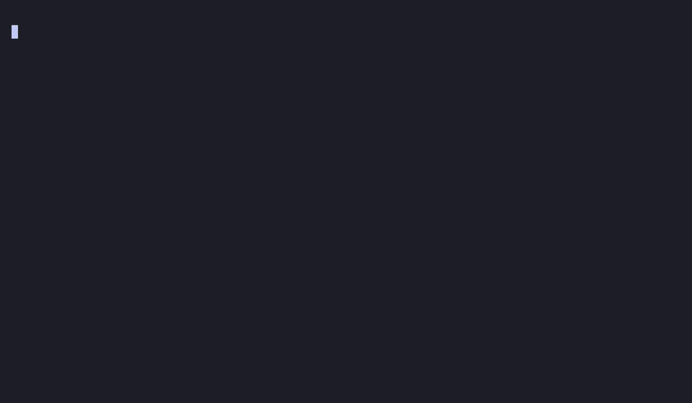

<div align="center">
  <picture>
    <source media="(prefers-color-scheme: dark)" srcset="assets/flashos_logo_dark.png">
    
  </picture>

<h3>AArch64 bare-metal kernel for the Raspberry Pi 4B and QEMU <code>-M virt</code></h3>

<p>
    <a href="https://github.com/ajhahnde/FlashOS/actions/workflows/test.yml"></a>
    <a href="https://codecov.io/gh/ajhahnde/FlashOS"></a>
    
    
    
    
  </p>

<p>
    <a href="DOCUMENTATION.md"><b>Documentation</b></a> ·
    <a href="SETUP.md"><b>Setup</b></a> ·
    <a href="MIGRATION.md"><b>Migration</b></a> ·
    <a href="VERSIONING.md"><b>Versioning</b></a> ·
    <a href="CHANGELOG.md"><b>Changelog</b></a> ·
    <a href="LICENSE.md"><b>License</b></a>
  </p>

<p>
    <b>English</b> ·
    <a href="docs/de/README.md">Deutsch</a>
  </p>
</div>

---

<p align="center">
  
</p>

> The boot above is a captured serial console of FlashOS booting on real
> Raspberry Pi 4B hardware to the `login:` prompt; the trailing `fsh`
> session — `whoami`, `ls`, `cat`, and a one-stage pipe — replays the
> shell's real output at a readable cadence.

## About

FlashOS is a bare-metal AArch64 kernel that boots on Raspberry Pi 4B
hardware and under QEMU. The kernel core is written in Zig; the boot
path, exception vectors, and context switch are AArch64 assembly. The
build is driven entirely by `build.zig`.
The current release ships with a complete uniprocessor process
lifecycle (`fork`, `exec`, `exit`, `wait`, `kill`), leak-free across
stress cycles, exercised by an in-kernel `[TEST]/[PASS]/[FAIL]`
harness and a host-side unit test suite.

## Specifications

|                  |                                                                                       |
| :--------------- | :------------------------------------------------------------------------------------ |
| **Hardware**     | Raspberry Pi 4 Model B (BCM2711)                                                      |
| **Architecture** | AArch64 (ARMv8-A)                                                                     |
| **Languages**    | Zig + AArch64 assembly                                                                |
| **Toolchain**    | Zig 0.16.0 +`aarch64-elf` binutils                                                    |
| **Targets**      | RPi 4B hardware,`qemu-system-aarch64 -M raspi4b`, _and_ `qemu-system-aarch64 -M virt` |

## Features

- **Two-stage boot.** EL3 armstub configures the GIC and `eret`s into
  the kernel at EL1 (Pi). On QEMU `-M virt`, `boot.S` does the EL3→EL1
  drop itself.
- **Dual-target build.** `-Dboard=rpi4b` or `-Dboard=virt` switches
  the per-board driver bag (`uart`, `gpio`, `timer`, `irq`), the
  linker script, and the boot quirks at comptime.
- **Four-level MMU.** Identity map for early bring-up, linear-high
  map for the kernel, demand-allocated user pages with per-region
  flags (text RX, data/heap/stack RW+UXN).
- **Priority round-robin scheduler** with timer-driven preemption.
- **Process lifecycle.** `fork` / `exec` / `exit` / `wait` / `kill`,
  zombie reap path, leak-free across stress cycles.
- **ELF64 loader.** `sys_execve` resolves a path through the VFS,
  streams each PT_LOAD segment into a freshly built address space with
  the right permissions, and eagerly maps the top stack page before
  copying the argv block onto the new user stack.
- **Userland mini-libc (`flibc`).** SVC wrappers, `printf` over
  `sys_writeConsole`, bump allocator over `brk` / `sbrk`,
  `fork` / `wait` / `exit` / `execve`. Linked into ELF demos by the
  build, kept under `user_space/lib/flibc/`.
- **Heap via `sys_brk` / `sys_sbrk`.** Pages are demand-allocated by
  the page-fault path inside `[HEAP_BASE, brk)`; shrinks unmap and
  free.
- **Region-aware page-fault dispatch.** `do_data_abort` classifies
  by user VA region (heap / stack / stack-guard / text / wild) and
  panics-and-zombies on out-of-region access; the parent's
  `sys_wait` reaps the offender so the harness keeps running.
- **Stack guard.** A 1-page unmapped region below the legal stack
  range turns runaway recursion into a `[KERN] stack overflow`
  diagnostic instead of memory corruption.
- **Unified file descriptors.** A single tagged `fds` table per task
  (`console` / `pipe` / `file`) behind one
  `read` / `write` / `close` / `dup2` ABI; fd 0/1/2 are pre-installed
  console slots, `fork` inherits the table and `execve` preserves it,
  so a shell can hand a child redirected stdio. Anonymous pipes
  (`sys_pipe`) ride the same table.
- **Interactive shell (`fsh`).** A userland REPL at `/bin/fsh` over a
  mini-libc (`flibc`): a raw `readline` line editor, a tokenizer with a
  single `|` pipe stage, in-process built-ins (`cd` / `exit` / `help` /
  `free` / `whoami`), a Unix-style `#`/`$` privilege prompt, and `fork` +
  `execvp` (`/bin/<name>` resolution) for externals — plus `/bin/echo`,
  `/bin/cat`, `/bin/ls` (the stateless `sys_readdir` consumer),
  `/bin/meminfo`, `/bin/forkbomb` (a capped leak probe), and
  `/bin/passwd`. Reads `/etc/fshrc` at startup; `sys_chdir` gives each
  task a working directory. No userland allocator yet — every buffer is
  fixed-size stack/static.
- **Process identity, login & permissions.** Every task carries
  real + effective uid/gid (inherited across `fork`, preserved across
  `execve`) behind a `getuid`/`setuid`-family ABI, and every file carries
  mode/uid/gid metadata enforced at the open/write/exec syscall boundary
  (`-EACCES`, root bypasses). Boot runs `/bin/login` as a session
  supervisor: the kernel verifies the password with PBKDF2-HMAC-SHA256 +
  a constant-time compare (`sys_authenticate` — the KDF never leaves the
  kernel), then login forks a child that drops privilege and execs the
  user's shell; `exit` returns to the `login:` prompt. Passwords live in
  a writable `/mnt/shadow` on the SD card (protected to `0600 root:root`
  by a FAT32 permission overlay, with the read-only initramfs seed as the
  always-bootable fallback) and are changed with `passwd` /
  `sys_passwd` — fresh kernel-minted salt, splice-safe in-place rewrite.
  Password echo is suppressed through `SYS_SET_CONSOLE_MODE`. The seed
  accounts use fixed public salts (build reproducibility); rotated
  records get random salts.
- **Syscalls** dispatched via `svc` and an indexed table — see
  [Documentation §5](DOCUMENTATION.md#5-syscalls--exceptions).
- **USB-C gadget console.** The Pi's USB-C port enumerates as a
  CDC-ACM serial device (BCM2711 DWC2 OTG — Full-Speed, polled,
  slave/PIO): a single C-to-C cable to a Mac carries both power and
  the interactive `fsh` console (`/dev/tty.usbmodem…`, no driver
  install). User/shell output switches to USB when enumerated and
  falls back to the Mini-UART otherwise.
- **Two UARTs.** Mini-UART (UART1) for the console fallback + kernel
  diagnostics, dedicated PL011 for an out-of-band trace channel.
- **Kernel symbol table** generated by a two-pass `populate-syms` step
  and consumed by the function-entry tracer (runtime intact, but
  currently inert — Zig has no `-fpatchable-function-entry=2`
  equivalent yet).
- **In-kernel test harness** (`[TEST]/[PASS]/[FAIL]` + tally, 28
  scenarios) plus a host-side `zig build test` suite (370 host
  tests across 35 modules).

## Quick start

Install the toolchain:

```bash
brew install zig aarch64-elf-binutils qemu
```

Build everything for the Pi (`kernel8.img` + `armstub8.bin` land in
`zig-out/`):

```bash
zig build                   # default: -Dboard=rpi4b
```

Or build for QEMU `-M virt` (no armstub):

```bash
zig build -Dboard=virt
```

Run the kernel under QEMU:

```bash
zig build -Dboard=rpi4b run        # raspi4b machine (Pi 4 model)
```

```bash
zig build -Dboard=virt  run-virt   # generic ARMv8 virt machine
```

Run host-side unit tests (page allocator + ELF parser):

```bash
zig build test
```

For the full hardware flow (two-pass build with symbol-table population
and an interactive `deploy` prompt):

```bash
./build.sh
```

See [Setup](SETUP.md) for the SD-card layout, firmware files, and
serial-console setup.

## Build steps

| Step                                 | What it does                                                    |
| :----------------------------------- | :-------------------------------------------------------------- |
| `zig build` (or `-Dboard=rpi4b`)     | Default — Pi:`kernel8.img` + `armstub8.bin`                     |
| `zig build -Dboard=virt`             | virt:`kernel8.img` only (no armstub)                            |
| `zig build kernel`                   | Kernel image only                                               |
| `zig build armstub` (rpi4b only)     | Armstub only                                                    |
| `zig build populate-syms`            | Regenerate `src/symbol_area.S` from the linked ELF              |
| `zig build deploy` (rpi4b only)      | Copy artefacts + RPi firmware to `$SD_BOOT`                     |
| `zig build -Dboard=rpi4b run`        | Boot under `qemu-system-aarch64 -M raspi4b`                     |
| `zig build -Dboard=virt run-virt`    | Boot under `qemu-system-aarch64 -M virt`                        |
| `zig build -Dboard=virt test-virt`   | Boot virt, watchdog asserts the boot reaches the fsh prompt     |
| `zig build -Dboard=rpi4b test-rpi4b` | Boot raspi4b, watchdog asserts the boot reaches the fsh prompt  |
| `zig build -Dboard=virt iso`         | Build a GRUB-EFI rescue ISO (virt only)                         |
| `zig build test`                     | Host-side unit tests (370 tests, 35 modules)                    |
| `zig build clean`                    | Remove `.zig-cache/` and `zig-out/`                             |

The default optimisation mode is `ReleaseSmall`. Override with
`-Doptimize=ReleaseSafe` (or `Debug`, `ReleaseFast`).

## Repository layout

```text
src/                kernel core (Zig + AArch64 assembly)
src/board/<name>/   per-board driver bag (rpi4b / virt) + linker script
user_space/         PID 1 image + in-kernel test harness
user_space/lib/flibc/  userland mini-libc for ELF demos
lib/                shared kernel↔user constants (syscall IDs)
tools/              hand-rolled ELF demos (hello, stackbomb, flibc_demo)
tests/              host-side unit tests
armstub/            EL3 → EL1 bootstrap shim (Pi only)
scripts/            symbol-table generation, iso, QEMU test watchdog,
                    Pi-baseline verifier
assets/             logo and visual assets
build.zig           the only build entry point
build.sh            two-pass build orchestrator + deploy prompt
config.txt          RPi 4 firmware configuration
```

A deeper walk-through of each subsystem is in
[Documentation](DOCUMENTATION.md).

## Versioning

`v[MAJOR].[MINOR].[PATCH]`. Per-tag notes live on the
[releases page](https://github.com/ajhahnde/FlashOS/releases).

## License

Apache License, Version 2.0. See [License](LICENSE.md).

## See also

- [eeco](https://github.com/ajhahnde/eeco) — self-maintaining workflow ecosystem.
- [the-way-out](https://github.com/ajhahnde/the-way-out) — top-down pixel-art escape-room shooter.

---

[Next: Documentation →](DOCUMENTATION.md)
