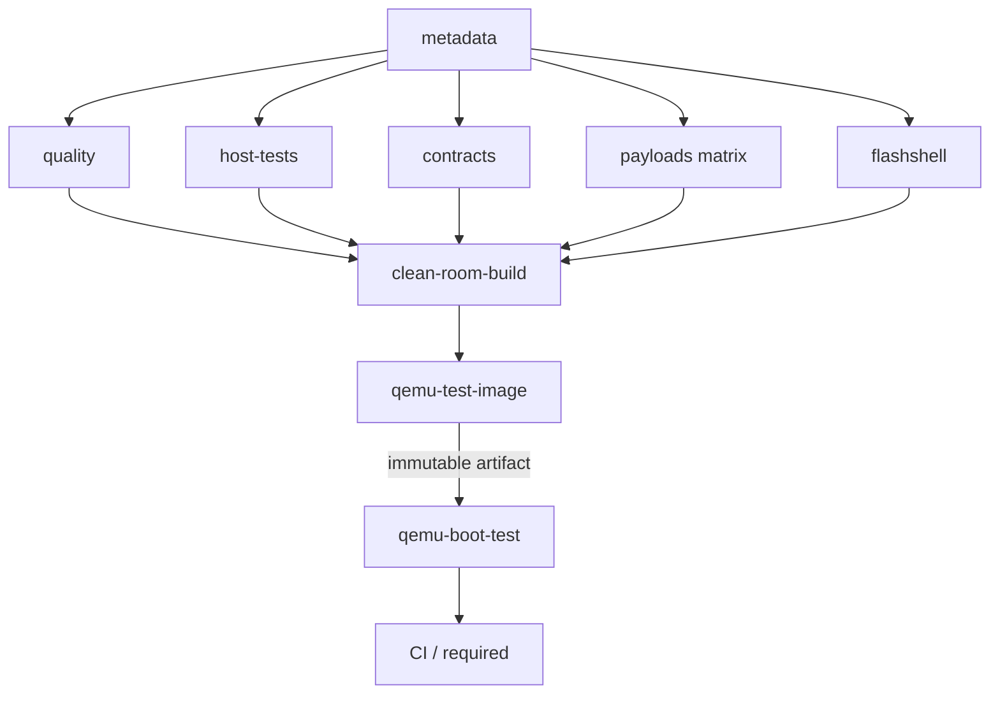

<div align="center">
  <picture>
    <source media="(prefers-color-scheme: dark)" srcset="assets/flashos_logo_dark.png">
    
  </picture>

<h3>A UNIX-like bare-metal OS for AArch64, built for the Raspberry Pi 4B and QEMU</h3>

<p>
    <a href="https://github.com/ajhahnde/FlashOS/actions/workflows/ci.yml"></a>
    <a href="https://github.com/ajhahnde/FlashOS/actions/workflows/security.yml"></a>
    <a href="https://codecov.io/gh/ajhahnde/FlashOS"></a>
    <a href="https://github.com/ajhahnde/FlashOS/releases/latest"></a>
    
    
    
  </p>

<p>
    <b>README</b> ·
    <a href="DOCUMENTATION.md"><b>Documentation</b></a> ·
    <a href="SETUP.md"><b>Setup</b></a> ·
    <a href="CHANGELOG.md"><b>Changelog</b></a> ·
    <a href="LICENSE.md"><b>License</b></a>
  </p>

</div>

---

<p align="center">
  
</p>

> The boot above is a replicate of FlashOS booting on
> Raspberry Pi 4B hardware to the `login:` prompt.

## About

FlashOS is a bare-metal AArch64 kernel that runs on Raspberry Pi 4B
hardware and under QEMU. The kernel core is written in Rust,
while the boot path, exception vectors, and context-switching code
are implemented in AArch64 assembly.

The current release provides a complete uniprocessor process
lifecycle—including `fork`, `exec`, `exit`, `wait`, and `kill`—and
remains leak-free under repeated stress testing. Correctness is verified
through an in-kernel `[TEST]`/`[PASS]`/`[FAIL]` harness and a host-side
unit test suite.

Installation, build targets, QEMU commands, SD-card deployment, and
console setup are documented in **[Setup](SETUP.md)**.

> FlashOS is currently in pre-1.0 development; compatibility between
> releases is not guaranteed.

## Specs

- **Hardware**: Raspberry Pi 4 Model B (BCM2711)
- **Qualified RAM**: 4 GiB configuration
- **Architecture**: AArch64 (ARMv8-A)
- **Languages**: Rust & AArch64 assembly
- **Toolchain**: Cargo, Clang, _and_ the pinned Rust LLVM tools
- **Targets**: RPi 4B hardware _and_ `qemu-system-aarch64 -M raspi4b`
- **Release image**: about 1.2 MiB for the current `kernel8.img`

## Features

- **Two-stage boot**. EL3 armstub enters the kernel at EL1 on Pi.
- **Four-level MMU**. Early identity mapping, a linear-high kernel map,
  and demand-allocated user pages with per-region permissions.
- **Priority round-robin scheduler** with timer-driven preemption.
- **Process lifecycle**. Leak-free `fork`, `exec`, `exit`, `wait`, and
  `kill`, including zombie reaping.
- **ELF64 loader**. `sys_execve` loads VFS-backed ELF segments into a
  fresh address space and prepares the user stack with `argv`.
- **Userland mini-libc** (`flibc`). Syscall wrappers, formatted output,
  heap allocation, and process APIs for ELF programs.
- **Dynamic heap.** `sys_brk` and `sys_sbrk` grow pages on demand and
  release them when shrinking.
- **Region-aware page faults**. Faults are classified by virtual-memory
  region; invalid access terminates the offending process safely.
- **Stack guard**. An unmapped guard page detects stack overflows before
  they corrupt memory.
- **Unified file descriptors**. Console, pipe, and file descriptors share
  one API with inherited and redirectable standard I/O.
- **Platform stack.** **FlashSDK** — the `flashsdk-abi`, `flashsdk-rt`, and
  `flashsdk-base` crates in this workspace — defines the narrow public
  syscall/userspace ABI, EL0 runtime, base library, and target-and-link
  contract; the kernel and every user program consume it in-tree as path
  dependencies.
  **FlashShell**, vendored in-tree as a nested consumer workspace
  (`components/flashshell/`) with its own pinned toolchain and CI job, is its
  first product consumer. **FlashUI** will follow as a native TUI that embeds
  FlashShell and becomes the post-login default; the current `/bin/fsh` remains
  a tested recovery shell. These contracts remain pre-1.0 until the FlashOS v1.0
  stability cut.
- **Users, login, and permissions**. UID/GID identity, Unix-style file
  modes, privilege dropping, PBKDF2-HMAC-SHA256 authentication, and
  protected password storage with a read-only fallback.
- **Syscalls** dispatched via `svc` and an indexed table.
- **USB-C gadget console**. CDC-ACM provides power and an interactive
  console over one cable, with automatic Mini-UART fallback.
- **Two UARTs**. Mini-UART handles diagnostics and fallback console I/O;
  PL011 provides an out-of-band trace channel.
- **Kernel symbol table**. A two-pass build generates symbols for the
  function-entry tracer.
- **Test suites**. An in-kernel `[TEST]`/`[PASS]`/`[FAIL]` harness plus
  crate-local Rust host tests.

A deeper walk-through of each subsystem is in [Documentation](DOCUMENTATION.md).

## Repository layout

```text
arch/aarch64/               AArch64 ISA core (boot, vectors, context switch)
src/                        board/linker glue, trace assembly, generated symbols
src/board/<name>/           per-board assembly definitions + linker script
crates/abi/                 kernel-private task, ELF, and page-descriptor layouts
crates/kernel/              Rust kernel implementation
crates/flibc/               Rust userland engines (readline, pager, TUI) for ELF programs
user/                       Rust PID 1, shell, tools, and test executables
components/flashshell/       FlashShell — nested consumer workspace (own toolchain + CI)
rootfs/                     static initramfs and FAT32 seed files
tools/                      retained ELF linker scripts + initramfs embed assembly
armstub/                    EL3 → EL1 bootstrap shim (Pi only)
xtask/                      native build, inspection, generation, and guard tasks
scripts/                    QEMU watchdog, SD fixture, hygiene, baseline verifier
assets/                     logo and visual assets
Cargo.toml                  Rust workspace
flashos.zsh                 shell helpers incl. the two-pass `build` orchestrator
config.txt                  RPi 4 firmware configuration
```

## CI/CD and release engineering

A GitHub Actions pipeline builds and qualifies the Rust/AArch64 image. Quality
gates run in parallel, then feed one clean-room build. That build produces a
single boot artifact, which is booted unchanged on an emulated Raspberry Pi 4B.



- **Gates** — formatting, Clippy (`-D warnings`), host tests, the architecture
  contracts (hygiene, generated ASM layout, armstub, source census), a sharded
  EL0-payload link matrix, and FlashShell under its own pinned toolchain.
- **Clean-room build** — built under rejecting `PATH` shims with subprocess
  tracing, so no retired compiler can sneak in.
- **Boot** — the boot job never rebuilds. It pulls the artifact from the build
  job, checks its SHA-256 sums, and powers on a pinned, source-built QEMU
  (`raspi4b`).
- **CI vs. release image** — the CI image carries `--ci-login-seed` and
  `--boot-selftest` (auto-login plus the in-kernel test harness). The release
  bundle is rebuilt from the tag without either flag and boots to the real
  `login:` prompt.
- **Releases** — tag-driven and reproducible (pinned `mtime`, sorted archives).
  Each ships the flashable bundle, `SHA256SUMS`, a CycloneDX SBOM, a provenance
  attestation, and a `build-info.json`. A dry run packages everything without
  publishing.
- **Supply chain** — pinned Rust and QEMU, SHA-pinned actions kept fresh by
  Dependabot, dependency review on PRs, and a reviewed `cargo-deny` policy.

## See also

- **[FlashOS Tour →](https://ajhahn.de/flashos/)**
- **[ajhahn.de →](https://ajhahn.de/)**

---

[Next: Documentation →](DOCUMENTATION.md)
