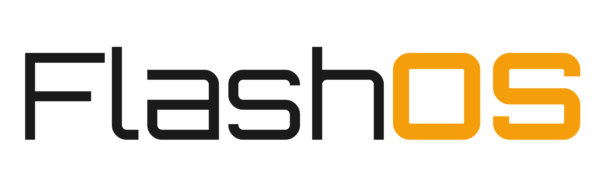

<div align="center">
  <picture>
    <source media="(prefers-color-scheme: dark)" srcset="assets/flashos_logo_dark.png">
    
  </picture>

  <p>
    <strong>An x86_64 operating system based on the Redox kernel, with a text-based user environment and Flash as its primary interface.</strong>
  </p>

  <p>
    <a href="https://github.com/ajhahnde/FlashOS/actions/workflows/ci.yml">
      
    </a>
    <a href="https://github.com/ajhahnde/FlashOS/actions/workflows/security.yml">
      
    </a>
    
    
    
  </p>

  <p>
    <a href="docs/README.md"><strong>Documentation</strong></a> ·
    <a href="docs/getting-started.md"><strong>Getting Started</strong></a> ·
    <a href="components/flash/README.md"><strong>Flash</strong></a> ·
    <a href="ci/README.md"><strong>CI</strong></a> ·
    <a href="https://github.com/ajhahnde/FlashOS/releases"><strong>Releases</strong></a> ·
    <a href=".github/SECURITY.md"><strong>Security</strong></a>
  </p>
</div>

> **Project status:** FlashOS is pre-alpha software. Interfaces, package boundaries, image formats, and supported workflows may change without compatibility guarantees. Documentation describes the source tree in which it is located; published releases may differ.

## About FlashOS

FlashOS is a small, independent operating-system project focused on a keyboard-driven terminal environment. It is not an official Redox OS distribution and is not affiliated with or endorsed by the Redox OS nonprofit.

The current system uses the Redox kernel and parts of the Redox ABI, toolchain, userspace, packaging, and image-building infrastructure. These dependencies are documented explicitly and do not imply that every upstream Redox capability is supported or qualified by FlashOS.

[Flash](components/flash/README.md) is the primary interactive and scripting interface. Flash scripts use the `.fsh` file extension.

## Current scope

| Area                           | Current project scope                                        |
| ------------------------------ | ------------------------------------------------------------ |
| Architecture                   | x86_64                                                       |
| Target ABI                     | `x86_64-unknown-redox`                                       |
| User environment               | Text-based interface without a graphical desktop environment |
| Primary interface              | Flash at `/usr/bin/fsh`                                      |
| Primary evaluation environment | QEMU `q35` with UEFI firmware                                |

Device-specific test results and the limits of current hardware evidence are maintained in [Hardware Compatibility](docs/hardware.md).

## Quick start

Complete the prerequisites and local configuration described in [Getting Started](docs/getting-started.md).

Build the development image with:

```bash
make CONFIG_NAME=flashos all
```

Start FlashOS in QEMU with:

```bash
make CONFIG_NAME=flashos qemu
```

Instructions for live images, local configuration, login details, troubleshooting, and physical media are kept in the [Getting Started Guide](docs/getting-started.md).

## Documentation tree

The following tree shows the canonical navigation paths between the central public Markdown documents. It intentionally excludes implementation-specific READMEs, test-fixture documentation, and individual historical files retained under `docs/upstream/`.

- [`README.md`](README.md) — Project overview and main entry point

  - [`docs/README.md`](docs/README.md) — General FlashOS documentation index

    - [`docs/getting-started.md`](docs/getting-started.md) — Build, boot, and first-use instructions
    - [`docs/architecture.md`](docs/architecture.md) — System layers, image configuration, and component boundaries
    - [`docs/development.md`](docs/development.md) — Repository development workflow
    - [`docs/verification.md`](docs/verification.md) — Testing and verification model
    - [`docs/hardware.md`](docs/hardware.md) — Published FlashOS hardware evidence
    - [`docs/roadmap.md`](docs/roadmap.md) — Public development direction
    - [`docs/upstream/README.md`](docs/upstream/README.md) — Index of retained upstream reference documents

  - [`components/flash/README.md`](components/flash/README.md) — Flash overview

    - [`components/flash/docs/README.md`](components/flash/docs/README.md) — Flash documentation index

      - [`components/flash/docs/language-guide.md`](components/flash/docs/language-guide.md) — Language concepts and syntax
      - [`components/flash/docs/scripting.md`](components/flash/docs/scripting.md) — Script and process execution
      - [`components/flash/docs/architecture.md`](components/flash/docs/architecture.md) — Internal crate and runtime architecture
      - [`components/flash/docs/development.md`](components/flash/docs/development.md) — Flash development and testing

  - [`ci/README.md`](ci/README.md) — Technical contracts for local and hosted CI
  - [`CHANGELOG.md`](CHANGELOG.md) — Public change history
  - [`.github/SECURITY.md`](.github/SECURITY.md) — Security reporting and evaluation limits
  - [`TRADEMARK.md`](TRADEMARK.md) — Trademark and project identity policy

## Repository map

| Path                 | Responsibility                                      |
| -------------------- | --------------------------------------------------- |
| `config/`            | FlashOS image profiles and system configuration     |
| `components/flash/`  | Flash source code and component documentation       |
| `recipes/`           | Package recipes and transitional system components  |
| `ci/`                | Local verification contracts and QEMU smoke testing |
| `.github/workflows/` | Hosted CI, security, image, and release workflows   |
| `mk/` and `Makefile` | Package, image, and emulator build orchestration    |
| `src/`               | Root build-system support code                      |
| `docs/`              | General public FlashOS documentation                |

Generated build outputs and local configuration files are not part of the public documentation tree.

## Verification

FlashOS verification is divided into separate layers so that source checks, target compilation, image construction, virtual-machine execution, and physical hardware evidence are not treated as equivalent.

- [Verification and Testing](docs/verification.md) explains the overall verification model.
- [CI Contracts](ci/README.md) documents the exact local scripts and their relationship to hosted workflows.
- [Hardware Compatibility](docs/hardware.md) records device-specific physical test evidence.

A successful upstream test or the existence of an upstream driver does not by itself qualify the corresponding hardware or behavior for FlashOS.

## FlashOS and upstream Redox OS

FlashOS currently relies on parts of the Redox ecosystem as a technical foundation. Compatibility identifiers such as `x86_64-unknown-redox`, `redoxer`, `relibc`, and inherited package names remain where they describe active interfaces or dependencies.

FlashOS maintains its own project identity, system profile, documentation, decisions, and releases. The current boundaries and intended development direction are documented in:

- [FlashOS Architecture](docs/architecture.md)
- [Public Roadmap](docs/roadmap.md)
- [Upstream References](docs/upstream/README.md)
- [Attribution Notice](NOTICE)

## Issues and security

General bug reports, documentation problems, and reproducible hardware observations may be submitted through [GitHub Issues](https://github.com/ajhahnde/FlashOS/issues).

Do not disclose suspected vulnerabilities in a public issue. Follow the reporting instructions and evaluation limits in the [Security Policy](.github/SECURITY.md).

No response, review, acceptance, or release timeline is guaranteed.

## License and attribution

The inherited root build infrastructure and Flash are available under the MIT License, with their respective copyright notices in the root [LICENSE](LICENSE) and the [Flash license](components/flash/LICENSE). Third-party packages and inherited components retain their respective licenses.

See the following files for attribution and project identity information:

- [NOTICE](NOTICE)
- [Trademark and Project Identity Policy](TRADEMARK.md)
- [Upstream Reference Documentation](docs/upstream/README.md)
