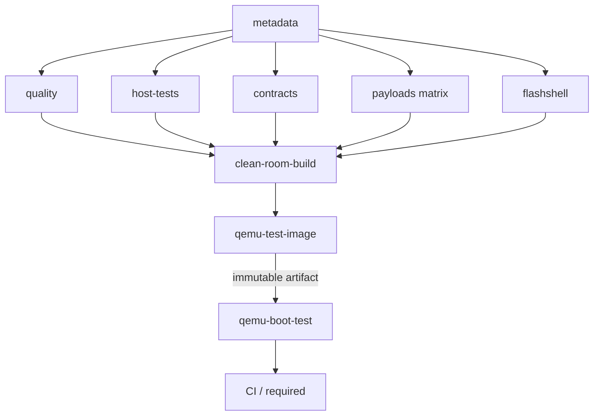

# CI/CD architecture

FlashOS is a Rust/AArch64 bare-metal operating system. Its continuous
integration is a multi-stage GitHub Actions pipeline (`.github/workflows/ci.yml`)
that separates cheap, parallelizable checks from the expensive, serial
integration path, and promotes a single immutable artifact from build to boot.

## Pipeline

## Why the jobs are separated

A single monolithic job serializes everything and hides which gate failed. The
pipeline instead groups work by cost and dependency:

- **`metadata`** runs only repository-wide validation that must precede
  everything else: the centralized version-manifest check
  (`scripts/sync_versions.sh --check`), pinned-toolchain activation, and public
  documentation-drift detection. It exports the pinned QEMU version as a job
  output for the boot stage.
- **`quality`, `host-tests`, `contracts`, `payloads`, `flashshell`** depend only
  on `metadata` and therefore run **in parallel**. They are independent: a Clippy
  failure and a host-test failure surface simultaneously instead of one masking
  the other.
- **`clean-room-build`** depends on all of the above. It is the production
  build-chain gate and runs under rejecting `PATH` shims with subprocess tracing
  (`cargo xtask guard --board rpi4b --full`), proving no retired compiler is
  invoked anywhere in the chain.
- **`qemu-test-image`** builds the CI boot image once and promotes it.
- **`qemu-boot-test`** consumes that artifact and boots it.
- **`required`** is the single aggregate status branch protection pins.

## `needs` dependencies

`clean-room-build` needs every parallel gate; `qemu-test-image` needs
`clean-room-build`; `qemu-boot-test` needs `qemu-test-image` (and `metadata`, for
the QEMU version). `required` needs all of them and runs with `if: always()`,
failing unless every listed job result is `success`. A failed payload matrix
shard therefore fails `required` even though `fail-fast: false` lets the other
shards finish for full diagnostics.

## Cache versus artifact semantics

The two mechanisms are used for different things and must not be conflated:

- **Caches** (`~/.cargo` registry, `~/qemu-prefix`) are best-effort
  reconstructible inputs. A cache miss is never a failure — it just rebuilds.
- **Artifacts** are the immutable outputs promoted between jobs. The CI boot
  image is uploaded once by `qemu-test-image` and downloaded verbatim by
  `qemu-boot-test`.

## Why QEMU is built from pinned source

Hosted runners ship whatever QEMU their image happens to include. The FlashOS
boot contract is validated against one specific QEMU release
(`FLASHOS_QEMU_VERSION` in `versions.env`), so the `setup-qemu` composite action
builds exactly that version from source (only `aarch64-softmmu`) and caches it by
OS, architecture, version, and a fingerprint of the configure flags. The build
verifies that `qemu-system-aarch64 -machine help` lists `raspi4b` before use.

## Why the boot job cannot rebuild

Promotion is the whole point: `qemu-boot-test` must prove that the exact bytes
produced by the build job boot correctly. It downloads the artifact, verifies its
`SHA256SUMS`, and runs the watchdog against the downloaded `kernel8.img` and
`test_sd.img`. It never invokes the compiler. This guarantees the tested artifact
and the promoted artifact are identical.

## The boot contract

`scripts/run_qemu_test.sh` is the single source of truth for the boot contract —
scenario tally, per-scenario and boot-baseline free-page checkpoints, homescreen
markers, and the 720-second timeout. CI calls the script; it never duplicates
those values in YAML. The CI boot image is built with `--ci-login-seed` (seeds an
unattended login so the third shell marker appears) and `--boot-selftest` (runs
the in-kernel `[TEST]` scenarios). Both are CI-only.

## Failure diagnostics and retention

`qemu-boot-test` uploads the serial log and staged image on failure
(`if: failure()`, 14-day retention). Build artifacts use short retention (7 days),
reflecting that they are reproducible, not archival.

## Fast path versus full integration path

- **Fast path** (a formatting or Clippy error) fails within the parallel stage,
  before the clean-room build ever starts.
- **Full integration path** (build → image → QEMU boot) runs only after every
  parallel gate is green, so the expensive emulated boot is never spent on a tree
  that already failed a cheap check.

## Reusable composite actions

- **`.github/actions/setup-flashos`** — activates the pinned Rust toolchain,
  runs the version-manifest check, exposes the QEMU version, and optionally
  caches Cargo downloads. It reads every version from `versions.env` /
  `rust-toolchain.toml`; no constant is duplicated in the action.
- **`.github/actions/setup-qemu`** — restores or source-builds the pinned QEMU.

## Legacy step → new-job mapping

The pipeline replaced a single-job workflow (`.github/workflows/rust.yml`). Every
gate was preserved:

| Legacy `rust` step | New location |
|--------------------|--------------|
| checkout | every job |
| centralized version manifest | `metadata` (via `setup-flashos`) |
| install pinned Rust + target diag | `setup-flashos` |
| `clang --version` | `setup-flashos` |
| `cargo fmt --all --check` | `quality` |
| `cargo clippy … -D warnings` | `quality` |
| `cargo test --workspace …` | `host-tests` |
| `cargo xtask check-hygiene` | `contracts` |
| `scripts/check_doc_drift.sh` | `metadata` |
| EL0 payload link loop | `payloads` (4-shard matrix) |
| `cargo xtask asm-defs --check` | `contracts` |
| `cargo xtask armstub` | `contracts` |
| `cargo xtask census` | `contracts` |
| `cargo xtask guard --board rpi4b --full` | `clean-room-build` |
| build seeded kernel + `make_test_disk.sh` | `qemu-test-image` |
| `run_qemu_test.sh` boot | `qemu-boot-test` |
| *(new)* FlashShell workspace gates | `flashshell` |
| *(new)* aggregate required status | `required` |
