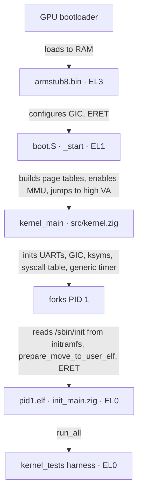

<div align="center">
  <picture>
    <source media="(prefers-color-scheme: dark)" srcset="../../assets/flashos_logo_dark.png">
    
  </picture>

<h1>Dokumentation</h1>

<p>
    <a href="README.md"><b>README</b></a> ·
    <b>Dokumentation</b> ·
    <a href="SETUP.md"><b>Setup</b></a> ·
    <a href="../../MIGRATION.md"><b>Migration</b></a> ·
    <a href="../../VERSIONING.md"><b>Versionierung</b></a> ·
    <a href="../../CHANGELOG.md"><b>Changelog</b></a> ·
    <a href="../../LICENSE.md"><b>Lizenz</b></a>
  </p>

<p>
    <a href="../../DOCUMENTATION.md">English</a> ·
    <b>Deutsch</b>
  </p>
</div>

---

Diese Seite ist der architektonische Überblick über FlashOS: wie der
Boot-Pfad, das Memory-Layout, der Scheduler, die Syscalls, die
IRQ-Behandlung, das Tracing und die Test-Harness zusammenpassen. Die
Modulnamen weiter unten beziehen sich auf tatsächliche Dateien im
Repository.

## Inhalt

1. [Source-Layout](#1-source-layout)
2. [Boot-Pfad](#2-boot-pfad)
3. [Memory-Management](#3-memory-management)
4. [Prozessverwaltung &amp; Scheduling](#4-prozessverwaltung--scheduling)
5. [Syscalls &amp; Ausnahmen](#5-syscalls--ausnahmen)
6. [Kernel-Symboltabelle](#6-kernel-symboltabelle-ksyms)
7. [Tracing](#7-tracing)
8. [Testen](#8-testen)
9. [Build-Artefakte](#9-build-artefakte)

## 1. Source-Layout

```text
src/                       Kernel core (Zig + AArch64 assembly)
  start.zig                Build root: comptime-imports every kernel module
  kernel.zig               kernel_main + bring-up
  boot.S                   _start, EL3→EL1, MMU bring-up, jump to high VAs
  entry.S                  Exception vector table + syscall dispatch
  utils.S, mm.S            Assembly helpers
  sched.S, irq.S           Context switch + IRQ enable/disable
  generic_timer.S          CNTP system register helpers
  symbol_area.S            Generated kernel symbol table (see §6)
  asm_defs.inc             Bridge header — pulls in board_asm_defs.inc
  asm_defs_common.inc      Shared assembler-only macros (board-independent)

  board.zig                Comptime alias: build_options.board → board/<board>/*
  generic_timer.zig        ARM generic timer
  page_alloc.zig           Physical page allocator
  mm_user.zig              map_page, copy_virt_memory, do_data_abort
  fork.zig                 copy_process, prepare_move_to_user[_elf]
  sched.zig                Priority round-robin scheduler
  sys.zig                  Syscall table + handlers
  utilc.zig                memcpy/memset/panic + main_output helpers
  elf.zig                  ELF64 header + program-header parser (host-testable)
  task_layout.zig          Canonical extern-struct layouts (TaskStruct, MmStruct, …)
  user_layout.zig          User VA constants (TEXT/DATA/HEAP/STACK bases + flags)
  block_dev.zig            BlockDev vtable: board-agnostic LBA read/write indirection
  sdhci_cmd.zig            SDHCI CMDTM bit layout, CMDx constants, CSD v2 parser, clock divisor
  mailbox.zig              VideoCore property-tag message layout + parsing (board-agnostic)
  fat32.zig                FAT32 BPB/FAT/dir-entry decode + cluster-chain walk (host-testable)
  fat32_backend.zig        FAT32 VfsOps backend: read + writeBack over block_dev (real SD I/O — Pi-HW path; replaced the earlier fat32_stub.zig)
  usb_descriptors.zig      USB CDC-ACM descriptor set + SETUP-packet decode (host-testable)

  board/rpi4b/             Raspberry Pi 4 driver bag
    uart.zig               Mini-UART driver (console)
    gpio.zig               GPIO pin function/enable
    timer.zig              BCM2711 system timer
    irq.zig                BCM2711 GIC + dispatch + invalid-entry reporter
    emmc2.zig              BCM2711 EMMC2 SDHCI driver — PIO single-block read/write
    mailbox.zig            VideoCore mailbox MMIO doorbell (pairs with src/mailbox.zig)
    usb.zig                BCM2711 DWC2 USB-OTG device (gadget) — CDC-ACM console
    boot_quirks.S          Pi-specific boot fixups
    board_asm_defs.inc     Pi memory-layout addresses + macros
    linker.ld              Per-board kernel link script

  board/virt/              QEMU `-M virt` driver bag
    uart.zig, gpio.zig, timer.zig, irq.zig   (virt MMIO addresses)
    dtb.zig                Minimal DTB walker for runtime device-address discovery
    usb.zig                No-op USB gadget stub (board-API parity with rpi4b)
    image_header.S         Linux arm64 image header (UEFI/GRUB compatibility)
    boot_quirks.S          virt-specific boot fixups
    board_asm_defs.inc     virt memory-layout addresses + macros
    linker.ld              virt kernel link script

  trace/
    trace_main.zig         Patchable-entry tracing
    utils.zig              Trace I/O helpers (PL011)
    ksyms.zig              Kernel symbol table lookup
    pl011_uart.zig         Dedicated PL011 trace UART driver
    hook.S                 Trace hook stub (saves regs, calls 'traced')

user_space/
  init_main.zig            PID 1 ELF root (staged at /sbin/init)
  kernel_tests.zig         In-kernel test harness ([TEST]/[PASS]/[FAIL])
  lib/flibc/               Userland mini-libc for ELF-loaded programs
    flibc.zig              Root re-exports (printf, malloc, fork, ...)
    syscalls.zig           Raw SVC wrappers (sys.write/fork/exit/...)
    io.zig                 printf / puts / write on sys_writeConsole
    heap.zig               Bump allocator over sys_brk / sys_sbrk
    process.zig            fork / wait / exit / execve glue

lib/
  syscall_defs.zig         Shared SYS_* IDs (kernel + user side)

tools/
  hello_elf.zig + .S       Hand-rolled ELF for [TEST] exec-elf
  stackbomb_elf.zig + .S   Recursive stack-blower for [TEST] stack-overflow
  flibc_demo_elf.zig + .S  flibc-driven demo for [TEST] flibc
  hello_linker.ld          Single-PT_LOAD layout (hello + stackbomb)
  flibc_demo_linker.ld     Single-PT_LOAD layout with .rodata folded in

tests/
  host_stubs.zig           Shared linker stubs for 'zig build test'
  host_stubs_pipe.zig      Pipe-test page-alloc stub
  host_stubs_sched.zig     Sched-test HW-side stubs
  host_stubs_initramfs.zig File/initramfs stubs (typed `current`)
  host_stubs_vfs.zig       VFS-test stubs

armstub/src/
  armstub8.S               EL3→EL1 bootstrap shim
  asm_defs.inc             Armstub-only assembler macros
  linker.ld                Armstub link script (.text at 0)
  root.zig                 Empty Zig root (build API requirement)

scripts/
  clear_syms.zig           Reset src/symbol_area.S to its placeholder form
  generate_syms.zig        Read 'aarch64-elf-nm' and emit src/symbol_area.S
  make_iso.sh              GRUB-EFI rescue ISO builder (virt only)

assets/                    Logo and visual assets

build.zig                  The only build entry point
build.sh                   Two-pass build orchestrator + deploy prompt
config.txt                 RPi 4 firmware configuration
```

## 2. Boot-Pfad



1. Der GPU-Bootloader lädt `armstub8.bin` und `kernel8.img` ins RAM
   und startet die Cores auf EL3.
2. `armstub/src/armstub8.S` konfiguriert die Secure-Mode-Register,
   aktiviert den GIC und `eret`et nach EL1.
3. `_start` (`src/boot.S`) setzt den Stack, leert `.bss`, baut die
   Identity- und High-Page-Tables, weckt die Secondary Cores,
   initialisiert `TCR_EL1` / `MAIR_EL1` / `VBAR_EL1` / `TTBR0` / `TTBR1`
   explizit (erforderlich für QEMU; auf echter Hardware lässt der
   armstub diese in einem brauchbaren Zustand), aktiviert die MMU mit
   einem `ISB` nach `SCTLR.M=1` und springt über das High-Virtual-Mapping
   nach `kernel_main`.
4. `kernel_main` (`src/kernel.zig`) initialisiert die Mini-UART, die
   PL011-Trace-UART, den GIC, die Kernel-Symboltabelle, die
   Syscall-Tabelle und den generic timer, forkt dann PID 1 und betritt
   die Scheduler-Schleife.
5. PID 1 (`kernel_process`) liest `/sbin/init` — das `pid1.elf`-Image,
   das im eingebetteten initramfs bereitgestellt wird — und übergibt
   seine Bytes an `prepare_move_to_user_elf`, das die PT_LOAD-Segmente
   durchläuft, jedes mit regionsweisen Berechtigungen mappt, die oberste
   Stack-Page eager mappt und zum ELF-Einsprungpunkt `eret`et.
6. `user_space/init_main.zig` ist der `pid1.elf`-Root: `_start` ruft
   `pid1_main` auf, das `run_all()` aus `kernel_tests.zig` ausführt. Die
   Harness durchläuft die siebenundzwanzig Szenarien und gibt eine
   `X/Y passed`-Bilanz aus, übergibt PID 1 dann an `/bin/login`: das
   Login-Gate authentifiziert gegen `/etc/shadow`, droppt Privilegien
   gemäß `/etc/passwd` und startet die Shell des Users per exec — der
   Boot endet am interaktiven Shell-Prompt (§4).

## 3. Memory-Management

Ein vierstufiges Übersetzungsregime: PGD → PUD → PMD → PTE, 4-KiB-Pages.

### Physisches Layout (RPi 4, 4-GiB-SKU)

| Bereich                         | Region            | Verwendung                         |
| :------------------------------ | :---------------- | :--------------------------------- |
| `0x00000000`–`0x38400000`  | 0 – 948 MiB      | Frei / Kernel-Image bei `0x80000` |
| `0x38400000`–`0x40000000`  | 948 – 1024 MiB   | VideoCore reserviert               |
| `0x40000000`–`0xFC000000`  | 1 GiB – 3960 MiB | `get_free_page`-Pool             |
| `0xFC000000`–`0x100000000` | > 3960 MiB        | MMIO (GIC, UART, GPIO)             |

### Virtuelles Kernel-Layout (EL1)

| Region       | Virtuelle Basis        | Physische Basis | Attribute             |
| :----------- | :--------------------- | :------------- | :-------------------- |
| Identity-Map | `0x0000000000000000` | `0x00000000` | Normal-NC (0–16 MiB) |
| Linear-High  | `0xffff000000000000` | `0x00000000` | Normal-NC             |
| VC-Loch      | `0xffff00003B400000` | `0x38400000` | unmapped              |
| RAM-High     | `0xffff000040000000` | `0x40000000` | Normal-NC             |
| Device-High  | `0xffff0000FC000000` | `0xFC000000` | Device-nGnRnE         |

Die Übersetzung zwischen physischer Adresse und dem Linear-High-Mapping
verwendet `PA_TO_KVA` / `KVA_TO_PA` aus `src/mm_user.zig`.

### Virtuelles User-Layout (EL0)

Die Konstanten sind in `src/user_layout.zig` definiert
(Zig-maßgeblich, importiert sowohl von `src/fork.zig` als auch von
`src/mm_user.zig`).

| Region | Virtuelle Basis        | Richtung       | Attribute (post-loader)  |
| :----- | :--------------------- | :------------- | :----------------------- |
| Text   | `0x0000000000000000` | statisch       | RWX (no UXN, no RO bit)  |
| Data   | `0x0000000000100000` | statisch       | RW- (UXN)                |
| Heap   | `0x0000000000200000` | wächst auf (brk) | RW- (UXN)                |
| Stack  | `0x00000FFFFFFFF000` | wächst nach unten | RW- (UXN), Guard darunter |

Text wird derzeit als RWX abgebildet: das Standard-Page-Bag des Loaders
gewährt EL0 Lese-/Schreibzugriff und löscht UXN, und es ist kein
Read-Only-(AP[2])-Deskriptor-Bit definiert, sodass W^X für User-Code noch
nicht erzwungen wird. Data, Heap und Stack ergänzen UXN für RW-NX.

Die 16-TiB-Lücke zwischen `HEAP_BASE` und `STACK_TOP` macht den Heap-/
Stack-Guard implizit — jeder Zugriff in diesem Bereich ist ein Wild
Pointer und `do_data_abort` paniced mit `[KERN] invalid uva at 0x<hex>`,
nachdem der verursachende Task zum Zombie gemacht wurde (das `sys_wait`
des Parents reaped wie üblich). Die Regionsklassifizierung richtet sich
nach `mm.brk` plus den statischen Layout-Konstanten in
`src/user_layout.zig`; siehe `do_data_abort` in `src/mm_user.zig` für
den vollständigen Dispatch.

Regionsweise Attribute (Text RX, Data/Heap/Stack RW mit UXN) gelten nun
universell, da PID 1 ELF-geladen aus dem initramfs stammt:
`prepare_move_to_user_elf` (`src/fork.zig`) mappt jedes
PT_LOAD-Segment mit aus `p_flags` abgeleiteten Flags, und
`do_data_abort` (`src/mm_user.zig`) stempelt demand-allozierte Heap- und
Stack-Pages mit `TD_USER_PAGE_FLAGS_DEFAULT | TD_USER_XN`. Der
Nicht-ELF-Blob-Pfad (`prepare_move_to_user`) trug den ausgemusterten
Blob-Loader und hat keinen lebenden Aufrufer mehr; jeder Task heute ist
ELF-geladen mit regionsweisen Attributen.

### User-Pages

`map_page` durchläuft (und alloziert lazy) PGD/PUD/PMD/PTE-Tabellen für
den Ziel-Task und schreibt dann eine Leaf-PTE mit dem mitgegebenen
Berechtigungs-Bag (`user_layout.TD_USER_PAGE_FLAGS_DEFAULT` für den
historischen kombinierten Berechtigungsstempel; der ELF-Loader wählt
regionsweise Werte). `allocate_user_page` ist der Komfort-Wrapper, der
zusätzlich eine frische physische Page aus `get_free_page` zieht.
Translation Faults (`dfsc == 0x4..0x7`) betreten `do_data_abort`, das
nach Region dispatcht:

| Fault-UVA-Bereich                       | Aktion                                 |
| :-------------------------------------- | :------------------------------------- |
| `[HEAP_BASE, current.mm.brk)`         | Demand-allozieren (RW+UXN); OOM → `[KERN] OOM` + Zombie |
| `[STACK_LOW, STACK_TOP)`              | Demand-allozieren (RW+UXN); OOM → `[KERN] OOM` + Zombie |
| `[STACK_GUARD_LOW, STACK_GUARD_HIGH)` | Panic `stack overflow` + Zombie-Task |
| `[TEXT_BASE, DATA_BASE)`              | Panic `text fault` + Zombie-Task     |
| alles andere                            | Panic `invalid uva` + Zombie-Task    |

Jeder Task ist ELF-geladen: PID 1 plus die
`{hello,stackbomb,flibc_demo}.elf`-Payloads unter `/test/` respektieren
ihre Link-Time-`p_vaddr`, sodass absolute Pointer, Switch-Jump-Tables und
Arrays-von-Pointern alle korrekt auflösen. Der ausgemusterte Blob-Loader,
der ein Nicht-ELF-Image unabhängig von seiner Link-Time-Adresse nach UVA
`0` kopierte, existiert nicht mehr.

### Out-of-Memory-Policy

`get_free_page` liefert die Page-PA bei Erfolg, **`0` bei Erschöpfung**
(`src/page_alloc.zig`). `0` ist ein eindeutiger Sentinel — der Pool
beginnt bei `MALLOC_START` (`0x40000000`), sodass keine lebende
Allokation jemals PA 0 ist — und `get_kernel_page` propagiert ihn als
rohe `0` (nie `pa_to_kva(0)`, was eine gültig aussehende KVA wäre und das
Versagen verbergen würde). Jede Allokationsstelle prüft `== 0` und lässt
ihre Operation sauber scheitern, anstatt den Kernel abzubrechen:

- `mm_user.map_page` liefert `-1` bei einem Allokationsfehler mitten im
  Walk und rollt alle dabei erzeugten Zwischen-PGD/PUD/PMD/PTE-Tabellen
  zurück (sodass das Versagen page-balance-neutral ist) und schreibt
  **nie** einen Deskriptor, der PA 0 mappt. `allocate_user_page` gibt die
  verwaiste User-Page frei, falls das nachfolgende `map_page` scheitert.
- `fork.copy_process` gibt das teilweise oder vollständig gebaute
  Child-mm frei (`sched.release_user_mm`) auf beiden Fehlerpfaden — einem
  `copy_virt_memory`-Fehler und Task-Slot-Erschöpfung — bevor die
  TaskStruct-Page freigegeben wird.
- `pipe` / `file` / `openFile` / `exec` verwandeln eine Allokations-`0`
  in einen Syscall-`-1` (siehe §5).

Zwei Fault-Pfade behalten eine prozessweite Reaktion statt eines
Syscall-Returns:

- **Fault-Kontext-Demand-Alloc** (`do_data_abort`, Heap/Stack) ist nicht
  wiederherstellbar — die fehlerhafte Instruktion kann ohne die Page nicht
  fortsetzen. Bei Erschöpfung gibt sie `[KERN] OOM at 0x<hex>` aus (zur
  Marker-Familie `stack overflow` / `text fault` / `invalid uva` gehörend)
  und zombifiziert den Task über `exit_process`; das `sys_wait` des Parents
  reaped.
- **`execve` / `exec` Post-Teardown**-OOM: Der Adressraum des Aufrufers
  ist bereits weg (`pgd == 0`), sodass ein Loader-`-1` jenseits des Points
  of no Return `[KERN] OOM` ausgibt und ihn zombifiziert (ein
  kontrollierter Zombie), den Fault-Pfad spiegelnd.

Der **soft**-Pfad ist das Gegenteil: `copy_from_user` / `copy_to_user`
prefaulten durch `mm_user.soft_demand_alloc`, das `-1` bei
Erschöpfung **ohne** `exit_process` liefert — ein Syscall, dem eine
Heap-/Stack-Adresse übergeben wurde, die nicht hinterlegt werden kann,
scheitert sauber und der Task überlebt.

Unter den aktuellen Caps ist eine echte Pool-Erschöpfung aus dem
Userland nicht erreichbar (`MAX_PAGE_COUNT * NR_TASKS` deckelt allen
lebenden User-Speicher bei 8 MiB gegen einen ~3-GiB-Pool), sodass der
Sentinel-Vertrag von der Host-Test-Suite (`page_alloc`, `mm_user`,
`sched`, `fork`) statt In-Kernel geübt wird. Es gibt noch kein `free()`
/ `sys_mmap` — der Allocator ist nur-allozierend plus dem per-Task-mm-Sweep
beim Reap; ein allgemeiner Allocator ist v1.x.

### Kernel-residente IPC-Pages

Anonyme Pipes (`src/pipe.zig`) allozieren eine 4-KiB-Page pro `Pipe`:
Header (refs + head/tail + readers-/writers-Wait-Queues) am Anfang,
Byte-Ring füllt den Rest. Die Page wird **nicht** in `mm.user_pages` oder
`mm.kernel_pages` verfolgt — ihre Lebensdauer gehört `Pipe.refs`. Fork
dupt die per-Task-fd-Tabelle (Refcount-Bump pro vererbtem Slot); `do_wait`
ruft `pipe.closeAll(zombie)` auf, bevor die mm-Pages gesweept werden,
sodass alle ungeschlossenen fds ihre Refs sauber fallen lassen. Dies ist
die einzige Kategorie von Kernel-Page heute, deren Lebensdauer vom
per-Task-mm-Sweep entkoppelt ist.

Die Console-RX-Schicht (`src/console.zig`) hält einen 256-Byte-Ring im
BSS — keine `get_free_page`-Allokation auf dem IRQ-→-Syscall-Pfad. Single
Producer (IRQ-seitiger `console_push`) / Single Consumer (`sys_read` auf
einem `console`-getaggten fd) per Konstruktion auf einem einzelnen Core;
die per-Ring-`WaitQueue` blockiert Reader im Empty-Branch und weckt bei
jedem Push.

### Eingebettetes initramfs

Das initramfs ist als `.initramfs`-Section zwischen `bss_end` und
`id_pg_dir` in beide Board-Linker-Skripte ins Kernel-Image gelinkt.
`tools/initramfs.S` trägt ein `.incbin "initramfs.cpio"` zwischen den
Labels `__initramfs_start` / `__initramfs_end`; der Build stellt
`pid1.elf` unter `/sbin/init` und `hello.elf` / `stackbomb.elf` /
`flibc_demo.elf` unter `/test/*.elf` bereit, über den handgeschriebenen
`scripts/build_initramfs.zig`-Encoder über eine sortierte arc-Liste
(feste mtime/uid/gid/ino, sodass das Archiv eine reine Funktion von
Inhalt + Namensliste ist). `src/initramfs.zig` stellt einen `Iterator` +
`locate(path)`-Walker über die newc-Bytes durch den TTBR1-Alias der
Section bereit, host-getestet gegen synthetische Fixtures. PID 1
(`kernel_process`) liest `/sbin/init` aus diesem Archiv und übergibt es
an `prepare_move_to_user_elf`; die Harness-Szenarien erreichen
`/test/{hello,stackbomb,flibc_demo}.elf` entweder von Hand
(`sys_openFile` + `sys_read`) oder über den pfadaufgelösten Loader
`sys_execve`. Das gesamte Archiv ist nur lesbar und lebt im Adressraum
des Kernels — `File`-Handles, die von `src/file.zig` alloziert werden,
tragen einen Offset in die Section, keine Kopie der Bytes. Die
Datei-Syscalls erreichen dieses Archiv über den VFS-Shim (nächster
Unterabschnitt) statt `initramfs.locate` direkt aufzurufen; der
`kernel_process` von PID 1 ist der eine verbleibende direkte Aufrufer,
weil er läuft, bevor der Syscall-Pfad verdrahtet ist.

### Filesystem-Layout (VFS-Shim)

`src/vfs.zig` ist eine 1-Bit-Superblock-Dispatch-Schicht, die zwischen
den Datei-Syscalls und den Storage-Backends sitzt. Sie besitzt eine feste
Zwei-Slot-Mount-Tabelle und routet jeden Pfad per Prefix:

| Pfad-Prefix     | Slot | Backend                                    |
| :-------------- | :--: | :----------------------------------------- |
| `/mnt/…`     |  1  | FAT32 —`src/fat32_backend.zig` |
| alles andere    |  0  | initramfs —`src/initramfs_backend.zig`  |

initramfs ist der Root `/`; FAT32 mountet bei `/mnt` (das System bootet
weiterhin, falls die SD-Karte unlesbar ist). Der EMMC2-Treiber
(`src/board/rpi4b/emmc2.zig`) ist **auf echter Pi-4-Hardware verifiziert**:
init + write_block + read_block + Byte-Vergleich alle grün
gegen eine 64-GB-SDXC, FAT32-formatiert (MBR, Name `BOOT`), wobei der Pi
FlashOS von EMMC2 bootet, mit entferntem Toshiba-USB. Der erste echte
Karten-Lauf deckte einen Treiber-Bug auf — write_block und read_block
pollten `BUFFER_WRITE_READY`/`BUFFER_READ_READY` vor jedem 32-Bit-Word;
diese Interrupts feuern einmal pro Block auf dem
BCM2711-Arasan-Controller. Die Schleife wartet jetzt einmal, burstet alle
128 Words durch `DATAPORT` und wartet dann auf `DATA_DONE` (das kanonische
SDHCI-Single-Block-PIO-Muster).

Der `/mnt`-Slot wird vom echten `src/fat32_backend.zig`
unterlegt (es ersetzte `fat32_stub.zig`): `fat32.zig` dekodiert die
BPB / FAT / Root-Dir bei `init()`, und die `open` / `read` / `seek` /
`close` / `write` des Backends durchlaufen und mutieren die Cluster-Chain
über `block_dev.sd_dev`. **On-Disk-Layout** entspricht
`scripts/format_sd.sh`: eine einzelne MBR-Primärpartition, Typ `0x0c`
(FAT32-LBA), beginnend bei **LBA 2048**, beschriftet `BOOT`, die ganze
Platte umfassend. Der Pi-HW-Acceptance-Lauf seedet zwei Dateien in den
FAT32-Root vor `picapture`: `ROUNDTR.DAT` (4 KiB Null) und `ROUNDTR.MAG`
(1 Byte Null) — 8.3-Kurznamen (`fat32.encode8_3` weist einen Basenamen
länger als 8 ab). `[TEST] fs-roundtrip` verwendet `ROUNDTR.MAG` als
Boot-zu-Boot-Zeuge.

**Kein QEMU-Gate übt den echten SD-/FAT32-Schreibpfad.** QEMU
`-M raspi4b` modelliert den BCM2711-EMMC2/Arasan-SDHCI nicht gut genug,
um CMD8 (SEND_IF_COND) zu bestehen, sodass `board.emmc2.init()` -1
liefert und `fat32_backend.init()` nie läuft; `virt` hat per Design kein
SD-Gerät. Auf **beiden** QEMU-Boards nimmt `[TEST] fs-roundtrip` den
mount-detektierten SKIP-Pfad (`[PASS] fs-roundtrip (skip)`, Bilanz
weiterhin 18/18). Der echte Variant-B-Roundtrip
(`[PASS] fs-roundtrip-write` bei Boot 1, `[PASS] fs-roundtrip` nach einem
Power-Cycle bei Boot 2) und das gesamte
`fat32_backend.writeBack` / `sys_write` sind **nur auf echter
Pi-4-Hardware** validiert; `zig build test` deckt die Decode-Units von
`src/fat32.zig` ab, aber nicht `fat32_backend.zig`. Der Dispatch ist ein
einzelner `startsWith("/mnt/")`-Branch; der nachgestellte Slash ist
tragend, sodass `/mnt2/foo` ein initramfs-Pfad bleibt und `/mnt` ohne
Slash ebenfalls. `sys_mount`, Longest-Prefix-Matching und
Pfadnormalisierung sind Zukunftsarbeit.

Jedes Backend stellt ein `VfsOps`-vtable bereit (`open` / `read` /
`seek` / `close` / `write` / `readdir`, C-ABI-fn-Pointer; `write` ist der
5. Slot, `readdir` der 6.). `vfs.vfs_open` löst den Pfad auf, dispatcht
zum `open` des Backends und legt den hinterlegenden `SuperBlock`-Pointer
in `File.sb` ab; `sys_read` / `sys_write` / `sys_seek` / `sys_close` (auf
einem `file`-getaggten fd) casten diesen opaken Pointer um und rufen über
das vtable zurück (`vfs.vfs_write` → Backend-`write`; das FAT32-Backend
implementiert es, das initramfs-Backend liefert -EROFS). Die
vtable-Einträge werden beim Bring-up zu ihren TTBR1-High-Mem-Aliassen
relocated (`vfs.relocateOps`, `sys_call_table_relocate` spiegelnd), sodass
das indirekte `blr` überlebt, wenn auf EL1 mit dem in TTBR0 installierten
User-pgd gelaufen wird.

Das `open` des Backends meldet außerdem die Permission-Metadaten der
Datei (`OpenResult.mode/uid/gid`): initramfs leitet die Felder des
cpio-Headers weiter, FAT32 stempelt seinen dokumentierten
`0o100666`-root:root-Default. Die Syscall-Schicht kopiert sie auf das
`File`-Handle und erzwingt sie — siehe §5 „VFS-Permission-Layer“.

### Verzeichnis-Enumeration

`sys_readdir` (Slot 37) ist der 6. `VfsOps`-Eintrag — ein
zustandsloser `(path, index, *Dirent)`-Walk ohne `opendir`-Handle und
ohne fd-Cursor (jeder Aufruf löst `path` frisch auf und liefert den
`index`-ten Eintrag). Keiner der beiden Backing Stores hat einen echten
Verzeichnis-Inode, sodass die beiden Backends die Auflistung
unterschiedlich synthetisieren:

- **initramfs — synthetisiert aus Pfad-Prefixen.** Das newc-cpio-Archiv
  ist flach: es gibt keinen `/bin`-Eintrag, nur `/bin/cat`, `/bin/echo`, …
  Also leitet `readdir` die Auflistung aus Prefixen ab. Für Verzeichnis
  `path` bildet es ein `prefix` (den Pfad plus einen garantiert
  nachgestellten `/`; Root `/` bleibt `/`), durchläuft den cpio-Iterator
  und nimmt das einzelne Pfadsegment, das `prefix` für jeden Eintrag
  folgt: ein direktes Datei-Child (`cat` unter `/bin/`) erscheint als
  `DT_REG`; ein tieferer Eintrag steuert sein erstes Segment als
  synthetisches `DT_DIR` bei (`bin` unter `/`). Die arc-Liste ist
  lexikografisch sortiert, sodass doppelte synthetische
  Unterverzeichnisse benachbart sind und mit einer einzelnen
  De-Dup kollabieren. `ls /` → `bin`, `etc`, `sbin`, `test`; `ls /bin` →
  `cat`, `echo`, `forkbomb`, `fsh`, `ls`, `meminfo`. Der reine
  `directEntry`-Helper ist host-getestet gegen ein
  comptime-cpio-Fixture.
- **FAT32 — Root-Directory-8.3-Walk (nur Pi).** `readdir` verwendet den
  Root-Walk wieder (16 Einträge/Sektor, überspringt `0x00` Ende / `0xE5`
  gelöscht / `ATTR_LONG_NAME` / `ATTR_VOLUME_ID` — das Volume-Label ist
  kein enumerierbarer Eintrag), rendert das 11-Byte-8.3-Feld des
  index-ten Überlebenden über das reine `fat32.decode8_3`
  (kleinbuchstabiges `name.ext`, Trailing-Space-Trim) und setzt `d_type`
  aus `ATTR_DIRECTORY`. Nur der Mount-Root enumeriert in diesem Release;
  eine Unterverzeichnis-Auflistung bräuchte einen
  Verzeichnis-Cluster-Walk (zurückgestellt — kein verschachteltes
  Verzeichnis im Demo-Image), sodass Nicht-Root-Pfade leer
  auflisten. Wie jeder FAT32-Pfad ist er **nur Pi-interaktiv**
  validiert: FAT32 mountet unter QEMU nicht (CMD8), sodass
  `vfs.resolve("/mnt/*")` null liefert und `sys_readdir` sauber -1
  liefert.

Da zustandslos, alloziert der Walk nichts — ein zukünftiges OOM-Audit
erbt von dieser Oberfläche keine neue Stelle, weshalb die zustandslose
Form gegenüber einem POSIX-`opendir` / fd-Cursor-Handle gewählt wurde
(das würde eine gefakte Verzeichnis-`File` oder eine Scratch-Page-Allokation
brauchen, die beim Close freigegeben wird). Die POSIX-Handle-Form ist
eine zukünftige Portable-Userland-Revision. Der `Dirent`-ABI-Typ ist in
§5 dokumentiert.

## 4. Prozessverwaltung & Scheduling

- **Scheduler.** Priority-Round-Robin in `src/sched.zig`. `_schedule`
  wählt den lauffähigen Task mit dem größten Counter über
  `pick_next_running`; wenn der Counter dieses Tasks null ist (Rundenende),
  ruft es `refill_counters` auf, das jeden Nicht-null-Slot als
  `(counter >> 1) + priority` umschreibt. Beide Helper sind rein und
  host-getestet.
- **Tick.** `timer_tick` dekrementiert `current.counter`. Wenn er null
  erreicht (und Preemption aktiviert ist), ruft es `_schedule` auf.
- **Task-Zustände.** `TASK_RUNNING`, `TASK_INTERRUPTIBLE`, `TASK_ZOMBIE`.
- **Context Switch.** `switch_to` aktualisiert `current`, programmiert
  die neue PGD über `set_pgd` und ruft `core_switch_to` (`src/sched.S`)
  auf, um Callee-Saved-Register, FP, SP und LR zu tauschen.
- **Fork.** `copy_process` alloziert eine Kernel-Page für den neuen
  Task, kopiert die Exception-Frame-Register des Parents, klont die
  User-Page-Table über `copy_virt_memory` und verlinkt sie in `task[]`.
- **Exit / Wait.** `exit_process` ruft `zombify_and_wake_parent` auf
  `current` auf (auf `TASK_ZOMBIE` umlegen, jeden
  `TASK_INTERRUPTIBLE`-Parent wecken). `do_wait` reaped die User-Pages,
  Kernel-Pages und den Slot des Zombies — die Page-Balance ist das
  Leak-Signal der Test-Harness.
- **Kill.** `sys_kill(pid)` durchläuft `task[]` nach einer passenden
  `.pid` und wendet denselben `zombify_and_wake_parent`-Helper an.
  Self-Kill wird abgelehnt — der laufende Task ist seine eigene
  Kernel-Page; `sys_exit` ist der sichere Self-Cancel-Pfad.
- **Exec.** `sys_execve(path, argv)` (Slot 31, `src/execve.zig`) ist der
  pfadaufgelöste ELF-Loader. Er löst `path` über das VFS auf, validiert
  den ELF-Header und reißt dann — jenseits des Points of no Return — den
  Adressraum des Aufrufers ab und installiert eine frische PGD, streamt
  jedes `PT_LOAD`-Segment zu seiner Link-Time-`p_vaddr` und legt den
  argv-Block auf den neuen Stack, bevor er per `ERET` in den
  Einsprungpunkt geht. Die PID bleibt über den Rebuild erhalten; ein
  Loader-`-1` nach Teardown ist der kontrollierte-Zombie-Fall (siehe die
  OOM-Policy oben).

### File-Descriptor-Modell

Jeder Task trägt eine **einzelne getaggte fd-Tabelle** —
`fds: [FD_TABLE_SIZE]FdSlot` auf `TaskStruct` (`src/task_layout.zig`),
`FD_TABLE_SIZE = 8`. Sie ersetzt die zwei parallelen `?*anyopaque` /
`?*File`-Arrays (Pipes + Dateien), die ein früheres Design unabhängig
indexierte, plus den synthetischen Console-fd. Die Mechanik lebt in
`src/fdtable.zig` (`install` / `get` / `getPipe` / `getFile` /
`isConsole` / `close` / `dup2` / `dupAll` / `closeAll`), das
Kernel- + host-testbares reines Pointer-Bookkeeping ist.

```zig
pub const Kind = enum(u8) { none = 0, console = 1, pipe = 2, file = 3 };
pub const FdSlot = extern struct {        // 16 B; 8 slots = 128 B
    ptr: ?*anyopaque = null,              // *Pipe | *File | null (console)
    kind: u8 = 0,                         // Kind; `none` == free slot
    _pad: [7]u8 = .{0} ** 7,
};
```

- **Dispatch nach Tag.** `sys_read` / `sys_write` / `sys_close` (Slots
  32/33/34) switchen auf das `kind` des Slots und rufen den
  per-Backend-Helper auf (aufgelöst über `getPipe` / `getFile`). Dies ist
  der einzige Einsprungpunkt — die früheren per-Kind-Shims sind
  ausgemustert.
- **Console ist refcount-befreit.** Ein `console`-Slot ist
  `{ ptr = null, kind = console }` — der RX-Ring und die Mini-UART-TX sind
  prozessweite Singletons ohne per-fd-Objekt, sodass `dup2` / `close` /
  `dupAll` / `closeAll` den Slot ohne Ref-Arithmetik und ohne Page
  kopieren oder leeren. Das hält die Free-Page-Invariante über jede
  fd-Operation auf stdio neutral.
- **fd 0/1/2 vorinstalliert.** Der Bring-up von PID 1 (`kernel_process`
  in `src/kernel.zig`) installiert drei `console`-Slots, bevor er den
  User Space betritt. Es wird keine Page alloziert, sodass die
  PID-1-Baseline `0xbbff2` unverändert bleibt.
- **fork erbt, execve bewahrt.** `copy_process` (`src/fork.zig`) ruft
  `fdtable.dupAll` auf und bumpt die Pipe-/File-Ref jedes
  Nicht-Console-Slots; `do_wait` (`src/sched.zig`) ruft
  `fdtable.closeAll` auf dem Zombie auf. `execve` reißt nur den Adressraum
  ab (`mm.*`) und **lässt `fds` intakt**, sodass eine Shell einem Child
  sein umgeleitetes stdio über die `exec`-Grenze übergibt.
- **`dup2`** schließt einen offenen `newfd` (Ref nach Kind fallen
  gelassen), zeigt ihn auf das Backend von `oldfd` und bumpt die Ref;
  `dup2(fd, fd)` ist ein No-op. Dies ist das Primitiv hinter der
  fd-Umleitung der Shell (`[TEST] fd-redirect`, §8).

### Shell & Userland (fsh)

Die Syscall-Oberfläche ist zu einer interaktiven Shell, `fsh`,
zusammengesetzt, im initramfs unter `/bin/fsh` bereitgestellt, plus den
`/bin/echo`- und `/bin/cat`-Coreutils, plus `/bin/ls`, `/bin/meminfo`
und `/bin/forkbomb`. fsh und die Coreutils linken gegen **flibc**
(`user_space/lib/flibc/`), die Userland-mini-libc: SVC-Wrapper, ein
comptime-format `printf`, der `_start`-argc/argv-Shim und — für Payloads,
die LLVMs `memcpy` / `strlen`-Idiom-Lowering auslösen — ein
freestanding `mem.zig`-Provider. Jeder Buffer ist
fixer-Größe-Stack/static; es gibt in diesem Release keinen
Userland-Allocator (Heap ist Zukunftsarbeit), sodass die einzelne
R+X-PT_LOAD, in die jede Payload linkt, kein beschreibbares `.bss` trägt.

- **REPL.** `fsh` liest `/etc/fshrc` einmal beim Start (`open` → `read` →
  `close`; Kommentar- und Leerzeilen übersprungen, jede andere Zeile
  dispatcht), dann loopt es: Prompt drucken → `readline` (fd 0) →
  tokenisieren → dispatchen.
- **`readline`** ist ein Userland-Line-Editor über `sys_read(0, &b, 1)`:
  druckbare Bytes echoen, BS/DEL löschen, CR/LF submittet, `^D` auf einer
  leeren Zeile ist EOF (Logout), `^C` verwirft die Zeile. Die
  Kernel-Console bleibt dumm — `sys_setConsoleMode` ist inert; raw/cooked
  ist eine zukünftige PTY-Angelegenheit. Die Byte→Buffer-State-Machine
  ist rein und host-getestet.
- **Tokenizer.** Whitespace-Split in ein fixes `argv[]` mit **höchstens
  einem** `|`; eine zweite Pipe oder eine leere Seite wird abgelehnt. Die
  Pipe-Grenze ist durch einen `null`-argv-Slot markiert, sodass die
  linken und rechten Kommandos bereits `execve`-fertige
  NULL-terminierte Vektoren sind. Rein + host-getestet.
- **Built-ins** laufen In-Process (kein Fork): `cd` (`sys_chdir`),
  `exit`, `help`, `free` (umhüllt `sys_dump_free`). Externe forken +
  `execvp`; `execvp` löst einen blanken Namen zu `/bin/<name>` auf (noch
  kein `$PATH`, keine Environment) und einen Namen mit Slash wörtlich.
  Ein einzelnes `|` verdrahtet `sys_pipe` + `dup2`: links forken
  (`dup2(wfd,1)`), rechts forken (`dup2(rfd,0)`), beide Enden in der
  Shell schließen, beide reapen.
- **Working Directory.** Jeder Task trägt `cwd` (`TaskStruct.cwd`,
  Standard `/`); `cd` aktualisiert es über Slot 36 und relatives
  `open`/`execve` joint dagegen (§5). Es gibt noch kein `$HOME` / uid;
  `.fshrc` ist ein fixer initramfs-Pfad.
- **Coreutils (`/bin`).** Jedes ist < 100 Zeilen gegen flibc,
  nur Stack-Buffer (Rule 1), und doppelt als Smoke-Test: `echo` (Args →
  fd 1), `cat` (Dateien / stdin → fd 1), `ls` (der erste
  `sys_readdir`-Konsument — `readdir(path, i, &d)` von `i = 0` bis -1,
  jeden Basenamen plus einen `/`-Suffix bei `DT_DIR` druckend; ohne Args
  listet es `cwd`), `meminfo`
  (`printf("free pages: %u\n", sys_dump_free())`, die eigenständige Form
  des `free`-Built-ins), `forkbomb` (eine gedeckelte
  16-Fork/Reap-Leak-Sonde — eine interaktive Demo der
  Fork/Reap-Page-Balance, nicht bis `fork() == -1` getrieben) und `dmesg`
  (snapshottet den Kernel-Log-Ring über `sys_klog_read` und
  schreibt den behaltenen Boot-Log nach fd 1, sodass der Boot-Log über die
  USB-C-Console ohne den Mini-UART-Adapter lesbar ist). Die
  `ls`-Auflistung und die Backend-Mechanik, die sie hervorbringt, sind in
  §3 „Verzeichnis-Enumeration“ dokumentiert.
- **PID-1 → login → fsh-Übergabe.** PID 1 bleibt die
  Test-Harness: nachdem `run_all` die `N/N passed`-Bilanz druckt,
  `execve`t `init_main.zig` `/bin/login` *anstatt* `sys_exit`
  (durchfallend zu `sys_exit` nur, falls execve scheitert). login ist ein
  **Session-Supervisor**: es fragt nach einem Username (Kernel-Echo an)
  und einem Passwort (Kernel-Echo aus — `SYS_SET_CONSOLE_MODE`), bittet
  den Kernel, das Passwort gegen die aktive Shadow-Datenbank zu
  verifizieren (`sys_authenticate`, §5), schlägt den User in `/etc/passwd`
  nach (der gemeinsame `src/pwfile.zig`-Parser), druckt den
  per-Session-`[Debug] login OK`-Marker und **forkt** dann ein Child, das
  Privilegien über `setgid` + `setuid` droppt (gid zuerst, während noch
  root) und die Shell des Users per exec startet — login selbst bleibt root, wartet,
  reaped und fragt erneut. `exit` in fsh ist daher ein Logout zurück zu
  `login:`, nicht das Ende des Boots. (Der Drop muss im Child leben:
  setuid ist für Nicht-root einseitig, sodass ein login, das sich selbst
  droppte, niemals eine zweite Session authentifizieren könnte.) Ein
  optionales argv-Session-Limit (`/bin/login 2`) lässt es nach N Sessions
  exiten — der Hook des `[TEST] login`-Schlusssteins (§8). **Das Erreichen
  des interaktiven Prompts ist das Boot-Erfolgssignal:** fsh druckt
  `[Debug] fsh init OK` beim REPL-Eintritt und zeigt `#` (root) oder `$`
  (alle anderen) als seinen Prompt; mit den zwei gescripteten Sessions von
  `[TEST] login` wartet der CI-QEMU-watchdog (`scripts/run_qemu_test.sh`)
  auf das **dritte** `fsh init OK` (dann SIGTERMt er) und assertet genau
  3 × beide Marker. Auf Pi / interaktivem QEMU fällt der Boot auf einen
  echten Login-Prompt, dann einen `fsh`-Prompt, der als der
  authentifizierte User läuft. **Unbeaufsichtigte CI:** PID 1 injiziert
  die Test-Credentials per Console (`flash`/`flash`, `SYS_CONSOLE_INJECT`)
  vor dem exec, sodass der echte Login-Pfad ohne Tipper
  authentifiziert. Weder login noch fshs Start gibt `sys_dump_free` aus,
  sodass die Free-Page-Checkpoint-Zahl deterministisch bleibt (§8).

## 5. Syscalls & Ausnahmen

Die Vektortabelle ist in `src/entry.S` und wird durch
`irq_init_vectors` (`src/irq.S`) in `vbar_el1` geladen. Synchrone
Ausnahmen von EL0 werden in `handle_sync_el0_64` dispatcht. SVCs gehen
über `el0_svc` → indizierter Lookup in `sys_call_table` (`src/sys.zig`);
Data Aborts rufen `do_data_abort` auf.

`enable_interrupt_gic` (`src/board/<board>/irq.zig`) verdrahtet Interrupt-IDs an einen
bestimmten Core. Der Kernel routet derzeit den Auxiliary-IRQ
(Mini-UART-RX) und den Non-Secure-Physical-Timer. Der Mini-UART-RX-Handler
drainiert die FIFO in einem einzelnen IRQ-Slot bis leer und führt jedes
Byte in den RX-Ring von `console.zig` ein; dasselbe Muster lebt im
`virt`-PL011-Pfad. Siehe `### Console-Subsystem` unten.

### Syscall-ABI

User Space ruft einen Syscall auf, indem die Syscall-Nummer in `x8`, die
Argumente in `x0..x5` platziert werden und `svc #0` ausgeführt wird. Der
Rückgabewert ist in `x0`.

```text
x8       syscall number
x0..x5   arguments (per syscall)
svc #0   trap into the kernel
x0       return value
```

Der Vektor bei `vbar_el1 + 0x400` (`el0_svc` in `src/entry.S`) indexiert
in `sys_call_table` (`src/sys.zig`) und `blr`t zum ausgewählten Handler.
`NR_SYSCALLS = 47` (in `src/asm_defs_common.inc`) wird durch einen
`b.hs`-Check auf `x8` erzwungen; Out-of-Range-Nummern fallen durch zum
Invalid-Entry-Pfad. Ein comptime-Guard in `src/sys.zig` reasserted
`defs.NR_SYSCALLS == 47`, sodass die Zig-Tabelle und das asm-Literal im
Gleichschritt bleiben.

Weil die User-PGD zum Zeitpunkt des SVC in TTBR0 installiert ist, wird
die Syscall-Tabelle beim Boot auf High-Mem-Adressen umgeschrieben (das
`LINEAR_MAP_BASE`-OR-in), sodass das `blr` im TTBR1-Mapping des Kernels
landet statt in den UVA-Space zu jagen.

### Syscall-Referenz

| `x8` | Name               | Args                                              |                                         Rückgabe                                        | Anmerkungen                                                                                                                                                                                                                                                                                                                                                                                                                                                                                                                  |
| :----: | :----------------- | :------------------------------------------------ | :-------------------------------------------------------------------------------------: | :----------------------------------------------------------------------------------------------------------------------------------------------------------------------------------------------------------------------------------------------------------------------------------------------------------------------------------------------------------------------------------------------------------------------------------------------------------------------------------------------------------------------------------------------------------------------------------------------------------------------------------------------------------------------------- |
|   0   | ~~`write_str`~~      | —              |                                          —                                          | **AUSGEMUSTERT** — der veraltete NUL-terminierte Console-String-Printer wurde entfernt, nachdem die vereinheitlichte fd-ABI (Slots 31-35) ihn ersetzte; die Slot-Nummer bleibt für immer reserviert und liefert `-1`. Der saubere Name `write` gehört nun dem vereinheitlichten `(fd, buf, len)`-Aufruf bei Slot 33                                                                                                                                                                                                                                                            |
|   1   | `fork`           | (keine)                                           |                     `i32` PID des Childs im Parent, `0` im Child                   | Standard-fork-Semantik. Bei Task-Slot-Erschöpfung (oder, vertraglich, Page-OOM) liefert es `-1`, wobei das teilweise gebaute Child-mm freigegeben wird — page-balance-neutral, kein halbgebauter Zombie                                                                                                                                                                                                                                                                                                                                                                                                                                        |
|   2   | `exit`           | (keine)                                           |                                     kehrt nicht zurück                                  | Markiert den Task `TASK_ZOMBIE`, rescheduled                                                                                                                                                                                                                                                                                                                                                                                                                                                                                 |
|   3   | `wait`           | (keine)                                           |                               `i32` PID des reapten Childs                            | Blockiert auf `TASK_INTERRUPTIBLE`, bis irgendein Child exitet, gibt dann seine Pages und seinen Slot frei                                                                                                                                                                                                                                                                                                                                                                                                                    |
|   4   | `dump_free`      | (keine)                                           |                               `u64` Anzahl freier Pages                               | **Öffentliche Introspection-ABI.** Druckt + liefert die Free-Page-Zahl. Die In-Kernel-Test-Harness verwendet den Rückgabewert als ihr Leak-Detection-Signal                                                                                                                                                                                                                                                                                                                                                                              |
|   5   | ~~`exec`~~           | —            |                  —                  | **AUSGEMUSTERT** — der veraltete Blob-/ELF-Loader wurde entfernt, nachdem Slot 31 `execve` ihn ersetzte; die Slot-Nummer bleibt für immer reserviert und liefert `-1`                                                                                                                                                                               |
|   6   | `kill`           | `x0 = pid`                                      |                              `i32` 0 bei Treffer, -1 bei Fehlschlag                  | Findet den Task mit passender `pid`, legt ihn auf `TASK_ZOMBIE` um, weckt den Parent. **Self-Kill wird abgelehnt** — nutze `exit`                                                                                                                                                                                                                                                                                                                                                                                           |
|   7   | `openFile`       | `x0 = const u8 *` (NUL-terminierter Pfad)       |                 `i32` fd ≥ 0 bei Erfolg, -1 bei Fehlschlag / Alloc-Fehler, -13 (`-EACCES`) bei einer Permission-Verweigerung                 | Dispatcht den Pfad durch den VFS-Shim (`vfs.vfs_open`, siehe §3) zum passenden Backend, führt den Permission-Check aus (open ist read-intent — die effektiven IDs des Aufrufers gegen mode/owner der Datei, root bypasst; eine Verweigerung liefert `-EACCES`, bevor irgendeine `File`-Page alloziert wird), alloziert eine `File`-Page (`src/file.zig`), legt den hinterlegenden `SuperBlock` + mode/uid/gid der Datei im `File` ab, installiert das Handle in den per-Task-`open_files`-Slot. Die Pfad-UVA erreicht den Kernel über `copy_from_user`; eine Wild-UVA liefert `-1` über den soft-Pfad in `mm_user.check_and_prefault_user_range` — der Aufrufer zombifiziert **nicht**                                                                                                                                                                           |
|   8   | ~~`readFile`~~       | —       |           —           | **AUSGEMUSTERT** — der veraltete per-Kind-File-Read wurde entfernt, nachdem Slot 32 `read` ihn ersetzte; die Slot-Nummer bleibt für immer reserviert und liefert `-1`                                                                                                                                                                                                                                                 |
|   9   | ~~`writeFile`~~      | —      |        —        | **AUSGEMUSTERT** — der veraltete per-Kind-File-Write wurde entfernt, nachdem Slot 33 `write` ihn ersetzte; die Slot-Nummer bleibt für immer reserviert und liefert `-1`. Das FAT32-Write-Back (`/mnt/…`) routet jetzt durch das vereinheitlichte `write` |
|   10   | `seek`           | `x0 = fd`, `x1 = i64 off`, `x2 = whence`    |                   `i64` neuer Offset, `-1` bei schlechtem fd / Out-of-Range       | `whence = 0` SEEK_SET, `1` SEEK_CUR, `2` SEEK_END. Bounds-Check `[0, File.size]`                                                                                                                                                                                                                                                                                                                                                                                                                                       |
|   11   | ~~`closeFile`~~      | —                                       |                              —                              | **AUSGEMUSTERT** — der veraltete per-Kind-File-Close wurde entfernt, nachdem Slot 34 `close` ihn ersetzte; die Slot-Nummer bleibt für immer reserviert und liefert `-1`. `do_wait` reklamiert die geleakten fds eines Zombies weiterhin über `fdtable.closeAll`                                                                                                                                                                                                                                                          |
|   12   | `brk`            | `x0 = addr` (oder 0 zum Lesen)                 |       `i64` neuer Break, oder aktueller Break wenn `addr == 0`, `-1` bei schlechter Anfrage      | Setzt den Heap-Break (aufgerundet auf PAGE_SIZE). Bounds:`[HEAP_BASE, STACK_TOP - STACK_BUDGET)`. Pages werden von `do_data_abort` demand-alloziert; Verkleinerungen unmappen + geben die freigegebenen Pages frei und TLB-flushen über `set_pgd`. Heap-OOM tritt daher beim ersten Touch als `[KERN] OOM` + Zombie auf (der Fault-Pfad), nicht als `brk`-Return                                                                                                                                                                                                                                                        |
|   13   | `sbrk`           | `x0 = delta` (i64)                              |                   `i64` vorheriger Break, `-1` bei Overflow / Range               | Komfort-Wrapper:`brk(current + delta)`. Liefert den *vorherigen* Break                                                                                                                                                                                                                                                                                                                                                                                                                                                   |
|   18   | `pipe`           | (keine)                                           |       `i64` gepackt (`(wfd << 32) \| rfd`), `-1` bei Alloc- oder fd-Tabellen-Fehler       | Alloziert eine 4-KiB-Pipe-Page (Header + Ring). Zwei fds in der vereinheitlichten `current.fds`-Tabelle installiert (`fdtable.install(.pipe, …)` ×2), `refs = 2`. Single-Producer / Single-Consumer pro Ende; Multi-Reader/Writer zurückgestellt. Die beiden Enden werden über die vereinheitlichten Slots 32/33 gelesen/geschrieben                                                                                                                                                                                                                                                                                       |
|   27   | ~~`pipe_read`~~      | —       | — | **AUSGEMUSTERT** — der veraltete per-Kind-Pipe-Read wurde entfernt, nachdem Slot 32 `read` ihn ersetzte; die Slot-Nummer bleibt für immer reserviert und liefert `-1`                                                                                                                                                                                                                                                              |
|   28   | ~~`pipe_write`~~     | —|                         —                         | **AUSGEMUSTERT** — der veraltete per-Kind-Pipe-Write wurde entfernt, nachdem Slot 33 `write` ihn ersetzte; die Slot-Nummer bleibt für immer reserviert und liefert `-1`                                                                                                                                                                                                                                                                                                                                                               |
|   29   | ~~`pipe_close`~~     | —                                       |                              —                              | **AUSGEMUSTERT** — der veraltete per-Kind-Pipe-Close wurde entfernt, nachdem Slot 34 `close` ihn ersetzte; die Slot-Nummer bleibt für immer reserviert und liefert `-1`                                                                                                                                                                                                                                                                                                                                                                                                                    |
|   23   | ~~`openConsole`~~    | —             |                         —                         | **AUSGEMUSTERT** — der veraltete Console-Open wurde entfernt; fd 0/1/2 sind echte `console`-Slots, auf PID 1 vorinstalliert (siehe §4 „File-Descriptor-Modell“). Die Slot-Nummer bleibt für immer reserviert und liefert `-1`.                                                                                                                                                                                                                                                                                                              |
|   24   | ~~`readConsole`~~    | —                    |                —                | **AUSGEMUSTERT** — der veraltete Console-Read wurde entfernt, nachdem Slot 32 `read` auf einem `console`-fd ihn ersetzte; die Slot-Nummer bleibt für immer reserviert und liefert `-1`                                                                                                                                                                                                                                                                                                                                                      |
|   25   | `setConsoleMode` | `x0 = u64 mode`                                   |                                          `i64` 0                                          | **Console-Echo-Flag.** `mode & CONSOLE_MODE_ECHO` an ⇒ der Kernel echoet drainierte druckbare Console-Bytes durch den Console-TX-Mux zurück (cooked-Stil); aus (der Boot-Default) behält die historische Aufteilung, bei der der Kernel nie echoet und das Userland-`readline` das Echo besitzt. `/bin/login` flippt es um seine Prompts herum (Username echoet, Passwort unterdrückt). Vorerst ein Bit; volle termios / Line Discipline ist weiterhin Zukunftsarbeit                                                                                                                                                                                                                                                                                                                                                                     |
|   26   | `closeConsole`   | (keine)                                           |                                          void                                          | Inert (fd-Tabellen-Teardown — noch nicht verdrahtet)                                                                                                                                                                                                                                                                                                                                                                                                                                                                                        |
|   30   | `console_inject` | `x0 = byte`                                     |                                          void                                          | **Nur Debug — nicht Teil der stabilen ABI.** Pusht ein Byte in den Kernel-RX-Ring, als wäre es auf der UART angekommen. Treibt deterministische `[TEST] console-echo`-Abdeckung auf QEMU, wo es keinen externen Input-Treiber gibt. Wird entfernt, sobald ein echter Host-Input-Treiber landet                                                                                                                                                                                                                                                              |
|   31   | `execve`         | `x0 = const char *path` (NUL-terminiert), `x1 = char *const argv[]` (NULL-terminiert) | `i32` 0 (kehrt bei Erfolg nicht zurück), -1 bei Resolve- / Parse- / Alloc- / argv-Fault-Fehler, -13 (`-EACCES`), wenn der mode des Ziels dem Aufrufer exec verweigert | Pfadaufgelöster ELF-Loader (ersetzt Slot 5 `exec`). Der Permission-Layer gated ihn am Exec-Bit: die effektiven IDs des Aufrufers werden gegen mode/owner des Ziels direkt nach dem VFS-Resolve und **vor** dem Adressraum-Teardown geprüft, sodass ein verweigerter exec soft zu `-EACCES` scheitert, mit intaktem Aufrufer (root bypasst). Löst `path` durch den VFS-Shim auf, streamt das gesamte ELF in einen statischen Kernel-Buffer (kein `PAGE_SIZE`-Cap), kopiert argv auf die neue oberste Stack-Page (Entry-Vertrag `x0 = argc`, `x1 = argv`, AAPCS64), reißt den Adressraum des Aufrufers ab und mappt dann das neue Image. Pfad- + argv-UVAs erreichen den Kernel über `copy_from_user`; eine Wild-UVA liefert `-1` über den soft-Pfad in `mm_user.check_and_prefault_user_range` — der Aufrufer zombifiziert **nicht** (jeder Copy schließt vor dem Teardown-Point-of-no-Return ab). Die fd-Tabelle (`current.fds`) wird über den Teardown absichtlich **bewahrt**, sodass eine Shell einem Child sein umgeleitetes stdio übergibt. Ein Post-Teardown-Loader-OOM gibt `[KERN] OOM` aus und zombifiziert den Aufrufer (kontrollierter Zombie — der Adressraum ist bereits abgerissen) |
|   32   | `read`           | `x0 = fd`, `x1 = u8 *buf`, `x2 = len`       | `i64` gelesene Bytes (Short Read OK), `0` bei EOF, `-1` bei schlechtem fd | **Vereinheitlichter Read.** Schlägt `fd` in `current.fds` nach und dispatcht auf das Slot-Tag: `console` → Console-RX-Pfad, `pipe` → Pipe-Ring-Drain, `file` → Backend-`read`. Ersetzte die per-Kind-Read-Shims (ausgemusterte Slots 8/24/27). Die `buf`-UVA erreicht den Kernel über `copy_to_user`; eine Wild-UVA liefert `-1` über den soft-Pfad, keine Zombifizierung |
|   33   | `write`          | `x0 = fd`, `x1 = const u8 *buf`, `x2 = len` | `i64` geschriebene Bytes, `-1` bei schlechtem fd, -13 (`-EACCES`), wenn der mode eines `file`-fd dem Aufrufer write verweigert | **Vereinheitlichter Write** (besitzt den sauberen Namen `write` — der veraltete NUL-terminierte Console-Printer früher bei Slot 0 `write_str` ist ausgemustert). Dispatcht auf das `current.fds`-Slot-Tag (`console`/`pipe`/`file`). Auf einem `file`-fd prüft der Permission-Layer write-intent gegen die mode/uid/gid, die der `File` seit dem open trägt (open ist in dieser ABI nur read-intent, sodass eine lesbare-aber-nicht-beschreibbare Datei sauber öffnet und hier verweigert wird; root bypasst). Ersetzte die per-Kind-Write-Shims (ausgemusterte Slots 9/0/28). Die `buf`-UVA erreicht den Kernel über `copy_from_user`; eine Wild-UVA liefert `-1` über den soft-Pfad, keine Zombifizierung |
|   34   | `close`          | `x0 = fd`                                       | `i32` 0 bei Treffer, -1 bei Fehlschlag | **Vereinheitlichter Close.** Leert den `current.fds`-Slot und lässt die Ref des hinterlegenden Objekts nach Kind fallen (`pipe`/`file`); `console`-Slots sind refcount-befreit (kein per-fd-Objekt). `file`-fds routen außerdem durch `vfs_close`. Ersetzte die per-Kind-Close-Shims (ausgemusterte Slots 11/29) |
|   35   | `dup2`           | `x0 = oldfd`, `x1 = newfd`                      | `i32` `newfd` bei Erfolg, -1 bei schlechtem `oldfd`/`newfd` | **POSIX `dup2`.** Wenn `newfd` offen ist, wird er zuerst geschlossen (Ref nach Kind fallen gelassen); `newfd` zeigt dann auf das Backend von `oldfd` und seine Ref wird gebumpt (`console` ist refcount-befreit). `dup2(fd, fd)` ist ein No-op, das `fd` liefert. Das Primitiv hinter der fd-Umleitung der Shell |
|   36   | `chdir`          | `x0 = const u8 *path` (NUL-terminiert)          | `i32` 0 bei Erfolg, -1 bei Wild-UVA / unterminiert / übergroß | **Working Directory.** Normalisiert `path` gegen das `cwd` des Tasks (`TaskStruct.cwd`, 256 B, Standard `/`) — relative Pfade werden gejoint und `.`/`..`-kollabiert vom reinen host-getesteten `src/path.zig:joinResolve`, absolute Pfade kollabieren an Ort und Stelle — und speichert das Ergebnis. Kein Backend-Existenz-Check in diesem Release (zurückgestellt auf `sys_readdir`); die open/execve-Grenze joint relative Pfade gegen dieses gespeicherte `cwd` vor dem noch-nur-absoluten `vfs.resolve`. `cwd` wird über `fork` vererbt und über `execve` bewahrt |
|   37   | `readdir`        | `x0 = const u8 *path` (NUL-terminiert), `x1 = u64 index`, `x2 = Dirent *out` | `i32` 0 mit gefülltem `*out` bei Treffer, -1 bei End-of-Directory / schlechtem Pfad / Wild-UVA | **Verzeichnis-Enumeration.** Zustandsloser Index-Walk — füllt den `index`-ten Eintrag des Verzeichnisses bei `path` und liefert 0, oder -1 jenseits des letzten Eintrags. Kein fd-Cursor / `opendir`-Handle (die POSIX-Form ist eine zukünftige Portable-Userland-Revision). `path` wird `cwd`-gejoint wie `open`/`chdir`, dann `vfs.resolve`d (null → -1, z. B. `/mnt/*` unter QEMU, wo FAT32 nicht mountet). Das initramfs-Backend synthetisiert Verzeichnisauflistungen aus cpio-Pfad-Prefixen; das FAT32-Backend rendert 8.3-Root-Directory-Einträge (nur Pi). Pfad-UVA hinein und `Dirent`-UVA hinaus kreuzen beide über das soft `copy_from_user` / `copy_to_user`; eine Wild-UVA liefert -1, kein Zombify. Alloziert nichts — die zustandslose ABI fügt keine OOM-Stelle hinzu |
|   38   | `klog_read`      | `x0 = u8 *buf`, `x1 = u64 len` | `i64` Byte-Zahl (0 bei einem leeren Ring), -1 bei Wild-UVA | **Kernel-Log-Read.** Snapshottet die jüngsten `min(len, retained)` Bytes des Kernel-Byte-Rings (`src/klog_ring.zig`) nach `buf`, ältestes zuerst, und liefert die Zahl. `main_output` (`src/utilc.zig`) teet jede ausgegebene Zeile in den 16-KiB-Overwrite-Oldest-Ring, sodass der Boot-Log im RAM überlebt; `/bin/dmesg` liest ihn über die USB-C-Console ohne den Mini-UART-Adapter zurück. Consume-frei + zustandslos — jeder Aufruf sieht den lebenden Ring, sodass er nie blockiert und keinen per-fd-Cursor hält. `buf` kreuzt über das soft `copy_to_user` (Wild-UVA → -1, kein Zombify); alloziert nichts (der Ring ist statisches BSS, baseline-neutral). Die Ring-Kapazität `KLOG_SIZE` ist die gemeinsame ABI-Konstante, auf die `dmesg` seinen Buffer dimensioniert |
|   39   | `getuid`         | (keine)                                           | `i64` reale uid | **Prozess-Credentials.** Meldet die reale uid des aufrufenden Tasks (`TaskStruct.uid`). Credentials werden über `fork` vererbt und über `execve` bewahrt |
|   40   | `geteuid`        | (keine)                                           | `i64` effektive uid | Wie `getuid`, für die effektive uid — die ID, gegen die die VFS-Permission-Checks prüfen |
|   41   | `getgid`         | (keine)                                           | `i64` reale gid | Wie `getuid`, für die reale Group-ID |
|   42   | `getegid`        | (keine)                                           | `i64` effektive gid | Wie `getuid`, für die effektive Group-ID |
|   43   | `setuid`         | `x0 = u32 uid`                                    | `i64` 0 bei Erfolg, -1 (EPERM) | **Privilege-Drop.** Root (euid 0) setzt sowohl die reale als auch die effektive uid auf einen beliebigen Wert — so wird `/bin/login` zum authentifizierten User. Ein Nicht-root-Aufrufer darf seine euid nur auf eine ID setzen, die er bereits hält (real oder effektiv); alles andere liefert -1, sodass ein gedroppter Prozess nie zurück zu root klettern kann. Kein Saved-uid (setresuid) in diesem Release |
|   44   | `setgid`         | `x0 = u32 gid`                                    | `i64` 0 bei Erfolg, -1 (EPERM) | Spiegel von `setuid` über die Group-IDs. `/bin/login` ruft es *vor* `setuid` auf (gid zuerst, während noch root — nach dem uid-Drop würde es verweigert) |
|   45   | `authenticate`   | `x0 = const u8 *user`, `x1 = u64 user_len`, `x2 = const u8 *pass`, `x3 = u64 pass_len` | `i64` 0 bei einem Match, -1 sonst | **Kernel-eigene Credential-Verifizierung.** Liest die aktive Shadow-Datenbank in-Kernel (die execve-artige No-Alloc-VFS-Rezeptur — baseline-neutral): zuerst die beschreibbare FAT32-Kopie `/mnt/shadow` (dorthin schreibt `passwd`), zurückfallend auf den initramfs-`/etc/shadow`-Seed, wenn `/mnt` nicht gemountet ist (QEMU virt), die Datei fehlt (frische Karte) oder sie korrupt ist — Letzteres laut angekündigt (die Anti-Brick-Regel: Korruption sperrt den Operator nie aus, die eingebackenen Seed-Credentials funktionieren weiterhin). Findet die Zeile des Users (`user:iterations:salt_hex:hash_hex`, geparst vom host-getesteten `src/shadow.zig`), führt PBKDF2-HMAC-SHA256 (`src/sha256.zig`) über das Passwort mit dem gespeicherten Salt + Iterations-Count aus und vergleicht constant-time (`ctEql`) gegen den gespeicherten Verifier. Die KDF und jedes Salt-/Hash-Byte bleiben im Kernel — das Userland sieht nur Pass/Fail. Das Klartext-Passwort kreuzt die User→Kernel-Grenze genau einmal in einen statischen Kernel-Buffer (vom nächsten Aufruf überschrieben). Credential-UVAs kreuzen über das soft `copy_from_user` (Wild-UVA / zu langer Input → -1, kein Zombify) |
|   46   | `passwd`         | `x0 = const u8 *user`, `x1 = u64 user_len`, `x2 = const u8 *old`, `x3 = u64 old_len`, `x4 = const u8 *new`, `x5 = u64 new_len` | `i64` 0 bei Erfolg, -13 (`-EACCES`) bei einem Autorisierungsfehler, -1 sonst | **Kernel-eigene Passwort-Änderung.** Schreibt den Record von `user` in der beschreibbaren FAT32-Shadow (`/mnt/shadow`) mit einem frischen kernel-generierten Salt (`src/hwrng.zig`) und einem PBKDF2-Re-Hash des neuen Passworts neu. Autorisierung: root (euid 0) darf jeden Record ohne das alte Passwort zurücksetzen (der Forgotten-Password-Recovery-Pfad); alle anderen nur den Record, dessen Name auf ihre eigene uid mappt (`/etc/passwd`-Lookup über das host-getestete `src/pwfile.zig`) und nur mit dem korrekten alten Passwort. Das Neuschreiben ist konstruktionsbedingt splice-sicher: der Iterations-Count wird behalten und Salt/Hash sind fixed-width Hex, sodass die neue Zeile byte-identisch in der Länge ist und das Whole-File-In-Place-Write die Dateigröße nie ändert (kein FAT32-Dir-Entry-Resize). Liefert -1, wenn keine beschreibbare Shadow existiert (QEMU virt / frische Karte — der initramfs-Seed ist unveränderlich), der User keinen Record hat oder das Neuschreiben die Record-Länge ändern würde. `/bin/passwd` ist der interaktive Konsument |

`sys_console_inject` ist ein dokumentierter Debug-Syscall, nicht Teil der
forward-stabilen ABI-Oberfläche. Es wird beibehalten, weil die
In-Kernel-Test-Harness davon abhängt.

Die aktive Datei-ABI ist `sys_openFile` (Slot 7) und `sys_seek`
(Slot 10), die durch den VFS-Shim (§3) zum passenden Backend dispatchen.
Das FAT32-Write-Back ging live: Writes nach `/mnt/…` routen
zum FAT32-Backend, jeder andere Pfad liefert -EROFS vom
initramfs-Backend. Die früheren per-Kind-Read/Write/Close-Beine (Slots
8/9/11) sind **ausgemustert** — der vereinheitlichte
Read/Write/Close (Slots 32/34) ersetzte sie, und diese Slot-Nummern
bleiben reserviert und liefern `-1`. Die Slots `14..17` (`sys_mmap`,
`sys_munmap`, `sys_mlock`, `sys_munlock`) und `19..22` (Socket-/IPC-Stubs)
sind in `src/sys.zig` für Vorwärtskompatibilität vorhanden, kehren aber
sofort zurück. Slot `18` ist das aktive `sys_pipe`. Das veraltete
Console-Open/-Read (`sys_openConsole` / `sys_readConsole`, Slots 23/24)
und das veraltete per-Kind-Pipe-Read/Write/Close (`sys_pipe_read` /
`_write` / `_close`, Slots 27/28/29) sind **ausgemustert**: ihre Handler
sind weg, die vereinheitlichte fd-ABI ersetzte sie, und diese
Slot-Nummern bleiben reserviert und liefern `-1`. Slot 25
(`sys_setConsoleMode`) ist als das Single-Bit-Console-Echo-Flag
live; Slot 26 (`sys_closeConsole`) bleibt ein inerter Stub
(fd-Tabellen-Teardown noch nicht verdrahtet). Slot `30`
(`sys_console_inject`) ist der nur-Debug-Host-Input-Shim — er treibt
außerdem den unbeaufsichtigten Boot-Login (PID 1 injiziert die
CI-Credentials durch ihn).

**Vereinheitlichte fd-ABI (Slots 32..35).** `sys_read` /
`sys_write` / `sys_close` / `sys_dup2` operieren auf jedem fd, indem sie
ihn in der per-Task-getaggten `fds`-Tabelle (§4 „File-Descriptor-Modell“)
nachschlagen und auf das Slot-Kind dispatchen. Die früheren
per-Kind-Console/Pipe/File-Read/Write/Close-Aufrufe wurden
**ausgemustert**: ihre Kernel-Handler sind gelöscht, die Dispatch-Tabelle
routet diese Slot-Nummern zu einem Stub, der `-1` liefert, und die
Nummern bleiben für immer reserviert (nie wiederverwendet). Es gibt jetzt
einen Code-Pfad pro Backend, nur über die vereinheitlichte ABI
erreichbar. Das veraltete `write` von Slot 0 (`write_str`) ist ebenfalls
ausgemustert; der saubere Name `write` ist der vereinheitlichte Slot 33.

**Working Directory (Slot 36).** `sys_chdir` speichert einen
normalisierten Pfad in `TaskStruct.cwd`; die open / execve-Grenze joint
relative Pfade dagegen vor `vfs.resolve` (noch nur-absolut). Der Join +
`.`/`..`-Collapse ist der reine host-getestete `src/path.zig`-Helper.
Siehe §4 „Shell & Userland (fsh)“.

**Verzeichnis-Enumeration (Slot 37).** `sys_readdir` ist ein
zustandsloser `(path, index, *Dirent)`-Index-Walk — kein
`opendir`-Handle, kein fd-Cursor (zurückgestellt auf eine zukünftige
Portable-Userland-Revision). Der gemeinsame `Dirent`-ABI-Typ
(`lib/syscall_defs.zig`, die User↔Kernel-Definition, die beide Seiten
importieren) kreuzt die Grenze per Pointer: `name` (32-Byte
NUL-terminierter Basename — initramfs-cpio-Namen laufen länger als 8.3;
FAT32 füllt ≤ 12 gerenderte 8.3-Zeichen), `d_type` (`DT_REG` 0 /
`DT_DIR` 1) und 7 Pad-Bytes (40-Byte-Struct, 8-Byte-aligned). Ein
`size`-Feld ist auf `ls -l` (fsh-v2) zurückgestellt. Die Backends
unterscheiden sich: initramfs synthetisiert Verzeichnisse aus
cpio-Pfad-Prefixen (das flache Archiv benennt keinen
Verzeichniseintrag); FAT32 durchläuft die Root-Directory-8.3-Einträge
(nur Pi). Siehe §3 „Verzeichnis-Enumeration“ für die Backend-Mechanik
und §4 „Shell & Userland (fsh)“ für den `ls`-Konsumenten.

**Kernel-Log (Slot 38).** `sys_klog_read(buf, len)` snapshottet
die jüngsten `min(len, retained)` Bytes des Kernel-Byte-Rings
(`src/klog_ring.zig`) nach `buf`, ältestes zuerst. `main_output`
(`src/utilc.zig`) teet jede ausgegebene Zeile in den
16-KiB-Overwrite-Oldest-Ring (`KLOG_SIZE`, gemeinsam in
`lib/syscall_defs.zig`), sodass der Boot-Log im RAM überlebt und
`/bin/dmesg` ihn über die USB-C-Console zurückliest — den Mini-UART-/FTDI-Adapter
für die Boot-Diagnose ausmusternd. Der Ring ist lock-frei und statisches
BSS: das Tee alloziert nie (baseline-neutral) und nimmt nie einen Lock
(`main_output` läuft aus Kernel- / Syscall- / IRQ-Kontext und so früh wie
beim Boot, bevor `current` existiert), sodass ein Race im schlimmsten Fall
ein Byte verstümmeln, nie aber den maskierten Buffer entkommen kann. Der
Read ist consume-frei und zustandslos — jeder Aufruf sieht den lebenden
Ring. Siehe §4 „Shell & Userland (fsh)“ für den `dmesg`-Konsumenten.

**Kernel-Crypto + Entropie.** `src/sha256.zig` (SHA-256,
HMAC-SHA256, PBKDF2-HMAC-SHA256 und der constant-time `ctEql`-Vergleich —
host-test-gegated gegen NIST FIPS 180-2, RFC 4231 und die publizierten
PBKDF2-HMAC-SHA256-Vektoren, plus `std.crypto`-Differential-Checks) und
`src/hwrng.zig` (die Kernel-Entropie-Quelle) sind das Crypto-Fundament für
die Identity-Arbeit. Beide sind per Design kernel-intern: das
Hashing passiert innerhalb von `sys_authenticate` (Slot 45, oben), sodass
Key-Material nie die User-/Kernel-Grenze kreuzt und kein
getrandom-artiger Syscall existiert. Das sha256-Modul wird immer
ReleaseSmall gebaut — sogar in Debug-Kernel-Builds — weil die
PBKDF2 → HMAC → SHA-256-Call-Chain auf dem per-Task-Kernel-Stack läuft und
Debug-Mode-Frames groß genug sind, um eine einzelne 4-KiB-Stack-Page zu
überlaufen (siehe die Anmerkung in `build.zig`). Dieser
Stack ist seine eigene Page, separat vom `TaskStruct` alloziert, sodass selbst
ein Overflow die Credential-Felder, die auf dem Task gespeichert sind,
nicht mehr erreichen kann — der Failure-Mode, den die
`[TEST] authenticate`-Canary bewacht (§8).

**Identity-Dateien.** `/etc/passwd` (`user:uid:gid:home:shell`,
world-readable, eine committete Datei — überall vom host-getesteten
`src/pwfile.zig` geparst) und `/etc/shadow`
(`user:iterations:salt_hex:hash_hex`, zur Build-Zeit von
`tools/gen_shadow.zig` generiert, das dasselbe `src/sha256.zig`-PBKDF2
ausführt, mit dem der Kernel verifiziert) liefern im initramfs aus.
`/etc/shadow` ist mode `0o100600` root:root — der cpio-Encoder stempelt
per-Datei-Modes aus der Policy-Liste des Builds (`build.zig`), und der
VFS-Permission-Layer (unten) verweigert ein Nicht-root-open mit `-EACCES`,
sodass die Passwort-Hashes für einen gedroppten Prozess unlesbar sind.

Die initramfs-Kopie ist der unveränderliche **Seed**; die *lebende*
Shadow-Datenbank ist `/mnt/shadow` auf der FAT32-Karte (mit denselben
Bytes geseedet von `scripts/make_test_disk.sh` für QEMU und
`zig build deploy` für echte Hardware, geschützt mit `0600 root:root` vom
Permission-Overlay unten). `sys_authenticate` liest zuerst `/mnt/shadow`
und fällt auf den Seed zurück; `sys_passwd` + `/bin/passwd` schreiben ihn
mit per-Änderung zufälligen Salts neu, die aus `hwrng` generiert werden,
sodass geänderte Passwörter über Reboots persistieren, während der Seed
immer als Recovery-Anker bleibt (korrupter oder fehlender FAT32-Zustand
kann den Operator nie aussperren — es fällt zurück, laut).

**Eine bewusste Beschränkung bleibt:** die *Seed*-Accounts
verwenden feste öffentliche Salts + einen moderaten Iterations-Count,
sodass das Kernel-Image byte-reproduzierbar bleibt (die Pi-Hash-Baseline)
und die Boot-Pfad-KDF unter QEMU TCG schnell bleibt; nur
`passwd`-rotierte Records bekommen zufällige Salts. Die Entropie-Quelle
selbst läuft einen bewusst schwachen Fallback — CNTPCT_EL0-Samples durch
SplitMix64 gemischt — und kündigt ihn laut beim Boot an
(`[Debug] hwrng: fallback (timer mix, weak) ok`). Der
BCM2711-Hardware-RNG (der RNG200-Block)-Treiber bleibt ein benannter
Carve-out: QEMUs `raspi4b`-Maschine emuliert diesen Block nicht, und ein
EL1-Read einer unbestückten Device-Adresse wirft einen synchronen External
Abort, sodass keines der beiden CI-Targets ihn üben kann. Der Fallback ist
Announce-and-Continue unter QEMU/CI; sobald der Hardware-Treiber landet,
wird ein Fallback auf echtem Silizium ein hartes Failure.
`[TEST] rng` (§8) assertet die gesunde Ankündigung durch den
Kernel-Log-Ring.

**VFS-Permission-Layer.** Jede Datei trägt `mode` / `uid` /
`gid`-Metadaten, von ihrem Backend zur Open-Zeit gemeldet
(`vfs.OpenResult`) und an der Syscall-Grenze vom reinen,
host-test-gegateten `src/perm.zig:checkAccess` erzwungen:

- **Woher die Metadaten kommen.** initramfs-Einträge tragen die
  mode/uid/gid-Felder des newc-cpio-Headers; der deterministische Encoder
  (`scripts/build_initramfs.zig`) stempelt sie aus der per-Datei-Policy-Liste
  in `build.zig` — Binaries (`/bin/*`, `/sbin/init`, `/test/*.elf`) sind
  `0o100755`, Config-Dateien (`/etc/passwd`, `/etc/fshrc`) `0o100644` und
  `/etc/shadow` `0o100600`, alle root:root. FAT32 hat kein natives
  Owner-/Mode-Konzept, sodass `/mnt`-Metadaten vom **Permission-Overlay**
  kommen: eine Root-Level-Text-Datei (`PERMS.TAB`, Format
  `NAME MODE UID GID` pro Zeile, geparst vom host-getesteten
  `src/overlay.zig`), die das Backend einmal zur Mount-Zeit liest.
  Annotierte Basenames bekommen ihren Eintrag; un-annotierte Pfade
  behalten den dokumentierten Default `0o100666` root:root (rw-rw-rw-, kein
  Exec-Bit — der historische „jeder Prozess darf SD-Karten-Dateien
  lesen/schreiben“-Vertrag) — außer dem `shadow`-Basename, der bei
  `0o100600` root:root flooret, selbst wenn das Overlay fehlt oder korrupt
  ist, sodass ein verlorenes Overlay die On-Card-Passwort-Datei nie
  exponieren kann. Das Overlay schützt sich selbst durch seinen eigenen
  Eintrag; ein fehlerhaftes Overlay wird komplett abgelehnt (laute
  Boot-Meldung, Defaults + Floor greifen). Das Editieren von `PERMS.TAB`
  greift beim nächsten Mount (Reboot).
- **Was wo geprüft wird.** `openFile` (Slot 7) prüft read-intent; `write`
  (Slot 33) prüft write-intent gegen die Metadaten, die der `File` seit dem
  open trägt; `execve` (Slot 31) prüft das Exec-Bit vor seinem Point of no
  Return. Eine Verweigerung liefert `-EACCES` (-13, die erste und bisher
  einzige errno-Konstante, `lib/syscall_defs.zig`); jeder andere Fehlschlag
  behält das historische `-1`.
- **Die Regeln** (klassisches Unix, schlank): effektive uid 0 bypasst
  alles (inklusive exec einer Datei ohne x-Bit — eine dokumentierte
  Vereinfachung); andernfalls entscheidet die erste passende Triade — Owner
  wenn `euid` der uid der Datei entspricht, sonst Group wenn `egid` ihrer
  gid entspricht, sonst Other — ohne Fall-through zu einer freundlicheren
  Triade.
- **Die privilegierte Tür.** Kernel-interne VFS-Opens führen den Check nie
  aus: `sys_authenticate` liest `/etc/shadow` im Auftrag des Aufrufers
  (das ist der Punkt — das Userland bittet den Kernel zu verifizieren, der
  Kernel liest, was das Userland nicht kann), und der execve-ELF-Streamer
  liest die Datei, die er bereits exec-geprüft hat.
- Carve-outs (zurückgestellt): Open-Flags (`O_RDONLY`/`O_WRONLY`),
  `chmod`/`chown`-Syscalls, Verzeichnis-/readdir-Permissions, setuid-Bits,
  Supplementary Groups, ACLs.

### Sicherheitsmodell

FlashOS umfasst eine Prozess-Identity- und Authentifizierungs-Schicht:
jeder Task trägt Unix-Credentials, die interaktive Console ist hinter
einem Login-Prompt gegated, und das Filesystem erzwingt per-Datei-Permissions.
Das Ziel ist eine getreue, lehrbare Unix-artige Grenze — keine gehärtete
Multi-Tenant-Grenze. Auf einem Single-Core-Kernel mit einem gemeinsamen
Kernel-Adressraum ist die Grenze, die sie tatsächlich verteidigt,
*unprivilegierter EL0-Prozess vs. privilegierter Kernel + root*: ein
Prozess, der Privilegien gedroppt hat, kann die Passwort-Hashes nicht
lesen, eine geschützte Datei nicht schreiben oder das nicht exec, was er
nicht darf, und die Console kann ohne ein Passwort nicht benutzt werden.
Die ehrlichen Non-Goals sind am Ende aufgelistet.

**Credentials.** Jeder Task trägt `uid` / `gid` / `euid` / `egid`
(`TaskStruct`), über `fork` vererbt und über `execve` bewahrt. Effektive
uid 0 ist root und bypasst jeden Permission-Check. Die geseedeten
Accounts sind `root` (uid 0) und `flash` (uid 1000).

**Authentifizierungs-Fluss.** PID 1 führt die Test-Harness aus und startet
dann `/bin/login` per exec (§4). login fragt nach einem Username (Console-Echo an)
und einem Passwort (Echo aus über `setConsoleMode`), bittet dann den
Kernel, es mit `sys_authenticate` (Slot 45) zu verifizieren. Der Kernel
liest die Shadow-Datenbank selbst, führt PBKDF2-HMAC-SHA256 über das
Passwort mit dem gespeicherten Salt und Iterations-Count des Records aus
und vergleicht constant-time gegen den gespeicherten Verifier; die KDF und
jedes Salt-/Hash-Byte bleiben im Kernel, sodass das Userland nur Pass oder
Fail sieht. Bei Erfolg **forkt** login ein Child, das Privilegien droppt —
`setgid` dann `setuid`, Group zuerst während noch root — und die Shell des
Users per exec startet; login selbst bleibt root, um die Session zu reapen und erneut
zu fragen, sodass `exit` ein Logout zurück zu `login:` ist. Der Drop muss
im Child leben: `setuid` ist für einen Nicht-root-Prozess einseitig,
sodass ein login, das sich selbst droppte, niemals eine zweite Session
authentifizieren könnte.

**Shadow-Datenbank + Anti-Brick.** Die maßgebliche Shadow-Datei ist eine
beschreibbare FAT32-Kopie bei `/mnt/shadow`; der read-only-initramfs-`/etc/shadow`-Seed
ist der Fallback, wenn `/mnt` nicht gemountet ist (QEMU virt), fehlt (eine
frische Karte) oder korrupt ist. Eine korrupte On-Card-Shadow wird laut
angekündigt und die eingebackenen Seed-Credentials funktionieren
weiterhin, sodass ein schlechter Write oder eine beschädigte Karte den
Operator nie aussperren kann. Als Defence in Depth ist der
shadow-Basename auf mode `0600` gefloort, selbst wenn kein
Overlay-Eintrag ihn benennt.

**Datei-Permissions.** Jede offene Datei trägt eine `mode` / `uid` /
`gid`. initramfs-Dateien nehmen ihre Modes aus den cpio-Headern (der Build
stempelt `0600` auf shadow, `0755` auf Binaries, `0644` auf den Rest, alle
root:root); FAT32-Dateien defaulten auf `0666 root:root`, es sei denn, das
optionale Root-Level-`PERMS.TAB`-Overlay (`src/overlay.zig`) benennt sie.
Die Checks laufen an der Syscall-Grenze — `open` für read-intent, `write`
für write-intent, `execve` für das Exec-Bit — und entscheiden anhand der
ersten passenden Triade (Owner wenn `euid` der uid der Datei entspricht,
sonst Group, sonst Other), wobei effektive uid 0 bypasst. Eine
Verweigerung liefert `-EACCES` (-13). Kernel-interne VFS-Opens sind eine
bewusste *privilegierte Tür*: `sys_authenticate` liest die Shadow-Datei im
Auftrag des Aufrufers — das ist der ganze Sinn, den Kernel um
Verifizierung zu bitten — und der `execve`-Loader liest das Image, das er
bereits exec-geprüft hat.

**Ein Passwort ändern.** `sys_passwd` (Slot 46) / `/bin/passwd` re-hashen
mit einem frischen kernel-generierten Salt und schreiben den Record in
`/mnt/shadow` neu. Root darf jeden Record ohne das alte Passwort
zurücksetzen (der Recovery-Pfad); jeder andere Aufrufer darf nur den
Record ändern, dessen Name auf seine eigene uid mappt, und nur mit dem
korrekten alten Passwort. Das Neuschreiben ist konstruktionsbedingt
splice-sicher: der Iterations-Count wird behalten und Salt und Hash sind
fixed-width Hex, sodass die Zeile ihre Byte-Länge behält und das
Whole-File-Write den FAT32-Verzeichniseintrag nie resized.

**Secure by Default.** Ein für Hardware gebauter Kernel bootet immer zu
einem echten `login:` und verlangt ein Passwort. Der unbeaufsichtigte
CI-watchdog — der keinen Tipper hat und die Console aus `/dev/null`
speist — würde dort für immer hängen, sodass PID 1 die Test-Credentials
*nur* dann per Console injiziert, wenn der Kernel mit
`-Dci-login-seed=true` gebaut ist. Das Flag defaultet auf **false**: ein
ausgeliefertes Image loggt sich nie automatisch ein, und ein watchdog, der
das Flag vergisst, scheitert laut (er timeouted bei `login:`), statt ein
still passwortfreies System zu booten.

**Credential-Integrität ist strukturell.** Der Kernel-Stack jedes Tasks
ist seine eigene Page, separat vom `TaskStruct`, der seine Credentials
speichert (§8). Das schließt eine Klasse von Bugs, bei der der tiefste
Syscall-Stack — die `authenticate`-PBKDF2-Chain — plus ein genesteter
Timer-IRQ-Frame in die `uid` / `euid`-Felder überlaufen und einen
Privilege-Drop scheitern lassen konnte; mit dem Stack auf einer anderen
Page als den Credentials kann ein Overflow sie nicht mehr erreichen. Die
`[TEST] authenticate`-Canary bewacht die Regression.

**Non-Goals (dieses Release).** Das Modell ist bewusst schlank: kein
`chmod` / `chown`, kein Open-Flag- (`O_RDONLY` / `O_WRONLY`) Intent über
die Read-/Write-Aufteilung oben hinaus, keine Verzeichnis- oder
`readdir`-Permissions, keine setuid-Bits, keine Supplementary Groups oder
ACLs und kein Saved-uid (`setresuid`). Effektive uid 0 bypasst sogar das
Exec-Bit. Es ist ein Single-Core-Kernel mit einem gemeinsamen
Kernel-Adressraum; dies ist ein Research- und Lehr-Sicherheitsmodell,
keine gehärtete Isolations-Grenze.

### Console-Subsystem

Der Board-IRQ-Handler (`src/board/{rpi4b,virt}/irq.zig`) drainiert die
UART-RX-FIFO auf jedem IRQ-Slot und pusht jedes Byte in einen
256-Byte-BSS-residenten Ring in `src/console.zig` über `console_push`.
Der Ring ist Single-Producer (IRQ) / Single-Consumer (Syscall) per
Konstruktion auf einem einzelnen Core. `console_push` weckt die
per-Ring-`WaitQueue` (`src/wait_queue.zig`); der Console-Read-Pfad
blockiert darauf, wenn der Ring leer ist, und drainiert einen Short Read
beim Wake. Die Echo-Policy lebt im User Space — der Kernel loopt das Byte
*nicht* durch den TX-Pfad zurück. Wenn der Ring voll ist, lässt
`console_push` (`src/console.zig:54`) das eingehende Byte still fallen;
das ist korrekt für den aktuellen Human-Typing-Rate-Anwendungsfall, und
ein künftiger zeilengepufferter Terminal-Modus wird das nicht
ändern. Console- und Pipe-Reads sind hinter einem einzelnen
`sys_read(fd, buf, len)` vereinheitlicht, das auf den getaggten
`fds`-Slot dispatcht (§4 „File-Descriptor-Modell“); das frühere
per-Kind-`sys_readConsole` ist ausgemustert (seine Slot-Nummer bleibt
reserviert und liefert `-1`).

### USB-C-Gadget-Console (CDC-ACM)

Der USB-C-Port des Pi ist ein zweiter Console-Transport. Der
DWC2-USB-OTG-Controller des BCM2711 wird als Full-Speed-USB-*Device* von
`src/board/rpi4b/usb.zig` hochgefahren: `kernel_main` ruft `usb_init()`
nach dem GIC-Bring-up auf, und die PID-0-Idle-Schleife bedient den
Controller durch Pollen von `GINTSTS` (`board.usb.poll()`) neben dem
UART-RX-Backstop — keine IRQ-Leitung, Slave-/PIO-Modus, kein DMA. Das
Device enumeriert als CDC-ACM-Serial-Funktion (byte-exakte Deskriptoren
in `src/usb_descriptors.zig`, host-getestet); macOS bindet seinen
eingebauten `AppleUSBCDCACM`-Treiber und erstellt
`/dev/tty.usbmodemXXXX`.

**Connection-Management.** Das Gadget wird bei `usb_init` nicht
host-sichtbar. Ein USB-Bus-Reset entwaffnet EP0 hardwareseitig, und der
Host sendet sein erstes SETUP ~20 ms nachdem ein Reset endet — also
funktioniert Enumeration nur, während die Idle-Schleife im
Mikrosekunden-Takt pollt, was während der Boot-Test-Harness nie der Fall
ist (und macOS deaktiviert einen Port nach ein paar fehlgeschlagenen
Enumeration-Versuchen dauerhaft). `usb.zig` hält das Device daher
elektrisch abgetrennt (`DCTL.SftDiscon`), bis `poll()` 2 s lückenlos
gelaufen ist (anhaltender Idle, gemessen an CNTPCT), und assertet erst
dann den D+-Pull-up. Eine festsitzende Enumeration (10 s angeschlossen
ohne `SET_CONFIGURATION`) heilt sich selbst über einen
1-s-Detach-Puls — elektrisch ein Replug, was auch den Port-Zustand des
Hosts zurücksetzt. Der Scheduler-Timer-Tick pollt den Core zusätzlich,
während nicht enumeriert: ein 1-Hz-Backstop, sodass der
Reset-/Enumeration-Zustand weiterläuft, wenn das System beschäftigt ist,
sodass sich der Connection-Manager selbst heilen kann, sobald Idle
zurückkehrt.

Console-Fluss nach Enumeration:

- **RX (Host → fsh).** Bulk-OUT-Pakete drainieren aus der gemeinsamen
  RX-FIFO in `console.console_push` — denselben Ring, den der
  UART-RX-Pfad speist — sodass `sys_read(0, …)`, das
  Wait-Queue-Blocking und fsh keine Änderungen brauchen; die Byte-Quelle
  ist für den User Space unsichtbar.
- **TX (fsh → Host).** Der User-Write-Pfad (`writeConsoleBytes` /
  `sys_writeConsole` in `src/sys.zig`) geht durch einen `console_tx`-Mux:
  `board.usb.cdc_tx` wenn `enumerated()`, sonst die Mini-UART (ein
  Switch, kein Tee). `cdc_tx` enqueued in einen begrenzten
  preempt-geschützten TX-Ring; die Poll-Schleife drainiert ihn in die
  EP2-IN-FIFO in 64-Byte-Chunks. Ein voller Ring spinnt kurz, dann fällt
  fallen — der Kernel blockiert nie auf einem Host, der aufgehört hat zu
  lesen.

Kernel-`[Debug]`-Prints, die OOM-Trace und der eigene Bring-up-Trace des
USB-Treibers bleiben bedingungslos auf der Mini-UART; die USB-Console
trägt nur den User-/fsh-Byte-Stream. Unter QEMU (`raspi4b` modelliert die
DWC2-Register, aber nicht den Device-Mode-Datenpfad) scheitert `usb_init`
soft mit `-1` und die Console fällt auf die Mini-UART zurück — das hält
den CI-Boot-watchdog grün und ist auch das No-Cable-Verhalten auf echter
Hardware. Die Replug-Re-Enumeration wird vom Connection-Manager
gehandhabt: an einer Mac-gespeisten Bench power-cyclet ein Replug den Pi,
und das Gadget re-enumeriert deterministisch, sobald der frische Boot
anhaltenden Idle erreicht. Ein IRQ-getriebener Service-Pfad bleibt
Zukunftsarbeit.

## 6. Kernel-Symboltabelle (ksyms)

Die Trace-Maschinerie schlägt Funktionsnamen per Adresse nach. Die
Tabelle ist Teil des gelinkten Images, sodass der Build ein
Zwei-Pass-Prozess ist:

1. **Pass 1.** `zig build` linkt `kernel8.elf` mit einer
   Platzhalter-`_symbols`-Section, groß genug, um die gefüllte Tabelle zu
   halten (`scripts/generate_syms.zig:pre_allocated_size`).
2. **Extraktion.** `zig build populate-syms` führt
   `aarch64-elf-nm -n kernel8.elf | sort | grep -v '\$' | zig run scripts/generate_syms.zig` aus, das
   `src/symbol_area.S` mit `.quad` / `.string` / `.space`-Direktiven
   überschreibt — ein 64-Byte-Eintrag pro Symbol, terminiert durch einen
   Null-Byte-Sentinel.
3. **Pass 2.** Ein weiterer `zig build` relinkt mit der gefüllten
   Section.

`build.sh` führt beide Passes aus und prüft per diff, dass das
Symbol-Layout konvergierte (d. h. das Einfügen der Symbol-Daten störte die
Adressen nicht).

## 7. Tracing

- `-fpatchable-function-entry=2` ist im aktuellen Zig-only-Build nicht
  aktiviert, sodass die Patchable-Functions-Section leer ist und
  `trace_init` effektiv ein No-op ist. Die Runtime-Maschinerie ist intakt
  und bereit, wieder verdrahtet zu werden, sobald Zig ein äquivalentes
  Flag bekommt.
- Wenn Patchable-Entries existieren, relocated `trace_init`
  (`src/trace/trace_main.zig`) die Adresstabelle, überschreibt das erste
  `nop` jedes Eintrags mit `mov x9, lr` und patcht dann das zweite `nop`
  mit `bl hook`.
- `hook` (`src/trace/hook.S`) sichert die Argument- und Link-Register,
  ruft `traced` auf, stellt sie wieder her und `blr`t dann in die
  ursprüngliche Funktion. `traced` löst die Adresse mit
  `ksym_name_from_addr` auf und druckt den Symbolnamen auf der
  PL011-Trace-UART.

## 8. Testen

FlashOS liefert zwei komplementäre Test-Oberflächen.

**Host-seitige Unit-Tests** (`zig build test`).
Reine-Logik-Kernel-Module können ohne die AArch64-Runtime getestet
werden. Jedes getestete Kernel-Modul ist seine eigene Test-Root, gelinkt
gegen ein Host-Stub-Objekt, das die assembly-only-Externs ausfüllt
(`memzero`, `panic`, `main_output*`, `core_switch_to`, `set_pgd`, das
IRQ-Masking-Paar, die Page-Allocator-Einsprungpunkte). Das gemeinsame
Stub-Set lebt in `tests/host_stubs.zig`; `sched.zig` und das
initramfs-/file-Paar bekommen dedizierte per-Target-Stub-Objekte
(`tests/host_stubs_sched.zig`, `tests/host_stubs_initramfs.zig`,
`tests/host_stubs_vfs.zig`), um das Doppeldefinieren von Symbolen zu
vermeiden, die das zu testende Modul bereits exportiert. Die aktuelle
Suite umfasst insgesamt **361 Host-Tests** über 35 Module — siehe die
Coverage-Matrix unten für die per-Modul-Aufteilung.

**In-Kernel-Runtime-Harness** (`user_space/kernel_tests.zig`).
PID 1 betritt `run_all()`, das siebenundzwanzig Szenarien auf echtem
Kernel-Zustand übt:

- `fork-stress` — 3 × 5 Fork/Reap-Runden mit per-Runden- und
  finalen Free-Page-Count-Baseline-Checks.
- `oom-graceful` — akkumuliert Children (jedes `sys_exit`et sofort, aber
  ein laufendes-oder-Zombie-Child hält einen `task[]`-Slot), bis `fork()`
  `-1` am 64-Slot-Cap liefert, assertet das saubere `-1` (kein Crash,
  kein halbgebauter Zombie), reaped alle und prüft, dass die Baseline
  wiederhergestellt ist. Der echte Page-Pool wird nie erschöpft (die
  8-MiB-Live-Memory-Decke); der Slot-Cap ist der deterministische
  Begrenzer, sodass das Szenario auf beiden QEMU-Targets identisch ist.
  Erreichbar nur nach dem Page-Allocator-/Kernel-Image-Overlap-Fix (siehe
  CHANGELOG).
- `kill` — ein Child forken, es per pid killen, Parent reaped.
- `exec-elf` — ein Child forken, `tools/hello.elf` über den ELF-Pfad
  `exec`en (Parser + PT_LOAD-Walk + eager-Top-Stack-Page), Parent reaped.
- `execve` — ein Child forken,
  `sys_execve("/test/argv_echo.elf", {"argv_echo","A","B"})` über den
  pfadaufgelösten ELF-Loader (Slot 31): VFS-Resolve +
  Whole-File-Stream in den statischen `exec_buf` + argv-on-Stack +
  Adressraum-Teardown + Remap. Das Child läuft bis zum Abschluss, Parent
  reaped; der Teardown gibt die alten Pages frei und der Reap sweept die
  Allokationen des Loaders, netting zur Baseline.
- `brk` — ein Child forken, Heap um 16 Pages wachsen lassen (jeder Touch
  feuert den Heap-Range-Demand-Alloc von `do_data_abort`), Pattern
  zurücklesen, auf Baseline verkleinern, Parent reaped.
- `stack-overflow` — ein Child forken, `tools/stackbomb.elf` `exec`en,
  das Child rekursiert über `STACK_LOW` hinaus in die Guard-Page, der
  Kernel zombifiziert über `[KERN] stack overflow`, Parent reaped.
- `wild-pointer` — ein Child forken, nach `0xDEADBEEF000` schreiben
  (Heap-Stack-Lücke), der Kernel zombifiziert über `[KERN] invalid uva`,
  Parent reaped.
- `efault-syscall` — eine Wild-Canonical-UVA an `sys_openFile` übergeben
  und asserten, dass es `-1` liefert, **ohne** den Aufrufer zu
  zombifizieren (das soft-Bein von
  `mm_user.check_and_prefault_user_range`). Kein Fork; Baseline
  hält (ein parity-`sys_dump_free`).
- `flibc` — ein Child forken, `tools/flibc_demo.elf` `exec`en (gebaut
  gegen `user_space/lib/flibc/`), die Demo führt
  `printf("flibc hello %d\n", 42)` + 32-Byte-malloc + Pattern-Verify +
  `exit` aus, Parent reaped. Validiert flibcs printf / Bump-Allocator /
  exit-Schichten end-to-end durch den ELF-Loader.
- `pipe` — ein Child forken, eine 16-Byte-Payload durch eine anonyme Pipe
  übergeben (Parent liest, Child schreibt), beide Enden schließen, Parent
  reaped. Validiert die `sys_pipe`-Allokation, den `fork`-Dup der
  vereinheitlichten `fds`-Tabelle, den vereinheitlichten `read` /
  `write`-Round-Trip über die Pipe-Enden und den `close`-Ref-Drop +
  Page-Free.
- `console-echo` — ein Child forken, das 8 deterministische Bytes
  (`0xC0..0xC7`) über `sys_console_inject` nach einer kurzen Verzögerung
  injiziert, der Parent blockiert im vereinheitlichten `sys_read` auf dem
  vorinstallierten Console-fd 0 (leerer Ring, deckt den
  `console.rx_wq.wait`-Pfad ab), drainiert über Short Reads, bis die
  Payload eingesammelt ist, dann Byte-Vergleich. Free-Page-Baseline
  weiterhin das [PASS]-Gate. Läuft vollständig über die vereinheitlichte
  `fds`-Tabelle.
- `fd-redirect` — treibt die vereinheitlichte
  `read`/`write`/`close`/`dup2`-ABI (Slots 32-35) end-to-end über eine
  Fork-Grenze, so wie eine Shell einem Child sein umgeleitetes stdio
  übergibt. `sys_pipe` → `fork` → Child `sys_dup2(wfd, 1)` dann
  `sys_write(1, …)` (fd 1 beginnt als Console-Slot, sodass der Write
  beweist, dass dup2 ihn auf das Pipe-Backend umzeigt) → Parent
  `sys_dup2(rfd, 0)` dann `sys_read(0, …)` → 16-Byte-Byte-Vergleich →
  beide Enden schließen alle fds → Child exitet, Parent reaped. Die
  Refcount-Choreografie gibt die Pipe-Page beim finalen
  `sys_close(rfd)` des Parents vor dem Checkpoint frei, sodass die
  Baseline hält.
- `initramfs-open` — `sys_openFile("/sbin/init")` + vereinheitlichter
  `read` der ersten 4 Bytes, assertet ELF-Magic `0x7f 'E' 'L' 'F'`,
  vereinheitlichter `close`, Baseline hält. Demonstriert den
  Nur-Lese-Datei-Pfad end-to-end gegen das eingebettete initramfs.
- `vfs-dispatch` — übt die beiden Beine des VFS-Shims: `/sbin/init`
  resolved durch das initramfs-Backend (positiv, fd ≥ 0 + sauberer
  Close), `/mnt/this-does-not-exist` routet zum FAT32-Stub und liefert -1
  (negativ-aber-geroutet), `/mnt` ohne nachgestellten Slash bleibt ein
  initramfs-Pfad und verfehlt dort. Assertet den Dispatch-Vertrag, nicht
  den Mechanismus; Baseline hält (eine File-Page alloziert und
  freigegeben).
- `trace` — vier sequentielle Fork/Exit/Wait-Zyklen, die patchten
  Trampoline `copy_process` (fork), `do_wait` (wait) und `_schedule`
  (Timer-Tick + expliziter Yield) übend. Auf dem Pi landet das `bl hook`
  der Trampoline auf PL011 (UART4) mit jedem kanonischen Namen; auf virt
  ist `pl011_uart_send_string` comptime-gestubbt und der Patch-Pfad läuft
  still. Das Pass-Kriterium spiegelt die anderen reap-basierten
  Szenarien: Free-Page-Count nach der Schleife gleich der Suite-Baseline.
- `fs-roundtrip` — das Variant-B-Magic-File-Persistenz-Szenario. Öffnet
  `/mnt/ROUNDTR.MAG`: ein negativer fd bedeutet `/mnt` ist nicht gemountet
  (kein FAT32 — **mount-detektierter SKIP**, `[PASS] fs-roundtrip (skip)`,
  ein parity-`sys_dump_free`). Magic-Byte `0` → First-Boot-Phase: ein
  4-KiB-Pattern nach `/mnt/ROUNDTR.DAT` über den vereinheitlichten `write`
  schreiben, Magic = 1 setzen, `[PASS] fs-roundtrip-write (reboot to
  verify)` ausgeben. Magic-Byte `1` → Second-Boot-Phase: `ROUNDTR.DAT`
  zurücklesen, gegen die Formel Byte-vergleichen, Magic auf `0`
  zurücksetzen, `[PASS] fs-roundtrip` ausgeben. Der Baseline-Check gated
  jeden Nicht-Skip-Branch. Dies ist das einzige Szenario, das einen
  Power-Cycle kreuzt, sodass es `fat32_backend.writeBack` + Persistenz
  end-to-end validiert — **aber nur auf echter Pi-4-Hardware**: QEMU
  `-M raspi4b` kann EMMC2-CMD8 nicht bestehen und `virt` hat kein
  SD-Gerät, sodass dieses Szenario auf beiden QEMU-Boards den SKIP-Pfad
  nimmt (siehe §3). Der Pi-HW-Operator führt es zweimal über einen Reboot
  aus.
- `readdir` — das Verzeichnis-Enumeration-Szenario. Durchläuft
  `/bin` über das rohe `sys_readdir(path, index, *Dirent)` von
  `index = 0`, assertet, dass die bekannten Coreutils `fsh` **und** `ls`
  vorhanden sind (robust gegen `/bin`-Wachstum — eine exakte Zahl wäre
  brüchig), dass der End-Sentinel feuert (der Aufruf jenseits des letzten
  Eintrags liefert -1, kein Durchgehen) und dass der zustandslose Walk
  nichts leakt (Free-Count gleich der Baseline — der eine neue
  `sys_dump_free`-Checkpoint, den dieses Szenario hinzufügt). QEMU übt das
  initramfs-synthetisierte-Verzeichnis-Bein (der Root-Mount); das
  FAT32-8.3-Bein ist nur-Pi (`/mnt/*` mountet unter QEMU nicht → sauber
  -1).
- `klog` — das Kernel-Log-Szenario. Ruft `sys_dump_free` (das
  `free_pages:` durch das `main_output` des Kernels ausgibt und es in den
  Ring teet), dann `sys_klog_read` für die jüngsten 256 Bytes, und
  assertet, dass der gerade ausgegebene `free_pages`-Marker vorhanden ist —
  was das `main_output` → Ring-Tee und den Slot-38-Snapshot-Pfad beweist.
  Der Marker ist kernel-ausgegeben, sodass die Assertion robust gegen den
  USB-Console-Zustand auf jedem Target ist. Das einzelne `sys_dump_free`
  doppelt als Baseline-Checkpoint; der statisch-BSS-Ring und der
  gewärmt-Stack-Snapshot-Buffer halten es leak-frei. `/bin/dmesg` ist der
  interaktive Konsument (nicht von der Harness getrieben, wie
  `meminfo` / `forkbomb`).
- `rng` — das Kernel-Entropie-Szenario. Läuft per Vertrag
  **zuerst** in der Szenario-Reihenfolge: es snapshottet die jüngsten 4 KiB
  des Kernel-Log-Rings über `sys_klog_read` und assertet, dass die
  Boot-Zeit-Entropie-Ankündigung vorhanden (`hwrng:`) und gesund
  (`hwrng: self-test failed` abwesend) ist — was beweist, dass `hwrng_init`
  lief, sein Two-Draw-Self-Test bestand und die Ankündigung den Ring
  erreichte. Das Zuerst-Laufen hält die Lücke zwischen der Boot-Ankündigung
  und dem Snapshot beschränkt; das Zuletzt-Laufen würde mehrere KiB
  Harness-Output dazwischen setzen, jenseits jedes baseline-sicheren
  Stack-Fensters. Beide QEMU-Targets nehmen den schwachen
  Timer-Mix-Fallback (QEMU emuliert keinen BCM2711-RNG200); der
  Hardware-Pfad ist nur-Pi-Bench. Das einzelne `sys_dump_free` doppelt als
  Baseline-Checkpoint; der 4-KiB-Snapshot-Buffer ist ein
  Szenario-Frame-Stack-Array (gleiches Budget wie der Payload-Buffer von
  `fs-roundtrip`), sodass das Szenario leak-frei ist.
- `creds` — das Prozess-Credential-Szenario. PID 1 assertet, dass
  seine eigenen Getter root melden, forkt dann ein Child, das Privilegien
  droppt (`setgid(1000)` + `setuid(1000)`), die Getter erneut liest und
  verifiziert, dass einem gedroppten Prozess `setuid(0)` verweigert wird.
  Das Child meldet ein einzelnes Y/N-Verdikt über eine Pipe, sodass PID 1
  selbst nie root droppt (es muss root bleiben, um `/bin/login` nach der
  Harness zu exec). Reap-basiert und baseline-neutral wie
  `pipe` / `fork-stress`.
- `authenticate` — das Kernel-Credential-Verify-Szenario. Treibt
  `sys_authenticate` direkt: der geseedete CI-Account muss verifizieren
  (0), ein falsches Passwort und ein unbekannter User müssen beide
  scheitern (-1). Außerdem eine Kernel-Stack-Overflow-Canary: es liest die
  eigenen Credentials von PID 1 nach den Auth-Aufrufen erneut. Die
  Crypto-Call-Chain ist der tiefste Syscall-Stack im Kernel; bevor jedem
  Task der Kernel-Stack auf seine eigene Page verschoben wurde, teilte sich
  der Stack eine Page mit dem `TaskStruct`, und ein tief genug Frame
  überlief zuerst in die Credential-Felder — sodass diese Canary auf
  `[FAIL]` flippt, falls diese Regression je zurückkehrt. Kein Fork;
  `/etc/shadow` wird über den No-Alloc-VFS-Pfad des Kernels gelesen, sodass
  das Szenario baseline-neutral ist.
- `perm` — das VFS-Permission-Szenario. Forkt ein Child, das auf
  uid/gid 1000 droppt und die Enforcement-Punkte abtastet: das Öffnen von
  `/etc/shadow` (mode `0o100600` root:root) muss mit genau `-EACCES` (-13 —
  ein blankes -1 würde „nicht gefunden“ bedeuten, d. h. der
  Permission-Layer feuerte nie) scheitern, das Öffnen von `/etc/passwd`
  (`0o100644`) muss gelingen, und das `execve` dieser
  no-x-Bit-Datei muss ebenfalls mit genau `-EACCES` scheitern. Das Child
  meldet ein Y/N-Verdikt über eine Pipe; PID 1 (noch root) öffnet dann
  dieselbe Shadow-Datei erfolgreich erneut, was den Root-Bypass beweist.
  Reap-basiert und baseline-neutral wie `creds`.
- `login` — der Login-Lifecycle-Schlussstein. Injiziert ein
  Zwei-Session-Console-Skript (`flash`, dann `root`, jedes in `exit`
  endend), forkt ein Child, das das echte `/bin/login` mit seinem
  Session-Limit-argv (`"2"`) per exec startet, und reaped es. login authentifiziert
  jede Session, forkt ein Child, das Privilegien droppt und die Shell
  per exec startet, reaped es bei `exit` und fragt erneut — der volle
  Supervisor-Lifecycle durch das echte Binary. Jede Session gibt die
  `[Debug] login OK` / `[Debug] fsh init OK`-Marker aus, sodass ein grüner
  Boot drei von jedem trägt (zwei von hier + der echte Boot-Login);
  `scripts/run_qemu_test.sh` keyt sein Erfolgskriterium und guardet auf
  genau diese Counts. Reap-basiert und baseline-neutral — der ganze Baum
  (login + zwei Session-Shells) muss reklamiert werden.
- `passwd` — das Passwort-Änderungs-Szenario. Auf einem Board mit
  einer beschreibbaren FAT32-Shadow (`/mnt/shadow` — das QEMU-rpi4b-SD-Image
  und eine deployte Karte sind damit geseedet) läuft es den vollen
  Roundtrip: root setzt den `flash`-Record ohne das alte Passwort zurück
  (der Self-Healing-Recovery-Pfad), rotiert es zu einem Temp-Passwort und
  beweist die Änderung über `sys_authenticate` (neues verifiziert, altes
  funktioniert nicht mehr), dann wird einem gedroppten Child (uid 1000) ein
  fremder Record und sein eigener Record mit einem falschen alten Passwort
  verweigert (beide genau `-EACCES`), bevor das Seed-Passwort über den
  legitimen Eigener-Record- + Korrektes-altes-Passwort-Pfad
  wiederhergestellt wird. Auf virt (keine SD-Karte) muss `sys_passwd` das
  dokumentierte `-1` antworten und das Szenario gibt `[PASS] passwd (skip)`
  aus — dasselbe SKIP-Muster wie `fs-roundtrip`. Trägt dieselbe
  Kernel-Stack-Canary wie `authenticate`.

Jedes Szenario gibt `[TEST] name` … `[PASS] name` (oder `[FAIL]`) aus, und
`run_all` druckt eine finale `X/Y passed`-Bilanz. Die Harness läuft
identisch unter QEMU (`zig build -Dboard=virt run-virt` /
`-Dboard=rpi4b run`) und auf echter Hardware (`./build.sh` → SD-Flash →
`picapture`); ein grüner Lauf landet `27/27 passed` mit 31
Baseline-Checkpoints (`0xbbff2` rpi4b / `0x3be4a` virt) und 0
`ERROR CAUGHT` auf beiden Boards, übergibt dann an `/bin/login` →
`/bin/fsh`. Mit dem Login-Lifecycle erscheinen die
`[Debug] login OK`- und `[Debug] fsh init OK`-Marker jeweils **dreimal**
pro Boot — zweimal von den gescripteten Sessions von `[TEST] login` und
einmal vom echten Boot-Login — und der CI-watchdog (§4) zählt genau das
(sein Early-Exit feuert beim dritten Shell-Marker). (In QEMU ist der
`fs-roundtrip`-Checkpoint sein parity-`sys_dump_free` auf dem SKIP-Pfad;
auf Pi-HW ist es der echte Write/Verify-Branch. Es gibt kein
In-Harness-`fsh`-Szenario — die Shell wird durch die Übergabe oben plus
den `[TEST] login`-Schlussstein geübt.)

**Pre-PID-1-EL1-Smoke** (`run_emmc2_smoke` in `src/kernel.zig`). Ein
einzelnes Szenario `emmc2-block` läuft, bevor PID 1 geforkt wird, schreibt
ein deterministisches 512-Byte-Pattern nach LBA 2064 über
`board.emmc2.write_block`, liest es über `read_block` zurück und
byte-vergleicht. Gibt `[TEST] emmc2-block` … `[PASS] emmc2-block` oder
`[FAIL] emmc2-block (write|read|mismatch)` aus. Auf QEMU übt es das
virt-Fake (`src/board/virt/emmc2.zig`); auf Pi 4 übt es den echten
BCM2711-EMMC2-Treiber (verifiziert auf einer 64-GB-SDXC). Die
EL0-27/27-Bilanz ist unbeeinflusst — beide Buffer leben auf dem
Kernel-Stack und das Szenario läuft im Kernel-Kontext.

### Behoben — Real-HW-Bilanz-Flap

Auf echtem Pi-4 gab die EL0-Harness intermittierend eine `18/19`-Bilanz
aus (gegen die damals aktuellen 19 Szenarien), nachdem Commit `55b9515`
einen per-Tick-Timer-Trace-Print entfernte. Dieser Print hatte die
Ursache maskiert: der Scheduling-Tick wurde mit einem **relativen**
`CNTP_TVAL`-Write neu armiert, was Interrupt-Latenz in die Tick-Periode
auf echter Hardware akkumulieren ließ. Der Fix schaltete den Timer auf
eine absolute `CNTP_CVAL`-Deadline mit einem Catch-up-Clamp um; der Flap
hat sich seither nicht reproduziert (14 aufeinanderfolgende grüne
Pi-4-Boots beim Release). QEMU-Läufe waren nie betroffen — beide Boards
waren durchgehend deterministisch. Das Boot-Erfolgskriterium (der
`[Debug] fsh init OK`-Marker, den der watchdog matcht, siehe §4 PID-1 →
fsh-Übergabe) ist von der Bilanz so oder so unabhängig: ein einzelner
später Tick erreicht trotzdem den interaktiven Prompt, und der
no-`[FAIL]`- / Checkpoint-Count-Guard des watchdogs fängt trotzdem ein
regrediertes Szenario.

### Free-Page-Invarianten

Die Harness verwendet `sys_dump_free`, um zu verifizieren, dass jedes
Szenario leak-frei ist:

- **Kernel-Boot-Baseline:** `0xbc000` — einmal von `kernel_main`
  (`src/kernel.zig`) ausgegeben, bevor PID 1 erstellt wird. Gleich 4 GiB
  Pi minus VC-Reservierung, Kernel-Image und den Identity- +
  High-Page-Tables.
- **User-Space-Baseline:** `0xbbff2` — von PID 1 beim Eintritt in
  `run_all` ausgegeben. Gleich der Boot-Baseline minus 14 Pages, die das
  PID-1-Setup beansprucht (ELF-Text + Page-Table-Chain +
  eager-Top-Stack-Page + Stack-Warm-up von `run_all` + seine eigene
  Kernel-Stack-Page + Bookkeeping). Jedes leak-freie Szenario muss bei
  diesem selben Wert enden. Die 14. Page ist PID 1s eigene
  Kernel-Stack-Page — jeder Task bekommt seine eigene, der Fix, der einen
  Deep-Syscall-Stack-Overflow aus den Credential-Feldern heraushält
  (siehe „Sicherheitsmodell“ in §5).

Ein vollständiger QEMU- oder Pi-Lauf druckt 32 `free_pages:`-Zeilen: 1
Kernel-Boot-Baseline + 1 User-Space-Baseline + 1 Checkpoint pro
fork-stress-Runde (3 Runden) + 1 fork-stress-final + je 1 für
rng / oom-graceful / kill / exec-elf / execve / brk / stack-overflow /
wild-pointer / exec-fault / undef-instr / efault-syscall / flibc / pipe /
console-echo / fd-redirect / initramfs-open / vfs-dispatch / trace /
fs-roundtrip / readdir / klog / creds / authenticate / perm / login /
passwd — d. h. 31 × `0xbbff2` (die User-Space-Baseline plus 30
Szenario-Checkpoints) + 1 × `0xbc000`.

```text
free_pages: 00000000000bc000   (kernel boot baseline)
free_pages: 00000000000bbff2   (PID 1 baseline)
free_pages: 00000000000bbff2   (rng)
free_pages: 00000000000bbff2   (fork-stress round 1)
free_pages: 00000000000bbff2   (fork-stress round 2)
free_pages: 00000000000bbff2   (fork-stress round 3)
free_pages: 00000000000bbff2   (fork-stress final)
free_pages: 00000000000bbff2   (oom-graceful)
free_pages: 00000000000bbff2   (kill)
free_pages: 00000000000bbff2   (exec-elf)
free_pages: 00000000000bbff2   (execve)
free_pages: 00000000000bbff2   (brk)
free_pages: 00000000000bbff2   (stack-overflow)
free_pages: 00000000000bbff2   (wild-pointer)
free_pages: 00000000000bbff2   (exec-fault)
free_pages: 00000000000bbff2   (undef-instr)
free_pages: 00000000000bbff2   (efault-syscall)
free_pages: 00000000000bbff2   (flibc)
free_pages: 00000000000bbff2   (pipe)
free_pages: 00000000000bbff2   (console-echo)
free_pages: 00000000000bbff2   (fd-redirect)
free_pages: 00000000000bbff2   (initramfs-open)
free_pages: 00000000000bbff2   (vfs-dispatch)
free_pages: 00000000000bbff2   (trace)
free_pages: 00000000000bbff2   (fs-roundtrip)
free_pages: 00000000000bbff2   (readdir)
free_pages: 00000000000bbff2   (klog)
free_pages: 00000000000bbff2   (creds)
free_pages: 00000000000bbff2   (authenticate)
free_pages: 00000000000bbff2   (perm)
free_pages: 00000000000bbff2   (login)
free_pages: 00000000000bbff2   (passwd)
```

Jede Abweichung deutet auf ein Leak im Szenario oberhalb des abweichenden
Checkpoints hin.

Das Beispiel oben zeigt die rpi4b-Werte. Auf virt hält dieselbe Struktur
mit dem eigenen Paar des Boards — Boot-Baseline `0x3be58`,
per-Szenario-Checkpoint `0x3be4a` — kleiner, weil virt 1 GiB RAM hat und
sein Kernel *innerhalb* des Page-Pool-Fensters geladen wird, sodass
`mem_map_reserve_below` das Kernel-Image (inklusive der 128-KiB-`_symbols`-Section
und des 16-KiB-klog-Rings) und den 64-MiB-`.sdscratch`-Buffer vom Pool
abzieht. Der Per-Task-Kernel-Stack-Page-Fix — jeder lebende Task bekommt
eine zweite Kernel-Page, sodass der Stack eines Deep-Syscalls nie in seine
`TaskStruct`-Credentials überlaufen kann (siehe „Sicherheitsmodell“ in §5)
— weitet das Boot-zu-Szenario-Delta auf `0xe` auf beiden Boards und landet
die dokumentierten Paare: rpi4b `0xbbff2` / `0xbc000` und virt
`0x3be4a` / `0x3be58`.

### Coverage-Matrix

Die Host-Spalte zählt inline `test "…"`-Blöcke in jedem Modul
(ausgeführt über `zig build test`). Die Kernel-Harness-Spalte listet die
`[TEST]`-Szenarien in `user_space/kernel_tests.zig`, die das Modul
end-to-end auf QEMU + Pi 4 üben.

| Modul                           | Host-Tests | Kernel-Harness-Szenarien                                                                            | Grund falls host-ungetestet                                                                                                                                                                                                                  |
| ------------------------------- | ---------: | --------------------------------------------------------------------------------------------------- | -------------------------------------------------------------------------------------------------------------------------------------------------------------------------------------------------------------------------------------------- |
| `src/page_alloc.zig`          |         12 | jedes (Free-Page-Baseline)                                                                          | —                                                                                                                                                                                                                                           |
| `src/elf.zig`                 |         16 | `exec-elf`, `stack-overflow`, `flibc`                                                         | —                                                                                                                                                                                                                                           |
| `src/wait_queue.zig`          |          4 | `pipe`, `console-echo`, `fd-redirect`                                                       | —                                                                                                                                                                                                                                           |
| `src/pipe.zig`                |          5 | `pipe`, `fd-redirect`                                                                   | —                                                                                                                                                                                                                                           |
| `src/fdtable.zig`             |          5 | `fd-redirect`, `pipe`, `console-echo`                                                 | —                                                                                                                                                                                                                                           |
| `src/console.zig`             |          7 | `console-echo`, `fd-redirect`                                                          | —                                                                                                                                                                                                                                           |
| `src/sched.zig`               |         13 | jedes Fork/Kill/Wait-Szenario                                                                       | —                                                                                                                                                                                                                                           |
| `src/initramfs.zig`           |         13 | `initramfs-open`, `vfs-dispatch`, `exec-elf`, `stack-overflow`, `flibc`, `readdir`, `perm`         | —                                                                                                                                                                                                                                           |
| `src/file.zig`                |          2 | `initramfs-open`, `vfs-dispatch`, `exec-elf`, `stack-overflow`, `flibc`, `fd-redirect`   | fd-Tabellen-Helper nach `src/fdtable.zig` verschoben; die `alloc`/`ref`/`unref`-Lebensdauer-Tests bleiben hier                                                                                                                       |
| `src/vfs.zig`                 |         13 | `vfs-dispatch`, `fs-roundtrip`, `initramfs-open`, `exec-elf`, `stack-overflow`, `flibc`, `readdir` | —                                                                                                                                                                                                                                           |
| `src/sdhci_cmd.zig`           |         13 | `emmc2-block` (CMD17/CMD24-Encoding, CSD-v2-Parse, Clock-Divisor)                                 | —                                                                                                                                                                                                                                           |
| `src/mailbox.zig`             |         14 | `emmc2-block` (Clock-Rate-Query für SDHCI-Divider; SD-VDD-Power-on und 3,3-V-I/O-Schiene bei init); USB-C-Console (`usb_init`s USB-HCD-Power-on)    | —                                                                                                                                                                                                                                           |
| `src/board/virt/dtb.zig`      |          4 | (virt-Boot-Übergabe)                                                                                | —                                                                                                                                                                                                                                           |
| `src/fat32.zig`               |         20 | `fs-roundtrip`, `vfs-dispatch`                                                                  | —                                                                                                                                                                                                                                           |
| `src/initramfs_backend.zig`   |          2 | `initramfs-open`, `vfs-dispatch`, `exec-elf`, `stack-overflow`, `flibc`, `readdir`, `perm`         | —                                                                                                                                                                                                                                           |
| `src/fat32_backend.zig`       |          9 | `vfs-dispatch`, `fs-roundtrip`, `passwd`                                                                  | dünner VfsOps-Wrapper über `src/fat32.zig`; der echte SD-Read/Write-Pfad läuft nur auf Pi-4-Hardware (QEMU `raspi4b`-EMMC2 stirbt bei CMD8, `virt` hat keine SD), sodass die On-Disk-Decode-Logik stattdessen von `src/fat32.zig`-Host-Tests abgedeckt wird. Der Splice-Vertrag (Sub-Sektor- + Whole-File-Same-Length-Writes) und der Permission-Overlay-Parse/-Apply sind hier host-getestet; FAT32-`readdir` wird von `[TEST] readdir` auf dem nur-Pi-Bein geübt (`/mnt/*` liefert unter QEMU sauber -1; FAT32-Host-Tests decken den `decode8_3`-Helper ab) |
| `src/block_dev.zig`           |          0 | `emmc2-block`                                                                                     | reine vtable-Indirektion; Logik ≈ fn-Pointer-Forwarding                                                                                                                                                                                      |
| `src/sys.zig`                 |          0 | jedes Syscall-Szenario                                                                              | extern-lastiger Dispatch; Logik ≈ Argument-Forwarding                                                                                                                                                                                        |
| `src/fork.zig`                |          5 | `fork-stress`, `oom-graceful`, `exec-elf`, `brk`                                                    | —                                                                                                                                                                                                                                           |
| `src/execve.zig`              |          6 | `execve`, `perm`                                                                                          | der argv-Block-Encoder (`encodeArgvBlock`) ist host-getestet; die Path-Resolve- + PT_LOAD-Stream- + Teardown-Pfade sind extern-lastig und integration-getestet über `[TEST] execve` + die PID-1-Übergabe an `/bin/fsh` (gleiche Haltung wie `sys.zig` / `fork.zig`); das Exec-Bit-Permission-Gate wird von `[TEST] perm` geübt            |
| `src/path.zig`                |         16 | (PID-1-Übergabe)                                                                                  | reiner cwd-bewusster Join + `.`/`..`-Collapse (`joinResolve`); die Kernel-open/execve-Grenze und der Host-Test teilen sich diese Source; der Runtime-Pfad wird von der interaktiven fsh-Shell nach der Harness getrieben                                                                                              |
| `src/mm_user.zig`             |         11 | `brk`, `stack-overflow`, `wild-pointer`, `efault-syscall`                                   | —                                                                                                                                                                                                                                           |
| `src/utilc.zig`               |         11 | jedes (jeder Print-Pfad)                                                                            | —                                                                                                                                                                                                                                           |
| `src/klog_ring.zig`           |          8 | `klog`                                                                                              | reine Overwrite-Oldest-Ring-Arithmetik (push / snapshot, monotone u64 head/tail); das `main_output`-Tee (`src/utilc.zig`) und der Slot-38-Snapshot (`src/sys.zig`) sind von `[TEST] klog` integrationsgetestet                                  |
| `src/sha256.zig`              |         17 | `authenticate` (über `sys_authenticate`)                                                             | reines Compute (SHA-256 / HMAC-SHA256 / PBKDF2-HMAC-SHA256 / `ctEql`); die Host-Vektor-Tests (NIST FIPS 180-2, RFC 4231, publizierter PBKDF2-Satz) plus `std.crypto`-Differentials sind das Gate; `sys_authenticate` und das Build-Zeit-`tools/gen_shadow.zig` sind die Konsumenten                              |
| `src/shadow.zig`              |         15 | `authenticate`, `passwd` (über `sys_authenticate` / `sys_passwd`)                                                             | reiner `/etc/shadow`-Zeilen-Parser + Hex-Encode/-Decode + das Same-Length-In-Place-Rewrite (`rewriteLineInPlace`); die Host-Tests pinnen das `user:iterations:salt_hex:hash_hex`-Format, das `sys_authenticate` (verify), `sys_passwd` (rewrite) und `tools/gen_shadow.zig` (generate) teilen                              |
| `src/perm.zig`                |          9 | `perm`                                                                                              | reine `checkAccess`-Entscheidungsfunktion; die Host-Wahrheitstabelle (Owner/Group/Other × Read/Write/Exec × Root-Bypass) ist das Gate für den Permission-Layer; die drei Syscall-Grenz-Enforcement-Stellen (`sys_openFile` / `sys_write` / `execve`) sind von `[TEST] perm` integrationsgetestet                              |
| `src/overlay.zig`             |         14 | `passwd` (über die geseedete `PERMS.TAB`)                                                                                              | reiner FAT32-Permission-Overlay-Parser + case-insensitive Lookup; die Host-Wahrheitstabelle (well-formed / Comments / CRLF / malformed-rejects-wholesale / Capacity / Self-Entry) ist das Gate für das Overlay; das Mount-Zeit-Apply + Open-Zeit-Lookup leben in `src/fat32_backend.zig` und sind dort host-getestet                              |
| `src/pwfile.zig`              |          7 | `login`, `passwd` (und `/bin/login` / `whoami` zur Laufzeit)                                                                                              | reiner `/etc/passwd`-Parser (Name- + uid-Lookups), geteilt vom Kernel (`sys_passwd`-Autorisierung), `/bin/login`, `/bin/passwd` und fshs `whoami`-Built-in; die Host-Tests pinnen das 5-Felder-Format gegen `user_space/etc/passwd`                              |
| `scripts/build_initramfs.zig` |          2 | `perm` (über die gestageten initramfs-Modes)                                                             | deterministischer newc-cpio-Encoder (ein Build-Zeit-Host-Tool, kein Kernel-Code); seine Host-Tests pinnen die mode/uid/gid-Byte-Offsets, die mit dem Parser von `src/initramfs.zig` geteilt werden — ein Encoder-/Parser-Drift wäre ein stiller Permission-Bypass                              |
| `src/hwrng.zig`               |          6 | `rng`                                                                                               | der reine SplitMix64-Mixer ist auf dem Host vektor- und differential-getestet; der Kernel-Glue (`fill` / die `hwrng_init`-Ankündigung) ist von `[TEST] rng` durch den klog-Ring integrationsgetestet                                                  |
| `user_space/lib/flibc/readline.zig` |   13 | (PID-1-Übergabe)                                                                                  | reine Byte→Buffer-Line-Editor-State-Machine; der SVC-Treiber sitzt hinter einem comptime-`has_driver`-Gate, sodass der Host-Build nie Inline-Asm analysiert; Runtime-Pfad = die interaktive fsh-Shell nach der Harness                                                                                          |
| `user_space/lib/flibc/execvp.zig`   |   13 | (PID-1-Übergabe)                                                                                  | reiner `/bin/<name>`-Path-Build; SVC-Treiber gegated wie `readline`; Runtime-Pfad = die interaktive fsh-Shell nach der Harness                                                                                                                                                                          |
| `user_space/fsh/tokenize.zig`       |   11 | (PID-1-Übergabe)                                                                                  | reiner Whitespace-Split + Single-Pipe-Dekomposition; der Shell-Treiber (`fsh.zig`) ist nur integrationsgetestet über die PID-1 → fsh-Übergabe (der `[Debug] fsh init OK`-Boot-Erfolgsmarker)                                                                                                                     |
| `tests/host_alloc.zig`         |          0 | —                                                                                                   | gemeinsamer Bump-Allocator-Helper, von anderen Test-Roots konsumiert; trägt keine eigenen inline-Tests                                                                                                                                                                                                        |
| `src/trace/*`                 |          0 | `trace`                                                                                           | Runtime-Code-Patching; keine ICache-Sync host-seitig                                                                                                                                                                                              |
| `src/trace/fp_walk.zig`       |          6 | — (rein Host)                                                                                       | AAPCS64-Frame-Record-Decoder für den `-Dtrace`-Sampler; die FP-Walk-Bounds- / Wrap- / Alignment- / Monotonic-Guards sind host-verifiziert (der Live-Sampler feuert nur auf echten Pi-Async-Timer-Ticks)                                                  |
| `src/board/*/irq.zig`         |          0 | Timer-Ticks,`console-echo`-RX                                                                     | reines MMIO; Stubs würden identity-readen                                                                                                                                                                                                         |
| `src/board/*/uart.zig`        |          0 | jeder Print                                                                                         | reines MMIO                                                                                                                                                                                                                                    |
| `src/board/*/emmc2.zig`       |          0 | `emmc2-block`                                                                                     | reines MMIO + board-spezifisch (BCM2711-SDHCI vs. virt-Fake); Verhalten auf echter Pi-4-Hardware verifiziert                                                                                                                 |
| `src/board/rpi4b/mailbox.zig` |          0 | `emmc2-block` (über die Clock-Rate-/GPIO-/Power-State-Calls des Treibers)                            | reines MMIO-Doorbell; Message-Layout + Parsing in `src/mailbox.zig` getestet                                                                                                                                                                   |
| `src/usb_descriptors.zig`     |         16 | — (USB-C-Console, nur Pi-HW)                                                                     | —                                                                                                                                                                                                                                           |
| `src/usb_tx_ring.zig`         |          7 | — (USB-C-Console, nur Pi-HW)                                                                     | reine Bulk-IN-TX-Ring-Arithmetik (monotone u64 head/tail, peek-then-advance); der MMIO/FIFO-Konsument in `src/board/rpi4b/usb.zig` bleibt hardware-verifiziert                                                                                    |
| `src/board/rpi4b/usb.zig`     |          0 | — (USB-C-Console, nur Pi-HW)                                                                     | DWC2-MMIO; QEMU `raspi4b` emuliert den Device-Mode-Datenpfad nicht, sodass Enumeration, der Connection-Manager und die Bulk-Console-Schleife (inkl. Replug-Re-Enumeration) auf echter Pi-4-Hardware verifiziert sind; der Deskriptor-Satz + SETUP-Decode, den er konsumiert, sind in `src/usb_descriptors.zig` host-getestet, der TX-Ring in `src/usb_tx_ring.zig` |

Summen: **361 Host-Tests** (`zig build test`) + **27 In-Kernel-EL0-Szenarien**
+ **1 Pre-PID-1-EL1-Szenario** (`emmc2-block`, `run-virt` / `run`). Die
35 Per-Modul-Inline-Zähler der Tabelle summieren sich auf **345**; das
`zig build test`-Total (361) ist genau 16 höher, weil der
`fork.zig`-Test-Root die 16 Tests von `src/elf.zig` über seinen direkten
Datei-Import erneut ausführt — elfs Tests laufen einmal unter ihrer
eigenen Zeile und einmal innerhalb des Steps von `fork.zig`. 345 + 16 =
361.

### Output-Marker

| Marker                  | Bedeutung                                                          |
| :---------------------- | :------------------------------------------------------------------ |
| `[TEST] <name>`       | Szenario gestartet                                                  |
| `[PASS] <name>`       | Szenario mit der erwarteten Free-Page-Zahl abgeschlossen           |
| `[FAIL] <name>`       | Szenario mit einem Leak oder falschem Rückgabewert beendet          |
| `X/Y passed`          | Finale Bilanz;`X == Y` ist die Green-Run-Bedingung               |
| `[Debug] login OK`          | Auth-Erfolgsmarker — `/bin/login` hat die Credentials verifiziert und Privilegien gedroppt; der QEMU-watchdog assertet, dass er genau einmal erscheint |
| `[Debug] fsh init OK`          | Boot-Erfolgsmarker — fsh hat seine interaktive REPL erreicht; der QEMU-watchdog und der Real-HW-`picapture`-Helper warten beide darauf |
| `ERROR CAUGHT`        | Kernel-seitiger Fault (Data Abort, Instruction Abort usw.)          |
| `kill ok`, `exec-elf ok` | Per-Szenario-Fortschritts-Prints                                   |

Greens erfordern: `X == Y`, alle `[PASS]` kein `[FAIL]`, 0 `ERROR CAUGHT`,
31 per-Szenario-Checkpoints + 1 Boot-Baseline und die
`[Debug] login OK`- und `[Debug] fsh init OK`-Marker ausgegeben.

## 9. Build-Artefakte

| Datei                        | Beschreibung                                                |
| :--------------------------- | :--------------------------------------------------------- |
| `zig-out/kernel8.img`      | Raw-Binary; die Firmware lädt es nach physisch `0x80000`  |
| `zig-out/armstub8.bin`     | EL3-Bootstrap-Shim, von der Firmware geladen               |
| `zig-out/bin/kernel8.elf`  | Ungestripptes ELF, behält Debug-Info für `nm` / `objdump` |
| `zig-out/bin/armstub8.elf` | Ungestripptes armstub-ELF                                   |

---

[← Zurück: README](README.md) · [Weiter: Setup →](SETUP.md)

<!-- sync-ref: DOCUMENTATION.md @ 6e5815d3d21a43d1c9c98f7a4dfc4cb2b4d724de | synced 2026-06-05 -->
